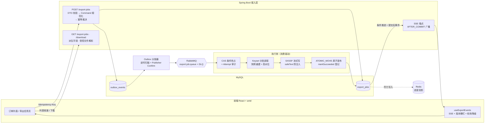
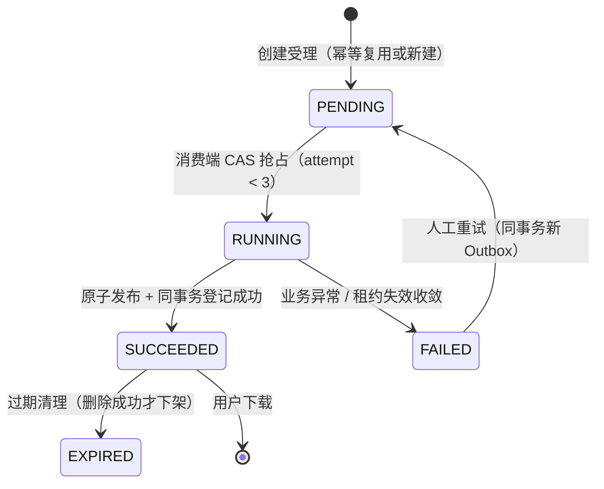

<div align="center">

# FlowHub

**企业级异步 Excel 导出中心** · Enterprise-Grade Asynchronous Export & Import Center

订单筛选 → 异步流式导出 → 实时进度推送 → 安全下载，以及完全对称的 Excel 批量导入。


</div>

---

## 目录

- [为什么值得关注](#为什么值得关注)
- [核心亮点](#核心亮点)
- [系统架构](#系统架构)
- [任务状态机](#任务状态机)
- [导入链路](#导入链路)
- [技术栈](#技术栈)
- [快速开始](#快速开始)
- [API 总览](#api-总览)
- [工程结构](#工程结构)
- [测试与质量](#测试与质量)
- [常见问题](#常见问题)
- [演进路线](#演进路线)

## 为什么值得关注

大多数演示项目只展示「接口怎么调」，FlowHub 展示的是**一个导出任务在生产环境中如何可靠地活下来**：

- 用户重复点击、网络重试 → **幂等键 + request hash** 裁决复用还是 409 冲突；
- 数据库写入成功但消息没发出去 → **事务性 Outbox + Publisher Confirm**，至少一次投递；
- 消息重复消费、多实例竞争 → **CAS 条件抢占 + Attempt 审计**，重复投递收敛为最多一次有效执行；
- 导出中途应用崩溃 → **租约失效收敛 + 启动恢复 + 人工重试**，绝不留下僵尸任务；
- 大结果集拖垮内存 → **Keyset 游标批查 + SXSSF 滑动窗口**，50 万行上限下内存恒定；
- 半写文件被下载 → **ATOMIC_MOVE 原子发布**，登记成功才算存在；
- 前端轮询风暴 → **SSE 推送 + `job_version` 版本栅栏 + 轮询降级**，乱序事件天然无害。

> 全链路已在真实环境完成端到端验证：20 万行确定性演示数据、5 万行导出任务从创建到下载 1.6 MB Excel 全程可复现。

## 核心亮点

### 可靠投递，而非「发出去就不管」

| 环节 | 机制 | 失败时行为 |
| --- | --- | --- |
| 创建受理 | 同事务写 `export_jobs` + `outbox_events`，返回 202 | 事务回滚，用户侧无副作用 |
| 消息投递 | 定时分发 + Publisher Confirm，**ACK 且无 Returned 才回填 `published_at`** | 保留事件下轮补发，任务状态不变 |
| 消费执行 | 手动 Ack + 条件 UPDATE 抢占（`PENDING AND attempt_count < 3`） | 抢占失败直接 Ack，零副作用 |
| 契约毒丸 | schema 未知 / 正文非法 → `basicReject` 转死信队列 | 不进重试风暴，DLQ 留证据 |

### 确定性数据读取

创建时以单查询统计命中行数与**范围内 MAX(id) 高水位**；执行时按任务快照重建筛选条件，Keyset 游标（`id > lastId AND id <= 高水位`）恒定成本分批读取——分页漂移、边导边增的问题从设计上不存在。

### 流式生成与安全发布

`SXSSFWorkbook(100)` 滑动窗口 + 压缩临时文件，百万行不爆内存；文本经 `safeText` 公式注入防护、金额写 NUMERIC 原生数值。文件生命周期全程受控：受控根目录提纯、**双层路径防腐**（normalize 拒绝 `..` + 逐段符号链接验真）、同文件系统原子移动发布、数据库登记失败补偿删除——不留孤儿文件。

### 进度分层：事实源、投影、通知各司其职

- **MySQL 条件推进**：`status='RUNNING'` 单向 + `processed_rows` 单调递增 + 租约续期，0 行即 fail-fast；
- **Redis Hash 投影**：尽力写入、失败降级日志，Redis 宕机不影响导出；
- **SSE AFTER_COMMIT 广播**：事务提交后重读事实再推送，回滚永不广播；事件 id = `jobId:version`，前端版本栅栏天然免疫乱序；
- **HTTP 校准兜底**：SSE 断开自动切轮询（3s/15s 按页面可见性），坏连接隔离不影响他人。

### 工程规范同样在线

统一响应 Envelope（`code/message/data/trace_id`）、`trace_id` 贯穿异步链路、API v1 集中前缀、record + `@BindParam` 的入参防腐、各层显式空值防御、主题 token 化的前端与**翻页/排序零抖动**的表格治理。

## 系统架构



## 任务状态机

所有状态迁移都由**条件 UPDATE** 裁决，非法并发迁移影响 0 行即失败，无需乐观锁重试循环：



配套的自愈机制：启动时只收敛**租约已失效**的 RUNNING（不误伤活跃执行）；每小时清理过期文件与孤儿文件（宽限期 + 活跃租约 + 引用检查三维对账后才删除）。

## 导入链路

订单 Excel 导入与导出**完全对称地复用同一套可靠性骨架**（独立表、独立队列拓扑，互不干扰），并在此之上解决写入侧特有的问题：

- **三层校验分工**：文件级（后缀 + PK 魔数 + ≤10 MB）与结构级（Sheet 名、9 列表头严格匹配）同步 400 拒绝，行级校验异步执行——快速失败不打扰异步管道；
- **SAX 流式读取**：`XSSFSheetXMLHandler` 逐行解析，导入大文件与导出一样内存恒定；
- **双重去重**：文件内 HashSet 查重 + `order_no` 数据库唯一约束冲突预查与逐行降级，绝不产生重复订单；
- **PARTIAL 部分成功语义**：有效行照常入库，错误行汇总进可下载的错误报告（行号与 Excel 对齐），`PENDING → RUNNING → SUCCEEDED | PARTIAL | FAILED → EXPIRED` 六态闭环。

导入导出格式互为逆操作（9 列同一事实源），导出改列定义时导入自动跟随。

## 技术栈

| 层 | 选型 |
| --- | --- |
| 后端 | Java 21 · Spring Boot 3.3.2 · MyBatis 3.0.3 · Flyway · Apache POI（SXSSF） |
| 中间件 | MySQL 8 · RabbitMQ（Publisher Confirm / 手动 Ack / DLX）· Redis（进度投影，可降级） |
| 前端 | React 18.3 · TypeScript 5.8 · Vite 6 · antd 6 · @tanstack/react-query 5 · dayjs |
| 实时通道 | Spring SSE + 版本栅栏 + 轮询降级混合策略 |
| 构建 | Maven Wrapper（免装 Maven）· npm · Windows `start.bat` 一键启动 |

端口约定：**后端 8080 · 前端 5174**。

## 快速开始

### 前置条件

| 依赖 | 要求 | 说明 |
| --- | --- | --- |
| JDK | 21 | 后端运行 |
| Node.js | ≥ 18 | 前端运行 |
| MySQL | 8.0+，本机 3306 | 必需：需存在 `flowhub` 库与 `flowhub/flowhub` 账号，Flyway 启动时自动建表 |
| RabbitMQ | `localhost:5672`（guest/guest） | **可选**：未启动时接口照常可用，消息待 Broker 恢复自动补发 |
| Redis | `localhost:6379` | **可选**：未启动时进度投影自动降级，功能不受影响 |

### 一键启动（Windows）

双击仓库根目录 `start.bat`——自动安装前端依赖，弹出两个窗口分别运行后端与前端。浏览器访问 <http://localhost:5174>，后端日志出现 `Started FlowHubApplication` 即就绪。

### 用 Docker 补齐中间件（可选）

```bash
docker compose up -d rabbitmq redis    # 管理台 http://localhost:15672（guest/guest）
```

### 手动启动

```bash
# 后端（backend 目录）
.\mvnw.cmd spring-boot:run        # Windows
./mvnw spring-boot:run            # Linux / macOS

# 前端（frontend 目录）
npm install && npm run dev
```

### 灌入演示数据（推荐）

`orders` 表为空时列表将无数据。执行确定性数据生成脚本，一键装入 20 万行仿真订单（状态/渠道/币种按业务权重分布，同参数重跑结果一致）：

```bash
cd backend/scripts
./seed-demo-data.sh                  # 默认 200,000 行（仅表为空时写入，绝不覆盖）
SEED_ROWS=50000 ./seed-demo-data.sh  # 自定义行数（1 ~ 1,000,000）
```

### 验证清单

| 检查项 | 地址 / 命令 |
| --- | --- |
| 前端页面 | <http://localhost:5174> |
| 健康检查（db / rabbit / redis 组件细分） | <http://localhost:8080/actuator/health> |
| 订单分页查询 | <http://localhost:8080/api/v1/orders?page=1&page_size=20> |
| 导出任务列表 | <http://localhost:8080/api/v1/export-jobs> |

体验路径：**订单页筛选/勾选 → 「导出已选」→ 导出任务页看 SSE 实时进度 → SUCCEEDED 后下载 Excel**；或在订单页「导入订单」下载模板、填数、上传，观察 PARTIAL 与错误报告。

## API 总览

统一响应 Envelope `{code, message, data, trace_id}`（snake_case），错误携带 `trace_id` 可直接对账后端日志。

### 订单查询

| 方法 | 路径 | 说明 |
| --- | --- | --- |
| GET | `/api/v1/orders` | 分页 + 8 项条件筛选 + 排序白名单（`sort_by`/`sort_order` 回显生效排序） |

### 导出任务

| 方法 | 路径 | 说明 |
| --- | --- | --- |
| POST | `/api/v1/export-jobs` | 创建受理（需 `Idempotency-Key` 头）：勾选 / 筛选两种 selection，202 返回 `{job_id, job_no, status, total_rows}` |
| GET | `/api/v1/export-jobs` | 分页列表 + 可选 `status` 过滤，含进度/可下载等派生字段 |
| GET | `/api/v1/export-jobs/events` | SSE：`job.progress / succeeded / failed / heartbeat`，事件 id = `jobId:version` |
| GET | `/api/v1/export-jobs/{id}/download` | 仅 SUCCEEDED 且未过期返回文件流，否则结构化错误码 |
| POST | `/api/v1/export-jobs/{id}/retry` | 仅 FAILED 且未达尝试上限，202 受理回 PENDING |

创建示例：

```bash
curl -X POST http://localhost:8080/api/v1/export-jobs \
  -H "Content-Type: application/json" \
  -H "Idempotency-Key: demo-0001" \
  -d '{
    "selection": { "mode": "FILTER", "filter": { "order_status": ["PAID","SHIPPED"] } },
    "columns": ["order_no","customer_name","order_status","total_amount","order_time"],
    "file_name": "已支付订单导出"
  }'
```

### 订单导入

| 方法 | 路径 | 说明 |
| --- | --- | --- |
| GET | `/api/v1/import-jobs/template` | 下载 9 列模板（与导出格式互逆，含下拉校验与填写说明） |
| POST | `/api/v1/import-jobs` | multipart 上传受理（字段 `file`），文件/结构级同步 400，行级异步 |
| GET | `/api/v1/import-jobs` | 分页列表（含 PARTIAL），带错误摘要等派生字段 |
| GET | `/api/v1/import-jobs/events` | SSE：`import.progress / succeeded / partial / failed / heartbeat` |
| GET | `/api/v1/import-jobs/{id}/error-report` | PARTIAL 时下载错误报告（行号与 Excel 对齐） |
| POST | `/api/v1/import-jobs/{id}/retry` | 仅 FAILED 可重试；PARTIAL 为终态不可重试 |

## 工程结构

后端按「横切 Web 基础设施 + 垂直自治业务模块」组织，前端按「API 防腐层 + feature」组织。

<details>
<summary><b>展开完整目录树</b></summary>

```text
flowhub/
├── start.bat                     # Windows 一键启动（后端 8080 + 前端 5174）
├── docker-compose.yml            # RabbitMQ / Redis 编排（含健康检查）
├── docs/                         # 设计与迭代文档
├── backend/                      # Spring Boot 后端
│   ├── mvnw / mvnw.cmd           # Maven Wrapper
│   ├── scripts/                  # seed-demo-data.sh 演示数据生成
│   └── src/main/java/com/example/flowhub/
│       ├── common/web/           # 横切基础设施
│       │   ├── api/              #   统一 Envelope / 自动包装 / RawResponse
│       │   ├── error/            #   错误码 / 业务异常 / 全局异常处理（field_errors）
│       │   ├── param/            #   入参归一化与解析公共工具
│       │   ├── trace/            #   trace_id 生成透传 + MDC 异步传递
│       │   └── config/           #   CORS / API v1 前缀 / 异步线程池
│       ├── order/                # 订单查询模块（controller/dto/service/query/mapper/entity/vo）
│       ├── export/               # 导出任务模块
│       │   ├── controller/       #   创建 / 列表 / 下载 / 重试 / SSE
│       │   ├── command/          #   请求规范化 + 列白名单
│       │   ├── mq/               #   RabbitMQ 拓扑 + Outbox 分发器 + 消费者
│       │   ├── excel/            #   SXSSF 流式 Writer
│       │   ├── service/          #   幂等受理 / CAS 抢占 / 执行体 / 发布协议 / 进度 / 恢复清理
│       │   └── mapper|entity|vo|error|event/
│       └── orderimport/          # 订单导入模块（与导出对称的完整垂直模块）
└── frontend/                     # Vite + React 前端
    └── src/
        ├── app/                  #   布局壳层（Sider + 顶栏 + 健康徽标）
        ├── api/                  #   防腐层（Envelope 解包 / ApiError / 下载协议 / 领域 API）
        └── features/
            ├── orders/           #   订单列表页（筛选 + 排序 + 勾选 + 导出/导入入口）
            ├── exports/          #   导出任务页（SSE 实时进度 + 下载/重试 + useExportEvents）
            └── imports/          #   导入任务页（useImportEvents + PARTIAL + 错误报告）
```

</details>

## 测试与质量

```bash
cd backend && .\mvnw.cmd test      # 后端：H2 内存库，不依赖外部 MySQL/RabbitMQ
cd frontend && npm test            # 前端：vitest 单测（含 jsdom SSE Hook 测试）
cd frontend && npm run build       # 类型检查 + 生产构建
```

测试策略上，本仓库用**集成测试锚定并发语义**而非只测 happy path：幂等并发（唯一约束裁决）、消费抢占（重复投递无副作用）、进度守卫（0 行 fail-fast / 回滚不广播）、文件发布（补偿删除 / 路径污染拒绝）、维护收敛（活跃租约不误伤）均有专项用例覆盖。

## 常见问题

- **`mvnw.cmd` 不是内部或外部命令**：部分终端环境禁止 cmd 从当前目录找可执行文件，请使用 `.\mvnw.cmd` 显式写法（`start.bat` 已内置处理）。
- **首次启动较慢**：Maven Wrapper 需下载依赖，以后端日志 `Started FlowHubApplication` 为准。
- **`/actuator/health` 显示 DOWN**：RabbitMQ / Redis 未启动时对应组件为 DOWN，属预期降级行为——应用功能正常，Broker 恢复后 Outbox 自动补发、消息恢复消费。
- **订单列表为空**：真实库 `orders` 表无数据所致，执行[演示数据脚本](#快速开始)灌入即可。

## 演进路线

已实现：订单查询、导出全链路（受理 → 投递 → 消费 → 读取 → 写盘 → 发布 → 下载 → 恢复）、导入全链路、前端三页与 SSE 实时进度。

下一步聚焦**从单机可靠走向分布式可靠**：

- [ ] 鉴权与任务归属（当前为演示环境，无登录体系）
- [ ] 对象存储接入（文件从本地受控目录迁移 OSS/S3）
- [ ] 多实例部署（跨实例 SSE fanout、分布式抢占锁、集群调度）
- [ ] 导出任务详情接口与筛选条件 URL 同步
- [ ] 性能基准脚本与 Playwright E2E 工程落地

---

<div align="center">

**FlowHub** — 把「点击导出按钮之后发生的事」讲透的工程演示。

</div>
