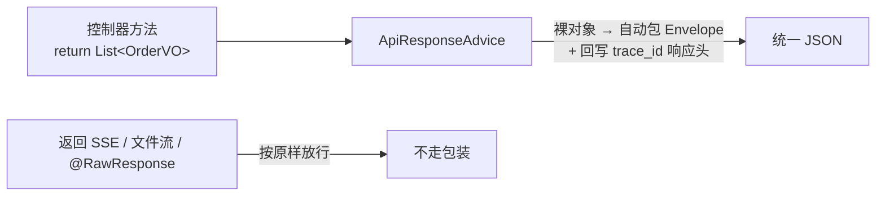
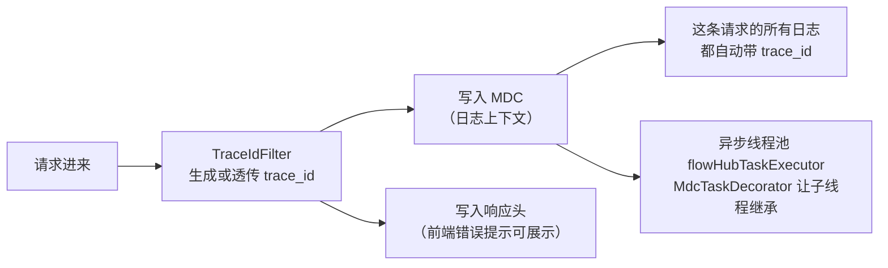
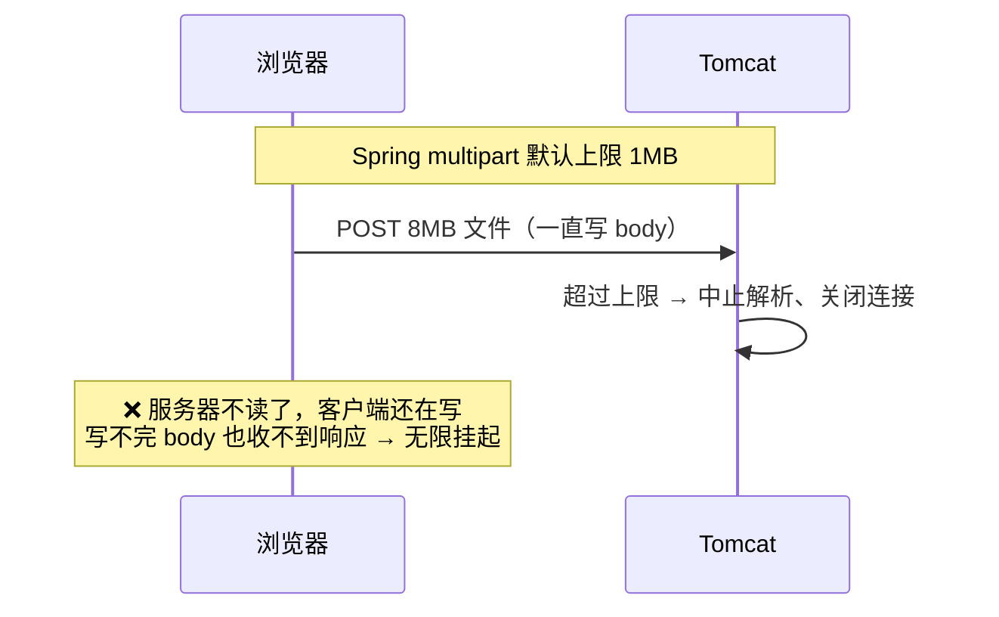

# 01 · 公共底座：所有接口的地基

> 🎯 **一句话**：统一响应格式、统一异常出口、统一链路追踪、统一参数防御——让每个业务模块「生下来就规矩」。
>
> 代码位置：`backend/src/main/java/com/example/flowhub/common/web/`

---

## 1. 为什么要有底座

没有底座的项目长这样：

- 😵 接口 A 返回 `{data: ...}`，接口 B 返回 `{result: ...}`，接口 C 直接返回裸数组——前端每接一个接口都要问一遍「这回是什么格式」；
- 😵 报错有的返回 500 带堆栈，有的返回 200 带 error 字段——前端根本没法统一处理；
- 😵 用户说「我刚才操作报错了」，后端翻遍日志对不上是哪次请求。

底座把这三件事一次性解决，业务代码只需要写业务。

---

## 2. 统一响应 Envelope

所有 JSON 接口的响应长一个样（`common/web/api/ApiResponse`）：

```json
{
  "code": "OK",
  "message": "success",
  "data": { "...业务数据..." },
  "trace_id": "3f9a2c..."
}
```

字段一律 `snake_case`，前端拿到的 `code` 既包括成功的 `OK`，也包括失败的业务码（如 `IDEMPOTENCY_CONFLICT`）。

**业务代码不用手动包装**——`ApiResponseAdvice`（一个 `ResponseBodyAdvice`）自动把控制器返回的裸对象包进 Envelope：



三个放行规则：已经包装过的不再二次包装；SSE/文件流这类 `Resource` 响应放行；显式标注 `@RawResponse` 的接口放行。

---

## 3. 全局异常出口

`common/web/error/GlobalExceptionHandler` 是**所有异常的唯一出口**：业务代码只管抛，格式化交给它。

| 异常 | HTTP | 表现 |
|---|---|---|
| `BusinessException` + 模块自定义错误码 | 各错误码自映射 | 业务失败的标准姿势，如 409 `IDEMPOTENCY_CONFLICT` |
| Bean Validation 失败（`@Valid` 等） | 400 `VALIDATION_ERROR` | `data.field_errors` 输出「字段路径 → 文案」映射 |
| 请求体 JSON 解析失败 | 400 `VALIDATION_ERROR` | 恶意/畸形请求体不再变 500 |
| multipart 超限/解析失败 | 400 | 见 [09-订单导入](09-订单Excel导入.md) 的挂死修复 |
| Accept 头与返回类型不匹配 | 406 `NOT_ACCEPTABLE` | — |

关键决策：**模块自己的错误码不进 common**。`export/error/ExportErrorCode`、`orderimport/error/ImportErrorCode` 各自实现 `ErrorCode` 接口——底座只定协议，不收编业务语义。

前端对应物：`ApiError`（携带 message/code/status/traceId/fieldErrors，见 [doc/10](10-前端交互层.md)），两端契约严格对齐。

---

## 4. trace_id：一根线串起整次请求



- 🆔 每次请求生成（或信任上游透传）一个 `trace_id`，日志、响应头、Envelope 三处同源；
- 🧵 业务里用 `@Async` 跑的代码也能继承链路——异步线程池 `flowHubTaskExecutor` 统一配了 `MdcTaskDecorator`，**新开线程池必须用这个 bean**，否则日志断链；
- 🔎 排障姿势：用户报错 → 前端展示的 trace_id → `grep trace_id` 一条线拉出全程日志。

---

## 5. 参数处理：空值契约的代码化

`common/web/param/ParamUtils` 把「什么样的参数算没传」写成了代码：

| 工具方法 | 契约 |
|---|---|
| `trimToNull` | null / 空串 / 纯空白 → 统一折叠为 null（null 是唯一合法的「未传」） |
| `splitMultiValue` | `a,b,c` 拆成列表 + trim + 过滤空 token + 去重；拆完为空 = 未传（防 MyBatis 生成 `IN ()` 非法 SQL） |
| `enumFromName` / `parseMultiEnum` | 枚举按常量名大小写不敏感解析；非法值**立即报 400，绝不静默忽略**（静默忽略 = 用户以为筛选生效了，实际没有） |
| `escapeLike` | 转义 LIKE 通配符 `\` `%` `_`——用户输入永远只是字面量，不是查询模式（详见 [doc/02](02-订单查询.md)） |
| `parseDecimal` / `parseDateTime` / `parsePhone` | 数值/时间/手机号解析，非法统一 400，错误文案带字段名 |

**强制复用规则**：写通用逻辑前必须先查 `common/web/` 有没有现成的，有就复用，没有且预计有第二个消费方就沉淀进去。这是从真实教训里来的（见下文踩坑）。

---

## 6. 六条编码约束（新人必读）

全仓库后端代码的强制规范，完整版在 [AGENTS.md](../AGENTS.md)，这里给速查版：

1. 📦 **数据承载类型一律 record**——实体、DTO、VO、值对象全部不可变；
2. 🔤 **snake_case 入参统一 `@BindParam`**——禁止写别名 getter 兼容下划线（这是删掉过的历史反例）；
3. 🛡️ **各层显式空值防御**——null 是唯一「未传」，空集合不是 null，`BigDecimal` 比较必须 `compareTo`；
4. 📐 **注解排版以「单行放不放得下」为界**——放得下横排，放不下每注解一行；
5. ♻️ **优先复用 `common/web/` 工具**——禁止业务类里私有重写轮子；
6. 💬 **注释只说签名看不出来的事**——类 1-3 行，方法 1 行，禁止复述设计文档。

---

## 7. 踩坑复盘 🧨

### 坑一：别名 getter——为一个下划线欠一身债

早期为了让 `?page_size=20` 能绑定，曾给 DTO 手写 `getPage_size()` 别名方法。结果：每个新字段都要写两个 getter，序列化和绑定行为不一致，后来 record 化时全部删除。**教训**：框架能力（Spring 6.1 的构造器绑定）能解决的事，不要手写兼容层。

### 坑二：`trimToNull` 私有在业务类里

它最初写在 `OrderService` 里，后来导出模块也要用——复制还是抽取？最终抽取为 `ParamUtils.trimToNull` 并让所有枚举解析同步委托。**教训**：第二个消费方出现前就该预判，「预计存在第二个消费方」直接进 common 并补单测。

### 坑三：上传超限把用户「挂死」而不只是报错 💀

这是全项目最隐蔽的一个坑（修复 commit `8c385f5`）：



解法分三层：

1. 配置调大 multipart 闸门（`max-file-size: 11MB`），比业务上限（10MB）略宽，让请求能到达业务校验；
2. `OversizeRequestBodyFilter` 对 `Content-Length` 超限的请求**先把 body 读光（swallow）再回 400**，保证浏览器能写完并收到响应；
3. 配套 `server.tomcat.max-swallow-size: -1`，并用「手工拼 multipart body + 精确 Content-Length」的真实 Tomcat 契约测试钉死这个行为（对齐浏览器 fetch FormData 的真实表现）。

**教训**：防护措施本身可能制造比原问题更糟的故障模式，超限防护要站在「连接是否被优雅关闭」的视角验证，而不只是「是否返回了 400」。

### 坑四：Windows 控制台一冻结，整个接口就卡死 🪟

现象：Windows 下用户不小心点到控制台窗口进入「快速编辑模式」（选择文本即冻结 stdout），所有写日志的请求线程被同步 Appender 无限期阻塞——**接口像断电一样全部超时**，而服务明明「活着」。

解法（`logback-spring.xml`）：控制台 Appender 外包一层 `AsyncAppender` + `neverBlock=true`——业务线程只管把日志丢进队列，队列满了丢日志保请求，永不阻塞。

配套细节：测试环境专门用 `logback-test.xml` 保留**同步**日志，因为多个测试断言 `CapturedOutput` 的日志内容，异步会引入时序竞态。

**教训**：「服务健康」不等于「服务可用」，日志这种最不起眼的 IO 也可能成为全局瓶颈；测试环境的日志配置要与生产有意分叉，并注释说明原因。

---

## 8. 测试验证 ✅

- Envelope 包装/放行规则、`field_errors` 结构：控制器层集成测试覆盖；
- `ParamUtils` 各解析方法：单测覆盖 null/空白/空集合/非法值边界（空值契约的用例是**必选项**，不是锦上添花）；
- `OversizeRequestBodyFilter` 单测 + 真实 Tomcat 契约测试（`ImportJobUploadControllerTest`）双保险。

---

## 9. 遗留与改进 🔭

- 统一 Envelope 目前靠 `ResponseBodyAdvice` 运行时包装，可在启动期做一次扫描校验，防止误标 `@RawResponse`；
- 错误码目前散在各模块枚举，可加一个启动期唯一性检查（HTTP 状态映射冲突早发现）；
- trace_id 已贯通日志与响应头，尚未接入日志文件落盘与聚合检索（本地演示仅控制台输出）。
