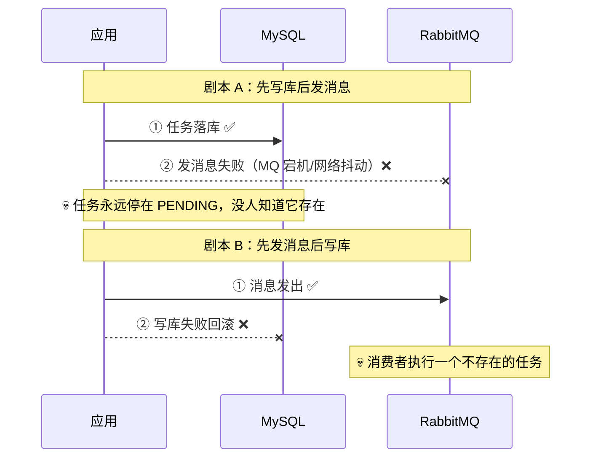
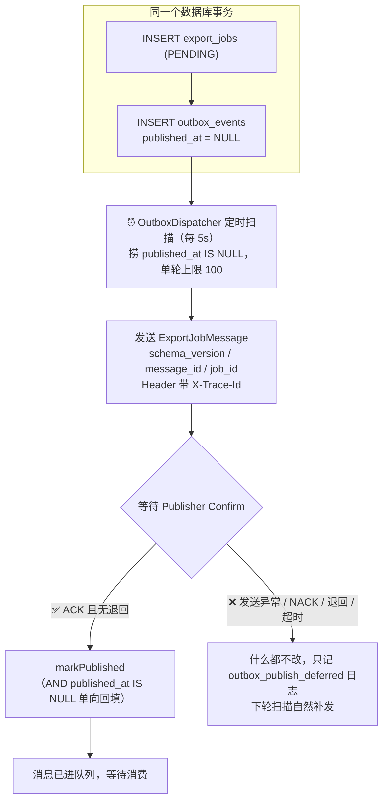
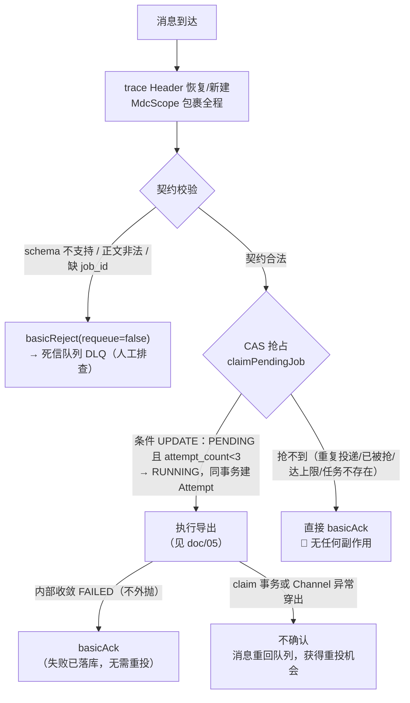

# 04 · 可靠投递：事务性 Outbox 与消费端幂等

> 🎯 **一句话**：保证「任务创建成功」必然导致「任务最终被执行」——哪怕消息队列挂了、服务崩了、消息投了两遍。
>
> 代码位置：`export/mq/`（RabbitConfig / OutboxDispatcher / ExportJobMessage / ExportJobConsumer）；导入侧在 `orderimport/mq/` 对称复刻
> 这是本项目**最核心**的模式，建议精读。

---

## 1. 要解决的问题：双写不一致 💔

「创建任务」要同时做两件事：**写数据库**（任务记录）+ **发消息**（通知执行方）。但这两件事没法放进一个原子操作：



两个顺序都有裂缝，因为「数据库事务」和「消息发送」是两个独立系统，无法共享一个事务。

---

## 2. Outbox 模式：先记账，再发货 📒

类比网购发货：仓库**先把发货任务记在小本本上**（和业务操作在同一个账本 = 同一个数据库事务），发货员**定时翻小本本**，发成功一笔打一个钩，失败的下轮再发。



三个关键细节：

1. **`published_at IS NULL` 即未发送**——Outbox 没有 FAILED 状态，不需要重试计数器，失败就是「还没成功」，天然无限重试直到成功（至少一次投递）；
2. **只有 Confirm 成功才打钩**——RabbitMQ 的 Publisher Confirm 是 Broker 收妥的回执；只 ACK 不够，还要求没有 Returned（消息进了队列而不是被丢弃），二者都满足才标记已发布；
3. **markPublished 带 `AND published_at IS NULL` 条件**——扫描和确认可能并发，单向回填防止覆盖。

📎 `message_id` 由 outbox 事件 id 经 `UUID.nameUUIDFromBytes` **稳定派生**：同一个事件无论补发多少次，消息 id 不变，方便在 Broker 侧追踪去重。trace_id 放进消息 Header，消费端的日志能与创建请求串成一条链。

---

## 3. 消费端：从「至少一次」到「最多一次有效执行」🔁

至少一次投递意味着**消息可能重复、可能多个实例同时收到**。消费端用一套组合拳把重复投递收敛为最多一次有效执行：



### 手动 Ack 的四象限

| 情况 | Ack 行为 | 理由 |
|---|---|---|
| 抢占失败（别人在跑） | ✅ Ack | 重复投递无害化，这正是幂等消费的核心场景 |
| 执行失败但已收敛落库 | ✅ Ack | 失败是**业务结果**（已记录 FAILED），重投只会再失败一次 |
| 契约非法 | ⛔ Reject → DLQ | 程序 bug 或脏数据，重投无意义，留证据给人 |
| 抢占事务/Channel 异常 | ❌ 不确认 | **未知状态**，让消息重投是唯一安全选择 |

### CAS 抢占的实现（同事务两步，不可拆分）

```sql
-- 条件 UPDATE：只有 PENDING 且未达尝试上限才能被我改成 RUNNING
UPDATE export_jobs SET status='RUNNING', attempt_count=attempt_count+1,
       version=version+1, started_at=..., lease_expires_at=...
WHERE id=? AND status='PENDING' AND attempt_count<3
-- 影响行数 = 0 → 抢占失败 → Ack 放弃
```

同事务再 INSERT 一行 RUNNING 状态的 `export_job_attempts` 审计记录。**两步必须同事务**：分开写的话，回滚可能留下「没有 Attempt 的 RUNNING」孤儿。

---

## 4. 优雅降级：RabbitMQ 没启动也能跑 🐇💨

开发环境不一定装着 RabbitMQ。本项目的设计是：**MQ 缺席不阻塞主流程**——

- 分发器每轮记 `outbox_publish_deferred` 日志，事件留在库里等恢复；
- 消费监听容器后台持续重连；
- `/actuator/health` 的 rabbit 组件 DOWN（诚实暴露），但应用照常服务；
- Broker 恢复后自动补发，任务开始流转。

**教训**：外部依赖的可选性要在架构里显式设计（哪些降级、哪些不降级），而不是靠运气。

---

## 5. 踩坑复盘 🧨

### 坑：SSE 断连异常外泄触发补偿删除（commit `0ece0c7`）

SSE 广播时若客户端断开，写连接的 `IOException` 一路外泄，被上层执行体的失败兜底误判为「执行失败」，触发了**文件补偿删除**——明明任务成功了，文件却没了。修复：广播侧兜住坏连接异常并移除连接。

**教训**：通知类旁路逻辑（广播、审计、通知）的异常必须与主流程的异常语义隔离，否则旁路故障会伪装成业务失败。

---

## 6. 导入侧：对称复刻，独立拓扑 📥

导入模块复刻了整套管道（`ImportOutboxDispatcher` / `ImportRabbitConfig` / `ImportJobConsumer`），但有意的差异：

- 独立拓扑：交换机/队列/routing key 全部用 `import.job.*` 命名，**与导出零共享**——避免 bean 冲突，也让两个业务可以独立扩缩容；
- 消费端参数（manual ack / prefetch / concurrency）复用同一份 `spring.rabbitmq.listener.simple` 配置；
- 独立队列意味着导出任务堆积不会拖住导入任务。

**复盘观点**：复刻比抽象划算——两条链路的差异点（校验时机、终态语义、错误报告）足够多，强行抽公共基类会造出配置面条；真正的共享（trace、Outbox 表模式、Ack 策略）以「约定」而非「代码」共享。

---

## 7. 测试验证 ✅

- `ExportJobConsumerTest`：直接方法调用消费逻辑（测试 yml 关闭监听容器自启动，不经 MQ 验证契约/抢占/收敛分支）；
- 抢占原子性、Attempt 同事务：集成测试断言「抢占失败零副作用」「回滚不留孤儿 RUNNING」；
- Confirm 闭环：`OutboxEventMapper.findUnpublished/markPublished` SQL 单向性有断言。

---

## 8. 遗留与改进 🔭

- DLQ 目前只进队列，无告警通道（生产应接监控告警 + 人工重放工具）；
- 分发器单机 `@Scheduled` 扫描，多实例部署时靠数据库行级状态保证不重发（Confirm 语义兜底），更严格可引入分布式锁或分片扫描。
