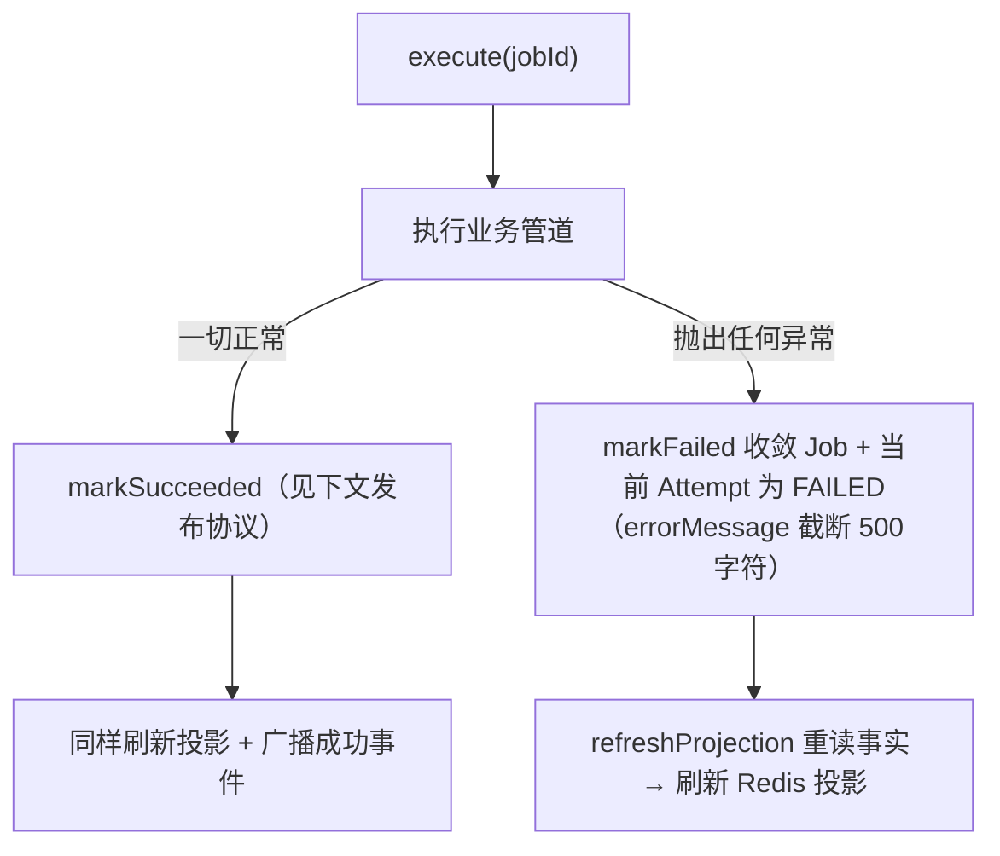
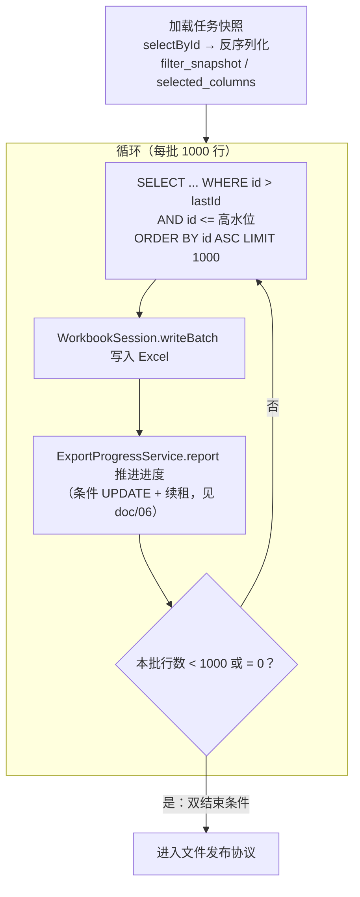
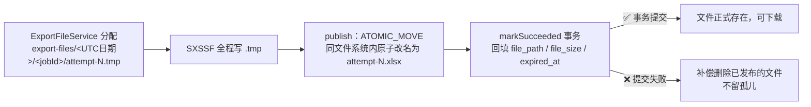

# 05 · 导出执行与 Excel 生成：恒定内存跑完 50 万行

> 🎯 **一句话**：消费端抢到任务后真正干活的部分——按任务快照分批读数、流式写 Excel、原子发布文件，全程内存恒定，失败必有交代。
>
> 代码位置：`export/service/ExportExecutionService` + `export/excel/`（ExcelExportWriter）+ `export/service/ExportFileService`
> 演示基线：5 万行任务全程可复现，设计上限 50 万行。

---

## 1. 执行壳：把「失败」管起来 🏗️

`ExportExecutionService.execute` 是执行入口，它的第一职责是**异常纪律**：

- 业务异常**绝不满天飞**：消费端 Ack 策略依赖「失败必已落库」（见 [doc/04](04-可靠投递-Outbox与消费.md)），执行壳是这条承诺的执行者；
- 失败原因可读：message 为空时回退异常类名（`ExceptionUtils`），保证数据库里的失败原因永远不出现空白。

---

## 2. Keyset 读取管道：快照定格 + 游标推进 📸

### 为什么需要「快照」和「高水位」

导出创建时把取数条件（筛选快照 / 勾选 ID / 列清单）**序列化存进任务记录**。执行时从任务记录重建条件，而不是重新问一遍请求方——这样即使原始请求方已消失，任务依然可重放、可重试。

`max_order_id_at_create`（创建时 SQL 顺带查出的最大 id）是**高水位线**：执行体只读 `id <= 高水位` 的订单，创建之后新下的订单**不属于**这次导出——「你点的导出，导的是你点击那一刻的数据」，不会中途混进新数据。

### 游标怎么走

- 🚶 **Keyset 分页**（`id > lastId ORDER BY id ASC LIMIT`）而非 `LIMIT offset`：每一批成本恒定，不随深度变慢；
- ♻️ `findBatch` **跨 Mapper 复用** `OrderMapper.criteriaConditions` 共享片段——导出内容和订单页筛选结果必然一致（见 [doc/02](02-订单查询.md)）；
- 🏁 结束判定是**双保险**：空批结束 + 不足一批结束，防止边界行差一。

---

## 3. SXSSF 流式写 Excel：只记住最近 100 行 🪟

POI 的 `XSSFWorkbook` 会把整个工作簿捧在内存里，10 万行就扛不住了。SXSSF（Streaming XML Spreadsheet Format）的思路：

> **滑动窗口**：内存里只保留最近 100 行（`ROW_WINDOW = 100`），更早的行已被刷到磁盘上的临时文件里，「写完就忘」。

`export/excel/ExcelExportWriter` + `WorkbookSession` 的要点：

| 机制 | 说明 |
|---|---|
| 🔐 列白名单二次复核 | open 时再验一次列清单，未知列在**创建文件之前**就抛出（不让半成品文件出现） |
| 🪟 滑动窗口 100 | 内存占用与总行数无关 |
| 🗜️ 临时文件压缩 | 磁盘上的中间产物走压缩格式 |
| 🧷 表头/冻结首行/自动筛选/列宽 | 一次配置，行数据纯追加 |
| 💰 金额列 | 写 NUMERIC 数值 + `0.00` 样式单例（样式对象不随行重复创建） |
| 🛡️ `safeText` 公式注入防护 | 用户数据若以 `=` `+` `-` `@` 开头，可能被 Excel 当公式执行（CSV 注入的同族问题）——文本写入前中和 |
| ⏱️ 时间列 | 固定格式，不受 Excel 区域设置影响 |
| 🚪 close 链 | `write → 关流 → close → dispose`，首个异常保留，后续异常挂 suppressed——关失败不吞真因 |

---

## 4. 文件发布协议：不存在「半个 Excel」📦

写完的文件要经历一条严格的发布流水线（与 [doc/07](07-文件安全与下载.md) 的路径安全配合）：

- 🚫 `AtomicMoveNotSupportedException` **不降级**：跨文件系统移动无法原子化，宁可失败重试也不引入「先复制后删」的中间态；
- 🧾 先发布、后登记：数据库登记成功的那一刻，文件一定已经完整存在于正式路径——「登记成功才算存在」；
- 🔙 反向补偿：登记失败就删掉已发布的文件，不留磁盘孤儿（与 [doc/08](08-恢复与清理.md) 的孤儿对账形成双保险）。

---

## 5. 踩坑复盘 🧨

### 坑：写失败后进度「虚高」

早期版本先推进进度再写 Excel，写入失败时进度已经报上去了——事实源里出现了「进度 80% 但任务失败」的诚实但不连贯的状态。修正为「**先写批、后报进度**」，保证进度永远反映已完成的写入。（配套测试：写失败不虚假推进 + 半成品清理。）

**教训**：进度类指标的推进必须与它描述的实际动作**同序**，先动事实后记进度，而不是反过来。

---

## 6. 测试验证 ✅

- `ExcelExportWriter` 单测 6 用例：**用真实 XSSF 重新打开**生成的文件断言（表头/列宽/金额/注入中和），不数 mock；
- 执行体集成测试 `ExportExecutionIntegrationTest` 7 用例：高水位阻断（创建后的新订单不进导出）、批次边界、快照重建、排除 ID、空值防御、round-trip；
- 发布/补偿：发布失败走失败收敛、DB 登记失败补偿删除文件。

---

## 7. 遗留与改进 🔭

- 单实例执行：任务在单 JVM 内串行消费（并发 2），更大吞吐需任务分片；
- Excel 仅 xlsx：如需 CSV 流出（数据管道场景），发布协议可直接复用；
- 样式/模板尚未参数化（表头样式固定），国际化表头需扩展列定义表。
