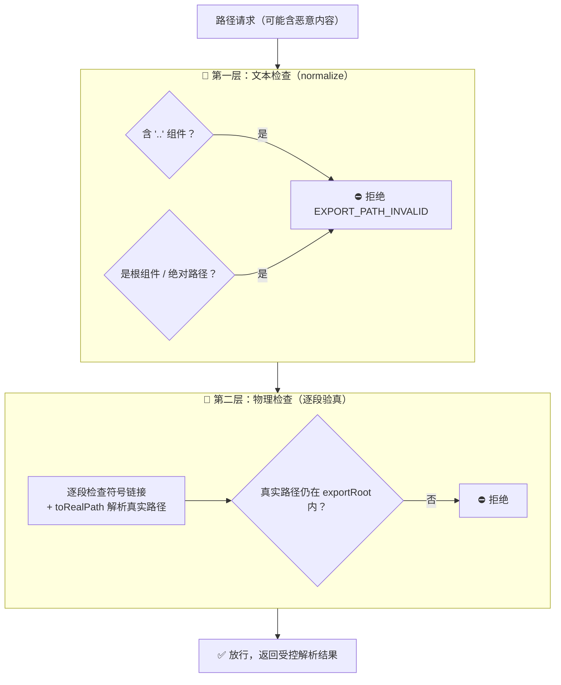
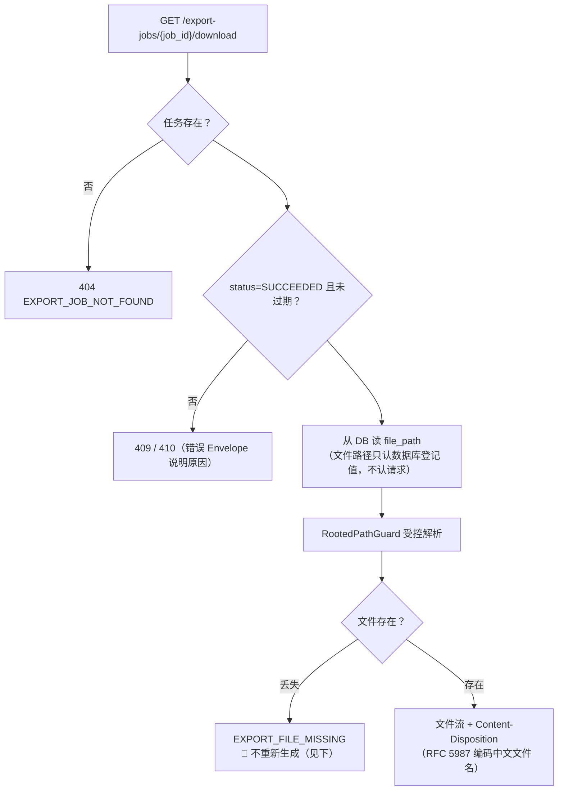
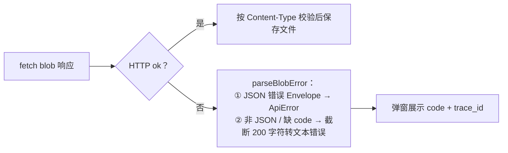

# 07 · 文件安全与下载：把文件关进笼子

> 🎯 **一句话**：导出文件涉及用户数据，下载接口是一扇门——本项目用「受控根目录 + 路径双层防腐 + 只按任务查文件」把门看住。
>
> 代码位置：`export/service/ExportFileService` + `DownloadableExportFile` / `PublishedFile` + `common/web/util/RootedPathGuard` / `ContentDispositionUtils`
> 接口：`GET /api/v1/export-jobs/{job_id}/download`

---

## 1. 威胁模型：下载接口怕什么 😈

| 攻击 | 剧本 | 后果 |
|---|---|---|
| 📂 路径穿越 | 任务数据里混入 `file_path=../../etc/passwd` 或文件名带 `..\..\` | 读走服务器任意文件 |
| 🔗 符号链接劫持 | 在导出目录里放置指向敏感文件的软链接 | 「合法路径」读到非法内容 |
| 🎭 越权下载 | 枚举 job_id 拿别人的导出 | 数据泄露（本项目无鉴权，属已知边界，见 [doc/README](README.md)） |
| 📄 半成品文件 | 写了一半的 `.tmp` 被下载 | 脏数据（已由原子发布杜绝，见 [doc/05](05-导出执行与Excel生成.md)） |

---

## 2. 受控根目录：文件的「监狱」 🏗️

所有导出文件只允许生活在 `exportRoot`（默认 `export-files/`）里，内部按三层定位：

```
export-files/
└── 2026-09-11/          ← UTC 日期
    └── 42/               ← 任务 ID
        ├── 1.tmp        ← 第 1 次尝试的半成品
        └── 1.xlsx       ← 第 1 次尝试的正式文件（发布后）
```

exportRoot 在**启动期提纯**：转绝对路径 → normalize → 创建目录 → `toRealPath` 解析真实路径。之后所有文件操作都从这一个「已知干净」的根出发。

---

## 3. 路径双层防腐：文本层 + 物理层 🛡️

每个涉及路径的入口（临时分配 / 发布 / 下载解析 / 补偿删除）都要过 `RootedPathGuard` 的两道检查：



为什么是**两层**而不是一层：

- 文本层挡「字符串层面就想逃跑」的路径（`..`、绝对路径、根组件）；
- 物理层挡「字符串合法但磁盘上被动了手脚」的场景（符号链接指向外面、大小写/编码欺骗）——`toRealPath` 解析的是文件系统的**真实**位置，骗不过去。

---

## 4. 下载流程：一切以数据库为准 🧾



三个决策值得展开：

- 📌 **文件路径只认数据库**：`file_path` 是 `markSucceeded` 时写入的登记值，下载时绝不接受请求参数里的任何路径暗示——请求里只有 `job_id`，一切字段从事实源查；
- 🚫 **文件丢失不重新生成**：直接报 `EXPORT_FILE_MISSING`。为什么不悄悄重跑一次导出？因为重生成会**绕过审计**（attempt 语义混乱、高水位快照已不可重建）、可能耗费大量资源，且把「文件丢了」这个事实掩盖成「一切都好」——诚实报错，让人决定要不要重试；
- 🌐 **文件名三段兜底**：响应头 `Content-Disposition`（`filename*=UTF-8''` 优先解析非 ASCII）→ 数据库 `file_name` → 任务编号。前端对应地有同名解析逻辑（`filenameFromDisposition`，见 [doc/10](10-前端交互层.md)）。

---

## 5. 前端下载的「双面响应」难题 🖥️

同一个下载 URL，成功返回二进制流、失败返回 JSON 错误包（甚至网关的 HTML 错误页）——前端 `api/download.ts` 的分流协议：



统一收口在业务语言接口 `downloadExportJob` 里，页面代码不接触 blob/状态码/header 细节。

---

## 6. 测试验证 ✅

- `ExportFileServiceTest` 8 用例：exportRoot 提纯、`..` 穿越拒绝、符号链接拒绝、根组件拒绝等防腐矩阵；
- `ExportJobDownloadControllerTest` 7 用例：未完成不可下载、过期 410、路径污染 400、`EXPORT_FILE_MISSING` 语义、文件名编码；
- 发布/补偿路径在执行体集成测试中覆盖（[doc/05](05-导出执行与Excel生成.md)）。

---

## 7. 遗留与改进 🔭

- 无鉴权是最大边界（任务归属人校验缺位），上生产第一优先补齐；
- 本地盘 → 对象存储迁移时，`RootedPathGuard` 的职责将转为「对象 key 合法性校验」，双层思路依然适用（文本层防 key 伪造 + 服务端再验）；
- 大文件下载目前全量流式返回，未做 Range 分片（断点续传）。
