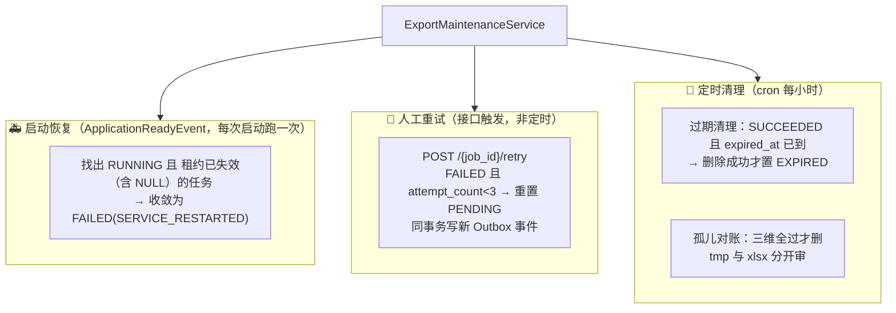
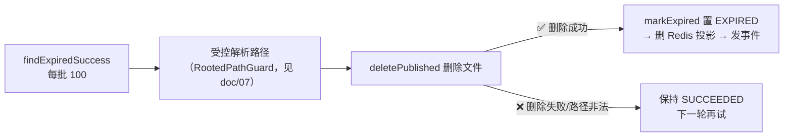

# 08 · 恢复与清理：系统崩溃后没人收尸怎么办

> 🎯 **一句话**：用「租约」识别死掉的执行体，用「启动恢复」收敛僵尸任务，用「删除成功才过期 + 孤儿三维对账」保证磁盘和数据库永远说同一种话。
>
> 代码位置：`export/service/ExportMaintenanceService`（导入侧 `ImportMaintenanceService` 对称实现）

---

## 1. 三类「悬而未决」的状态 💀

一个跑着跑着被 kill -9 的服务，会留下三类烂摊子：

| 烂摊子 | 剧本 | 如果不管会怎样 |
|---|---|---|
| 🧟 僵尸任务 | 执行体抢到 RUNNING 后进程崩溃 | 任务永远卡 RUNNING，前端进度条永远转 |
| 📁 泄漏的正式文件 | `markSucceeded` 后保留期到了没人清 | 磁盘慢慢被吃光 |
| 🗑️ 孤儿文件 | 写了一半崩溃 / 事务回滚但文件已发布 | 数据库里查无此文件的「幽灵文件」 |

`ExportMaintenanceService` 就是清道夫，三招对应三摊：

---

## 2. 租约：执行体的「活着证明」 ⏱️

抢占任务时写入 `lease_expires_at`（默认 5 分钟）；之后**每次推进进度都顺路续租**（见 [doc/06](06-进度状态与SSE实时通知.md) 的三道闸）。

于是「执行体是否还活着」有了一个可判定的机器标准：

> **租约过期（含 NULL）= 这个 RUNNING 是僵尸。**

- 有租约且未过期 → 可能真的还在跑，**绝不误伤**（本地时钟抖动、长 GC 都在容忍范围内）；
- 租约 NULL → 历史遗留数据，同样视为失效（宁可保守收敛，不留永久僵尸）。

---

## 3. 启动恢复：只做「安全的事」 🚑

每次应用启动（`ApplicationReadyEvent` + `@Transactional`）执行一轮恢复，但有三条铁律：

1. **只收敛「租约已失效」的 RUNNING**——服务重启时其他实例的活任务不受影响（单机部署下等价于全收敛，但逻辑是按租约写的，多实例安全）；
2. **Attempt 先行、Job 收尾**——先把当前 RUNNING 的 Attempt 记成 FAILED（审计完整），再把 Job 置 FAILED，两步同一事务；
3. **不自动重跑**——恢复只负责把状态说实话（FAILED / SERVICE_RESTARTED），要不要重跑由人决定（`POST /retry`）。

> 🤔 为什么不自动重试？崩溃往往有系统性原因（OOM、磁盘满、依赖故障），自动重跑很可能原地再崩一次，甚至放大损失。把重试留给人，是刻意的设计保守。

---

## 4. 过期清理：删除成功才算过期 🗑️

SUCCEEDED 的文件保留 24h（`expired_at` 在 `markSucceeded` 时写入）。清理逻辑里藏着一个重要的**顺序决定论**：

**「先删文件、删除成功才改状态」**——状态永远跟随物理事实。反过来（先置 EXPIRED 再删）的话，删除失败会出现「任务已 EXPIRED 但文件还躺着」的永久的假账。

---

## 5. 孤儿对账：三维全过才动手 🕵️

删除任何「数据库里查无此文件」的东西之前，要过三道独立检查（误删正式文件的代价远大于多留几轮）：

| # | 检查 | 挡住什么 |
|---|---|---|
| ① | 文件年龄 > 宽限期（1h） | 正在写入的新文件被当成孤儿 |
| ② | 无任何 RUNNING 且租约有效的任务 | 正在活跃使用的文件被误删（`countRunningWithValidLease`） |
| ③ | Job/Attempt 表无路径引用（`countByFilePath`） | 已发布/已登记文件被当成孤儿 |

`tmp` 半成品与 `xlsx` 正式文件走不同候选逻辑：正式文件判孤儿更严格（可能有活跃任务刚发布尚未登记——宽限期覆盖这个窗口）。

---

## 6. 人工重试的契约 🔧

- 仅 `FAILED` 且 `attempt_count < 3`（MAX_ATTEMPTS）可重试，否则 409 `EXPORT_JOB_NOT_RETRYABLE`；
- 重试 = 条件 UPDATE 重置回 PENDING + **同事务写一条新 Outbox 事件**（复用创建事件契约，分发器/消费端零改动）；
- 失败 Attempt 历史**全保留**——每次尝试一行，重试三次就有三行审计，谁也别想抹掉历史。

导入侧语义差异：**PARTIAL（部分成功）不可重试**——错误行已有错误报告兜底，重跑整单反而可能造成重复导入，详见 [doc/09](09-订单Excel导入.md)。

---

## 7. 测试验证 ✅

`ExportMaintenanceIntegrationTest` 6 用例覆盖最容易被误删/误收敛的场景：

- 活跃租约不误伤（恢复与孤儿对账都不碰有租约的任务）；
- 重试保留历史 Attempt + 新 Outbox 事件 + 抢占计数递增；
- 达上限拒绝重试；
- 「删除成功才 EXPIRED」——删除失败保持 SUCCEEDED；
- 孤儿 tmp 在活跃任务保护期不被删；
- 孤儿 xlsx 三态判定（引用/未引用/过期）。

---

## 8. 遗留与改进 🔭

- 恢复目前只收敛不告警：生产环境 `SERVICE_RESTARTED` 应触发告警；
- 清理批大小（100）与宽限期（1h）为代码常量，可配置化；
- 多实例下定时任务会重复执行（幂等所以无害），可用分布式锁/选主进一步收敛。
