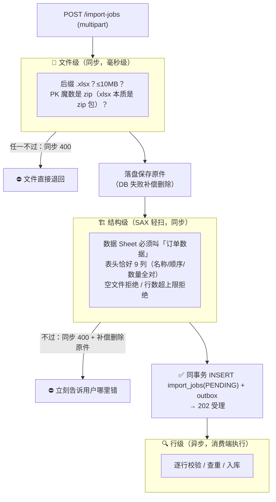
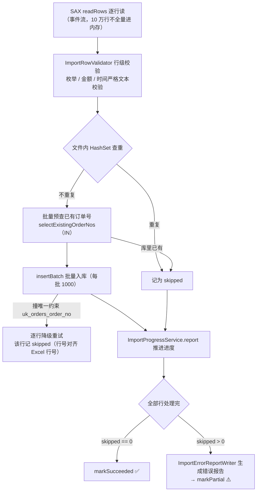

# 09 · 订单 Excel 导入：10 万行文件里混着 300 行错误怎么办

> 🎯 **一句话**：导出的镜像功能——上传 Excel 异步批量入库。核心命题是三层校验（拦住能拦的）+ PARTIAL 部分成功（拦不住的诚实告诉你错在哪）。
>
> 代码位置：`orderimport/` 包全自包含（`controller/dto/service/excel/mq/entity/error`）
> 接口族：`/api/v1/import-jobs`（模板下载 / 上传受理 / 列表 / SSE / 错误报告 / 重试）

---

## 1. 与导出的对称性 🪞

导入完全复刻了导出的异步骨架（Outbox + 消费 + 进度 + SSE + 恢复清理，见 [doc/04](04-可靠投递-Outbox与消费.md)），差异只在「业务本体」：

| | 📤 导出 | 📥 导入 |
|---|---|---|
| 输入 | 数据库查询结果 | 用户上传的 xlsx |
| 校验 | 创建时同步校验命中数 | 文件/结构同步校验，行级异步校验 |
| 产出 | Excel 文件 | 数据库订单 + 错误报告 xlsx |
| 终态 | SUCCEEDED / FAILED | SUCCEEDED / **PARTIAL** / FAILED |
| 失败证据 | error_code + message | + 错误报告文件（可下载） |

**表头单一事实源**：`ImportColumn` 的 key 委托 `ExportColumn`、中文表头委托 `ExcelExportWriter.titleOf`——导入模板的 9 列永远与导出格式互逆一致，导出列定义改了，导入自动跟随，不存在两处漂移。

---

## 2. 三层校验：先拦住能拦的 🚧

**同步与异步的分界线**：文件坏了、模板错了，用户需要**立刻**知道并改了重传（同步 400）；某一行手机号填错，不影响「任务受理」，放到异步阶段逐行汇报（错误报告）。这个分界让用户不用「上传→等几分钟→发现表头错了→重来」。

结构校验靠 SAX **轻扫**（`ExcelImportReader.scanStructure`）：不解析全部数据，只读 Sheet 名和表头，所以同步阶段的成本极小。顺带把「PK 魔数对但不是合法 OOXML」的伪装文件在这里识别出来（400 `IMPORT_FILE_CORRUPTED`，并补偿删除已落盘原件，不留垃圾）。

---

## 3. 异步执行管道：逐行过筛 🏭

消费端抢到任务后（CAS 抢占与导出同款，见 [doc/04](04-可靠投递-Outbox与消费.md)）：

**四层防重复导入**（从快到慢兜底）：

1. 文件内 HashSet——同一文件里重复的订单号；
2. DB 预查 `IN`——与库存量订单冲突的，直接跳过；
3. `orders.order_no` 唯一约束——并发场景的最后防线；
4. `DuplicateKeyException` 逐行降级——批量插入撞约束时拆成逐行，把错误精确到行，绝不因一行脏数据回滚整批。

> 为什么「已存在」是跳过而不是报错？导入的语义是「幂等地补充数据」，重复上传同一份文件是常态操作，跳过 + 计数（error_summary 里可见）是更友好的行为。

---

## 4. PARTIAL：部分成功的诚实语义 ⚠️

10 万行里 300 行错了，把整个任务判 FAILED 吗？——不合理：99900 行有效数据扔掉重来对用户是灾难。所以导入有独有终态：

| 终态 | 含义 | 用户能做什么 |
|---|---|---|
| SUCCEEDED | 全部入库，0 行跳过 | 直接用数据 |
| **PARTIAL** | 有效行已入库，错误行跳过，错误报告已生成 | 📥 下载错误报告（`GET /{job_id}/error-report`），改好错误行再传一次（重复行会被自动跳过） |
| FAILED | 系统性失败（如 DB 故障），可能一行都没进 | 人工重试 |

PARTIAL 细节：

- 错误报告是**真正的 xlsx**（错误行号 + 原始内容 + 失败原因），前端直接下载；
- 缓冲上限 5000 行（`import.error-report-max-rows`）：超限截断展示但**计数如实**——报告里永远能看到真实错误总数；
- 生成报告的 DATABASE 失败同样走补偿删除（不留半份报告）；
- 错误摘要 `error_summary` 存 Top N JSON（`[{reason, count}]`），列表页不下载报告也能看到主要失败原因。

---

## 5. 踩坑复盘 🧨

### 坑一：上传超限挂死（本次复盘中最重要的工程故事 💀）

详见 [doc/01](01-公共底座.md) 坑三——multipart 默认上限只有 1MB，超限请求被 Tomcat 中止解析后，浏览器「写不完 body 也收不到响应」，表现为无限挂起。修复组合拳：调大 multipart 闸（11MB）+ `OversizeRequestBodyFilter` 先吞 body 再 400 + `max-swallow-size=-1` + 手工拼 multipart body 的真实 Tomcat 契约测试。

### 坑二：错误报告写出空文件（commit `98661e4`）

错误报告 writer 在某条异常路径下生成了 0 字节的 xlsx 且已登记路径——用户下载到打不开的文件。修复后「生成成功才登记路径」，与导出「登记成功才算存在」的哲学对齐。

**教训**：凡是「生成产物 + 登记引用」的两步操作，登记必须以产物完整为前提；反之（先登记后生成）任何中断都会留下悬空引用。

### 坑三：表头错误提示的体验打磨

表头不匹配时最初直接回显单元格原始内容，超长单元格（或含换行的）能把错误弹窗撑爆。后来统一截断为 50 字符单行预览再回显（日志与响应同规则）——错误信息要**可读**，完整原值留给错误报告。

---

## 6. 模板下载的小心思 📋

`GET /import-jobs/template` 返回的模板不只是空表头：

- 9 列表头（与导出互逆）+ 三枚举列**内置下拉**（防用户手填错误值）；
- 金额列整列预设 `0.00` 数值格式（防文本型数字）；
- 附填写说明页；
- 全部在内存构造 byte[]，无临时文件。

模板质量直接决定行级错误率——校验做得再好，也不如让用户一开始就填对。

---

## 7. 测试验证 ✅

- 上传受理：文件级/结构级校验矩阵 + 真实 Tomcat 契约测试（multipart 挂死回归钉死）；
- 执行链路：行级校验、文件内查重、DB 预查、DuplicateKey 逐行降级、PARTIAL 报告生成、补偿删除；
- `ImportProgressSseIntegrationTest`：进度守卫 + AFTER_COMMIT + 坏连接隔离矩阵（与导出侧对称）；
- 维护清理：启动恢复 / 过期清理 / 孤儿对账（错误报告候选按 jobNo+attemptNo 判定执行在岗）。

---

## 8. 遗留与改进 🔭

- 模板校验提示可进一步本地化/国际化；
- 错误报告目前是「下载-修改-重传」闭环，可演进为在线修复（表格内编辑重提交）；
- 导入字段扩展（如多币种）依赖导出列定义联动，需保持 `ImportColumn` 委托链。
