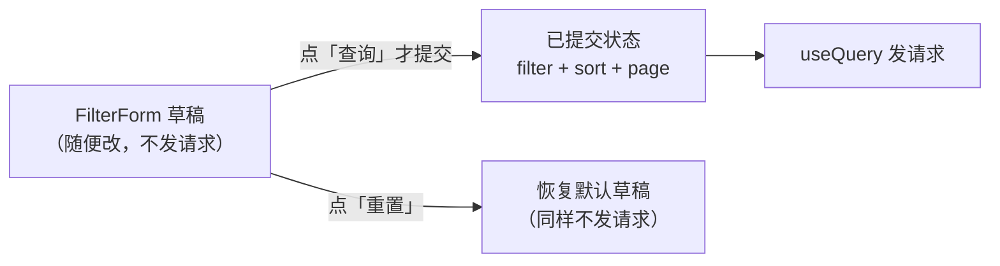
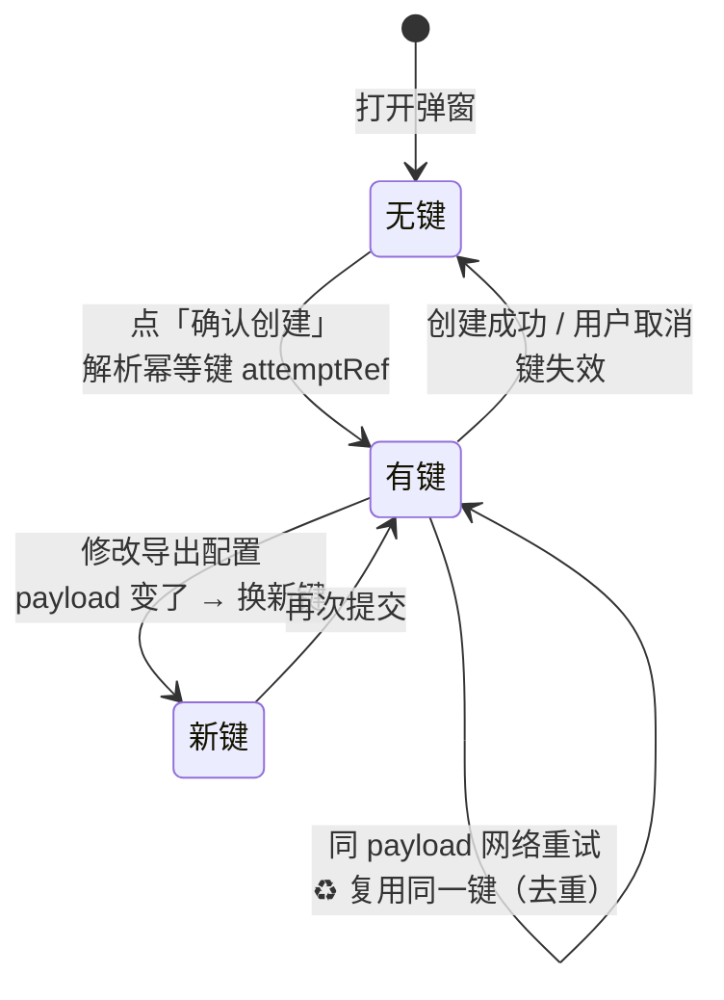
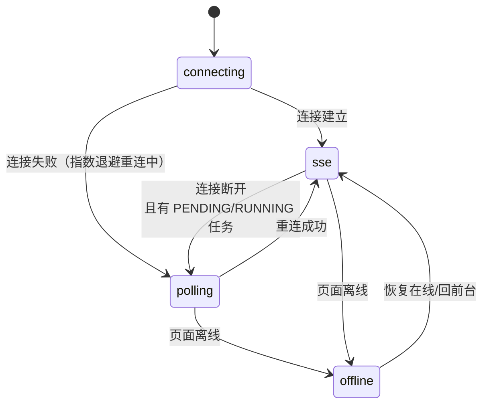

# 10 · 前端交互层：让「异步」在界面上可感知

> 🎯 **一句话**：三个页面（订单 / 导出任务 / 导入任务）+ 一套 API 防腐层 + 一个 SSE 实时同步 Hook——把后端的异步任务变成用户眼里「点了就有进度、好了就能下载」的顺滑体验。
>
> 代码位置：`frontend/src/`（`api/` 防腐层、`app/` 布局壳、`features/` 业务页）

---

## 1. 分层结构

```
frontend/src/
├── api/            ← 🧱 防腐层：Envelope 解包 / 错误转换 / 下载协议（页面不碰 HTTP 细节）
├── app/            ← 🖼️ 布局壳：Sider 导航 + 顶栏（动态页题 + 后端健康徽标）
├── features/
│   ├── orders/     ← 📋 订单列表页（筛选/排序/勾选/两个导出弹窗/导入弹窗）
│   ├── exports/    ← 📤 导出任务页（SSE 实时进度/下载/重试）
│   └── import-jobs/← 📥 导入任务页（SSE/PARTIAL/错误报告下载）
└── styles/         ← 全局样式（滚动条占位、数字等宽）
```

**防腐层是前端的地基**（对应后端 [doc/01](01-公共底座.md)）：

- `api/http.ts` 的 `requestJson`：统一加请求头、校验「2xx 必须是合法 Envelope」、统一解包出 `data`、错误统一转成 `ApiError`（带 message/code/status/traceId/fieldErrors）。页面只认识业务数据和 `ApiError` 两种东西；
- `api/download.ts`：解决「同一 URL 成功是文件流、失败是 JSON/网关错误页」的双面响应（`parseBlobError` / `filenameFromDisposition` / `saveBlob`，机制见 [doc/07](07-文件安全与下载.md)）；
- `api/healthApi.ts`：后端健康是 Actuator 原生 JSON 而非 Envelope，**有意独立**处理、不复用 `requestJson`——防腐层不假装万物同构。

---

## 2. 订单页：表格体验的三个狠细节 📋

### 细节一：草稿与已提交严格分离



输入过程中**零请求**，服务端数据只来自 useQuery，用户意图（草稿）和数据（已提交）两个概念在状态层面就分开了——杜绝「打一个字发一次请求」的典型失控。

### 细节二：零布局位移的表格

9 列全部固定 `width` + `tableLayout: fixed` + `scroll.x/y`（表体定高内滚）+ react-query `placeholderData: keepPreviousData`（翻页时旧数据淡出、新数据淡入，表格不塌陷）+ `scrollbar-gutter: stable`（滚动条常驻占位）。**翻页/排序/筛选全程一行都不跳**。

### 细节三：查询失败的温柔兜底

查询失败时保留上一次成功的数据 + 错误提示（含 trace_id），表格不清空、用户意图不丢——网络抖一下不至于把用户正在做的事冲掉。

---

## 3. 导出弹窗：幂等键的一生 🔑

「确认导出」按钮背后藏着一个防止重复创建的完整设计（`features/orders/idempotency.ts`）：



配合后端（[doc/03](03-导出任务创建与幂等.md)）形成完整闭环：**前端保证「同一意图一个键」，后端保证「同一键同一结果」**。创建成功后 `invalidateQueries(['exportJobs'])` 刷新任务列表缓存，且**不清空勾选**——用户导完还能继续操作。

---

## 4. useExportEvents：SSE 混合同步状态机 📡

这是前端最复杂的一个 Hook（jsdom 单测 6 用例），解决「实时性」与「正确性」的双重要求：



四个防御机制：

| 机制 | 防什么 | 怎么防 |
|---|---|---|
| 🚧 **版本栅栏** | 乱序事件把新状态改回旧状态 | 事件 id 带 `jobId:version`，version 小于本地已见的直接丢弃（后端事件设计见 [doc/06](06-进度状态与SSE实时通知.md)） |
| 🎯 **乐观局部更新** | 全列表刷新闪烁/开销大 | 按 jobId 定点更新对应行，其他行不动 |
| 🔄 **失效收敛** | 乐观更新的行与事实漂移 | 失败/异常路径回退为 `invalidateQueries` 拉真实数据 |
| ⏱️ **轮询降级** | SSE 挂了进度就死了 | 非 sse 模式 + 存在进行中任务 → 3s 轮询（页面不可见时放宽到 15s，尊重浏览器省电） |

外加完整生命周期清理：组件卸载关连接、页面隐藏暂停、离线暂停、回前台立即 HTTP 校准一遍（SSE 中断期间可能漏推）。

> 🧠 心智模型：**SSE 负责「快」，HTTP 负责「准」**——推送到的更新先上屏（快），可疑时刻用查询校准（准）。

配套 UI：`ConnectionBadge` 徽标只描述**连接状态**（实时通道正常 / 已降级轮询 / 不可达），刻意不把「通道断了」说成「任务失败」——不夸大故障是信任设计的一部分。

---

## 5. 导入任务页与上传守卫 📥

- `ImportJobsPage` + `useImportEvents` 与导出侧对称（5 类 SSE 事件、PARTIAL 语义、错误报告下载、人工重试），机制不重复展开；
- 有意思的增量是 `uploadGuards.ts`：**上传前的前置守卫**——选文件阶段就做后缀/大小检查（jsdom 可单测），把「明知道会失败的上传」挡在浏览器里，不浪费一次 multipart 请求（后端三层校验兜底不变，见 [doc/09](09-订单Excel导入.md)）；
- 导入入口（`ImportModal`）挂在订单页：模板下载、选择文件、提交后跳导入任务页——用户动线与导出一致（创建页 → 任务页）。

---

## 6. 主题与工程化 🎨

- 主题全部收敛在 `main.tsx` 的 antd `ThemeConfig`（token 化），组件内颜色一律取 token 不写死；`ConfigProvider` + antd `<App>` 包装根组件，`message`/`modal` 走上下文实例（避免静态方法告警）；
- 页题/菜单文案单一事实源在 `app/layoutMeta.ts`（node 单测覆盖）；
- 顶栏 `HealthBadge` 每 15s 轮询 `/actuator/health`，Tooltip 展示 db/rabbit/redis 组件细分——后端「优雅降级」哲学在 UI 上的直接投影；
- `.claude/` 配了 PostToolUse hook：改任何 `frontend/` 文件自动跑 `npm test && npm run build`——前端改动的最小验证闭环是工程强制的（详见 [doc/11](11-测试与质量守门.md)）。

---

## 7. 测试验证 ✅

- 防腐层：`http.test.ts`（Envelope 校验/错误转换）、`download.test.ts`（双面响应分流/文件名解析）；
- 纯函数层：`filters/selection/idempotency/uploadGuards` 均有单测（纯函数是前端可测性的红利，能拆纯函数的逻辑不留在组件里）；
- Hook：`useExportEvents.test.tsx` / `useImportEvents.test.tsx`（jsdom 模拟 EventSource 生命周期）；
- 真实链路：Playwright E2E 覆盖三页联动（见 [doc/11](11-测试与质量守门.md)）。

---

## 8. 遗留与改进 🔭

- 无路由：本地状态切页，刷新回到订单页；URL 不承载状态，无法分享「第 3 页的失败任务」这种视图；
- 筛选条件未同步到 URL（与上一条同根）；
- SSE Hook 与轮询逻辑可以进一步抽通用层，导入/导出两个 Hook 有少量平行代码。
