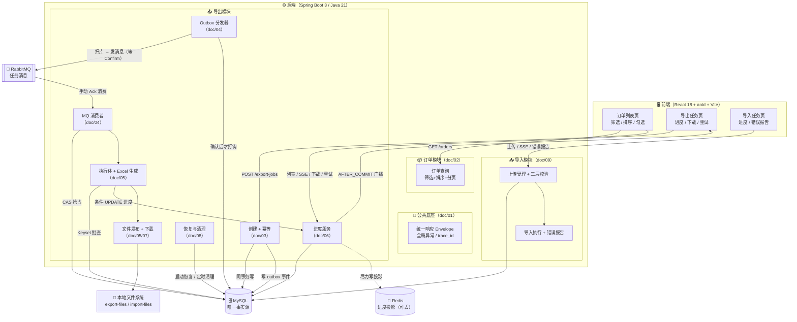
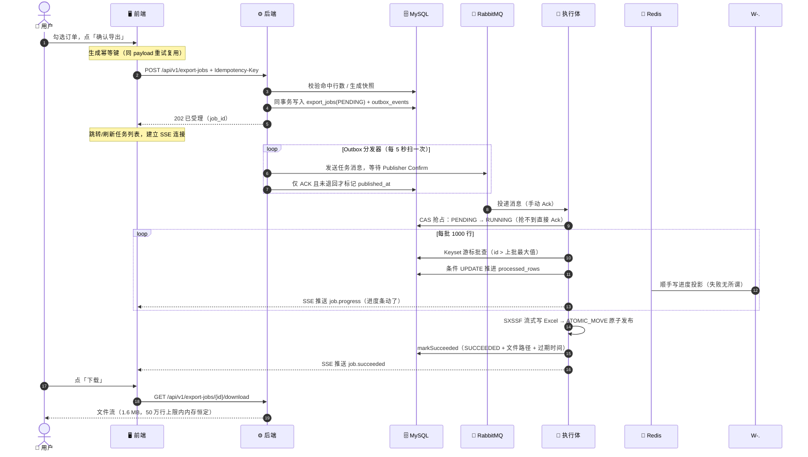
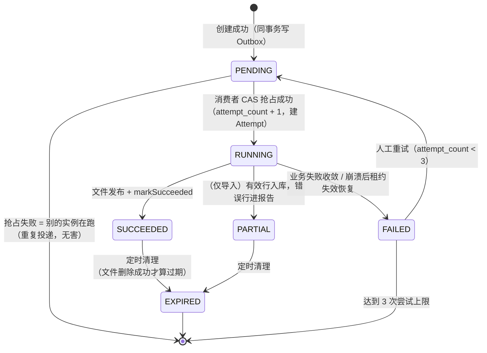

# FlowHub 复盘总览（主文档）

> 🎯 **一句话**：FlowHub 是一个「点击导出 → 后台慢慢生成 → 实时告诉你进度 → 好了之后安全下载」的异步 Excel 导出中心，外加一套完全对称的 Excel 批量导入。
>
> 本目录是项目主要功能的**全方位复盘**：每个功能是怎么想的、怎么做的、踩过什么坑。刚接手的人从这篇开始读。

---

## 目录

- [1. 这个项目解决什么问题](#1-这个项目解决什么问题)
- [2. 全景架构图](#2-全景架构图)
- [3. 一次导出的完整旅程](#3-一次导出的完整旅程)
- [4. 任务的一生（状态机）](#4-任务的一生状态机)
- [5. 功能地图与文档导航](#5-功能地图与文档导航)
- [6. 技术选型与理由](#6-技术选型与理由)
- [7. 复盘：沉淀下来的 8 个可靠性模式](#7-复盘沉淀下来的-8-个可靠性模式)
- [8. 已知边界（诚实地说明没做什么）](#8-已知边界诚实地说明没做什么)
- [9. 阅读建议](#9-阅读建议)

---

## 1. 这个项目解决什么问题

想象一个电商后台，运营想「把上个月的订单导出成 Excel」：

```
😈 天真做法：用户点按钮 → 后端当场查库 + 生成 Excel → HTTP 响应里直接返回文件
```

这条朴素的路在生产环境会寸步难行：

| 😱 问题 | 后果 |
|---|---|
| 50 万行数据要查几分钟 | 浏览器/网关超时，用户看到报错，其实后端还在白干 |
| 整个 Excel 撑在内存里 | 几百个并发导出直接把 JVM 撑爆（OOM） |
| 用户等不到就疯狂点按钮 | 同一份数据被导出 10 次，浪费 10 倍资源 |
| 生成到一半服务重启 | 半个 Excel 被下载走，或者任务永远卡在「处理中」 |
| 进度完全不可见 | 用户不知道是卡了还是在跑，只能刷新/猜 |

FlowHub 的答案是：**把「导出」从一个 HTTP 请求，变成一个有状态、可追踪、可恢复的异步任务**。

```
✅ FlowHub 做法：
   点导出 → 秒回「已受理」→ 后台任务队列慢慢生成 → 实时推送进度条
   → 完成后通知你 → 从任务列表安全下载，过期自动清理
```

导入是完全对称的反向问题：上传一个 10 万行的 Excel，同样不能同步做完 → 同样走异步任务化，并额外解决「有 300 行填错了怎么办」的问题（答案：**PARTIAL 部分成功 + 错误报告**）。

---

## 2. 全景架构图



**三层状态设计的核心思想**（详见 [doc/06](06-进度状态与SSE实时通知.md)）：

- 🗄️ **MySQL 是唯一事实源**——任务状态、进度行数，只认这里；
- 📌 **Redis 是可丢弃的投影**——加速读取用，写失败仅记日志，应用照常跑；
- 📡 **SSE 是实时通知**——事务提交成功后才广播，绝不广播会被回滚的假消息。

---

## 3. 一次导出的完整旅程

以「勾选 5 万条订单 → 导出 → 下载」为例，走完整个系统：



**几个值得驻足的瞬间**：

- 第 5 步「同事务双写」：任务记录和「要执行它」的消息在**同一个数据库事务**里落库——这就是事务性 Outbox，保证不会出现「任务创建了但永远没人执行」（详见 [doc/04](04-可靠投递-Outbox与消费.md)）；
- 第 10 步「CAS 抢占」：消息可能重复投递、多实例可能同时消费，谁用条件 UPDATE 抢到状态位谁执行，其他人直接放弃——重复投递被收敛为**最多一次有效执行**；
- 第 15 步「原子发布」：Excel 先写成 `.tmp` 临时文件，全部写完并落盘后才**原子改名**为正式文件——不存在「下载到半个 Excel」。

---

## 4. 任务的一生（状态机）

导出任务与导入任务共用同一套生命周期骨架（导入多一个 PARTIAL 终态）：



设计要点：

- 🚦 **所有状态迁移都是条件 UPDATE（CAS）**，并发下谁抢到谁生效，天然防重复；
- 🔁 **FAILED → PENDING 只能人工重试**，不自动重跑——故障时刻自动重跑可能放大事故，把决策留给人；
- 🧾 **每一次执行都留下 Attempt 审计行**，任务失败了能查清「哪一次、为什么、跑了多久」；
- 🗑️ **「删除成功才 EXPIRED」**：文件还在磁盘上就不算过期，删失败下轮再试——状态永远跟随物理事实。

---

## 5. 功能地图与文档导航

| 功能 | 状态 | 一句话 | 复盘文档 |
|---|---|---|---|
| 公共 Web 底座 | ✅ | 统一响应/异常/链路追踪/参数防御，所有接口的地基 | [01-公共底座](01-公共底座.md) |
| 订单查询 | ✅ | 8 项筛选 + 白名单排序 + 分页，防 SQL 注入 | [02-订单查询](02-订单查询.md) |
| 导出任务创建 + 幂等 | ✅ | 幂等键裁决「复用 / 冲突」，同事务双写受理 | [03-导出任务创建与幂等](03-导出任务创建与幂等.md) |
| 可靠投递（Outbox + MQ） | ✅ | 先记账再发货，至少一次投递 → 最多一次有效执行 | [04-可靠投递-Outbox与消费](04-可靠投递-Outbox与消费.md) |
| 导出执行 + Excel 生成 | ✅ | Keyset 游标 + SXSSF 滑动窗口，内存恒定 | [05-导出执行与Excel生成](05-导出执行与Excel生成.md) |
| 进度状态 + SSE 实时通知 | ✅ | 事实源/投影/广播三层，版本栅栏防乱序 | [06-进度状态与SSE实时通知](06-进度状态与SSE实时通知.md) |
| 文件安全与下载 | ✅ | 受控目录 + 路径双层防腐，防目录穿越 | [07-文件安全与下载](07-文件安全与下载.md) |
| 恢复与清理 | ✅ | 租约收敛僵尸任务，过期清理与孤儿对账 | [08-恢复与清理](08-恢复与清理.md) |
| 订单 Excel 导入 | ✅ | 三层校验 + PARTIAL 部分成功 + 错误报告 | [09-订单Excel导入](09-订单Excel导入.md) |
| 前端交互层 | ✅ | 三个页面 + SSE 混合同步 + API 防腐层 | [10-前端交互层](10-前端交互层.md) |
| 测试与质量守门 | ✅ | H2 集成测试 + 前端单测 + Playwright 全链路 E2E | [11-测试与质量守门](11-测试与质量守门.md) |

---

## 6. 技术选型与理由

| 层 | 选型 | 为什么是它 |
|---|---|---|
| 后端语言/框架 | Java 21 + Spring Boot 3.3 | 教学场景下生态最全，虚拟线程前的经典并发模型足够演示 |
| 持久层 | MyBatis（XML 动态 SQL） | 筛选条件是动态拼装的，XML 动态 SQL 比.jpa 更直观可控；`criteriaConditions` 片段被查询和导出执行体**共享**，保证两处取数口径永远一致 |
| 迁移 | Flyway | 表结构演进有版本号、可追溯（V1~V9） |
| 消息队列 | RabbitMQ + Publisher Confirm | 「发送方确认 + 手动 Ack」是最容易讲清楚可靠性的组合 |
| 缓存 | Redis | 只做**可丢弃的进度投影**，挂了不影响正确性——演示「缓存要用在刀刃上」 |
| 实时通知 | SSE（而非 WebSocket） | 单向推送够用；HTTP 原生、断线重连语义简单、浏览器兼容好 |
| Excel 写 | POI SXSSF（滑动窗口 100） | 写 50 万行内存不涨；配套临时文件压缩与公式注入防护 |
| Excel 读 | POI SAX（事件流） | 10 万行文件不全量加载 DOM，边读边校验 |
| 前端 | React 18 + TS + antd 6 + react-query 5 | 服务端分页/缓存失效语义成熟，`keepPreviousData` 天然配合列表翻页 |
| E2E | Playwright（真实 Chrome） | 全链路守门：页面操作 → SSE 进度 → 下载校验 → 数据核对 |

---

## 7. 复盘：沉淀下来的 8 个可靠性模式

这是本项目最想传达的东西——**每个「生产事故传闻」背后都有一个对应的工程解法**：

| # | 事故剧本 | FlowHub 的解法 | 关键词 | 文档 |
|---|---|---|---|---|
| 1 | 用户手抖点了两下导出 | 幂等键 + 规范化 request hash：相同请求复用任务，不同请求 409 | `Idempotency-Key` | [03](03-导出任务创建与幂等.md) |
| 2 | 库写成功、消息没发出去，任务永远没人执行 | 事务性 Outbox：消息和业务同事务落库，分发器扫表补发，Confirm 后才打钩 | Outbox 模式 | [04](04-可靠投递-Outbox与消费.md) |
| 3 | 消息重复投递 / 多实例同时消费 | CAS 条件抢占 + Attempt 审计，重复投递收敛为最多一次有效执行 | 抢单语义 | [04](04-可靠投递-Outbox与消费.md) |
| 4 | 50 万行导出把内存打爆 | Keyset 游标批查 + SXSSF 滑动窗口，创建时定格高水位 | 流式处理 | [05](05-导出执行与Excel生成.md) |
| 5 | 用户下载到写了一半的文件 | `.tmp` → `ATOMIC_MOVE` 原子发布 → 数据库登记成功才算存在 | 原子发布 | [05](05-导出执行与Excel生成.md) |
| 6 | 服务重启后任务永远卡在 RUNNING | 心跳 + 租约：租约过期的 RUNNING 在启动恢复时收敛为 FAILED，可人工重试 | 租约机制 | [08](08-恢复与清理.md) |
| 7 | 半成品/孤儿文件泄漏磁盘 | 「删除成功才 EXPIRED」+ 孤儿三维对账（时间宽限 + 无活跃租约 + 无 DB 引用） | 对账清理 | [08](08-恢复与清理.md) |
| 8 | 恶意文件名 / 路径穿越读走任意文件 | 受控根目录 + 路径双层防腐（文本 normalize + 物理符号链接验真） | 路径防腐 | [07](07-文件安全与下载.md) |

以及一个贯穿全局的原则：

> **分层诚实**：MySQL 是唯一事实源，Redis 只是投影，SSE 只是通知。每一层都允许失败，失败只降级不污染事实。

---

## 8. 已知边界（诚实地说明没做什么）

| 边界 | 现状 | 如果要上生产需要 |
|---|---|---|
| 🔐 鉴权 | 无登录/权限/任务归属校验 | 接入 SSO，任务挂归属人，下载鉴权 |
| ☁️ 对象存储 | 文件在本地 `export-files/` 目录 | 换 OSS/S3，下载改预签名 URL |
| 🖥️ 多实例部署 | SSE 广播是进程内连接表，文件在本地盘 | 消息广播（Redis Pub/Sub 或 MQ fanout）+ 共享存储 |
| 🧭 前端路由 | 本地状态切页，无 URL 路由 | 引入 React Router，任务页可分享/收藏链接 |
| 📊 任务详情页 | 列表已含全部派生字段，无独立详情接口 | 补 `GET /export-jobs/{id}` 详情接口 |

这些是**有意的取舍**：教学项目的价值密度在可靠性模式本身，而非外围设施。

---

## 9. 阅读建议

- 🧭 **只想了解项目**：读完本文档 + [doc/03](03-导出任务创建与幂等.md) + [doc/04](04-可靠投递-Outbox与消费.md) 即可建立核心心智模型；
- 🔧 **要改后端代码**：先读 [doc/01](01-公共底座.md)（编码约束都在那里），再按模块读对应文档；
- 🧪 **要写测试 / 排查测试问题**：直接看 [doc/11](11-测试与质量守门.md)；
- 🖥️ **要改前端**：先读 [doc/10](10-前端交互层.md)（SSE 混合同步机制改动前必读）。

配套入口：仓库根目录 [README.md](../README.md)（快速开始与 API 总览）、[AGENTS.md](../AGENTS.md)（面向 AI/新人的完整工程规范，约束的事实源）。
