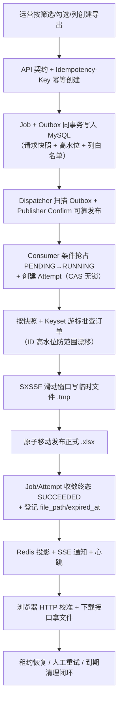
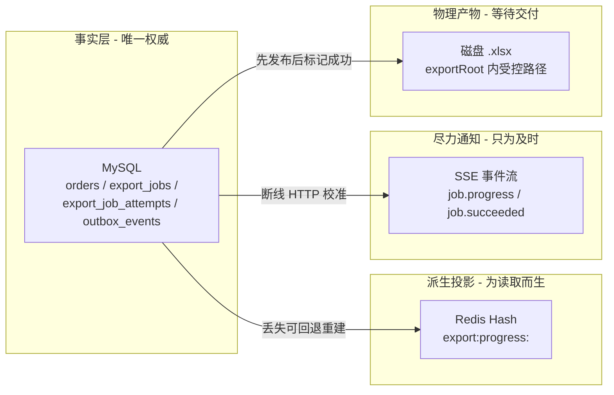

# 学习笔记：终极架构复盘——事实优先、跨资源收敛与演进边界

> 对应教程章节「项目收尾、终极复盘与系统边界」（第 20 章）。
> ✅ 实现状态：**本章是纯架构复盘，主体机制（第 12-19 章）已全部落地**。本文产出两件事：① 把前 19 章分散的机制提炼成可迁移的「判断方法」；② 清晰界定「已实现能力 vs 刻意保留的教学简化 vs 真实生产需补的项目」，形成**尚未实现的规划清单（第 7 节）**。文章里的「验收清单/工程规约」是自检工具，非新功能。

---

## 0. 名词人话速查表（先看这个）

本章没有新组件，它是把前面所有组件「回到用户问题上」重讲一遍。类比：**一台精密钟表面板**——你不需要背每个齿轮（技术选型），但要懂「哪个齿轮崩了，秒针会停在几点」以及「为什么必须先用 SQL 备份再校时」（事实源优先）。

| 名词 | 人话 |
|---|---|
| 事实源 Source of Truth | MySQL 的 Job/Attempt/Outbox 是唯一权威，谁都覆盖不了它（Redis 丢、SSE 断、文件删都不改这个事实） |
| 派生投影 Projection | Redis Hash 进度投影——为「页面快读」生成的缓存，丢了可由 MySQL 重建 |
| 尽力通知 Best-effort | SSE 事件——「提醒页面值得再看一眼」，断线丢事件不影响最终事实 |
| 幂等 Idempotency | 同一意图重发不产生多份副作用；每层要说明「什么副作用只许发生一次，什么可以安全重复」 |
| 条件抢占 CAS | MySQL `WHERE status=PENDING AND attempt_count<3` 这类条件 UPDATE——无锁、原子、唯一起点 |
| 跨资源失败窗口 | DB 与 MQ、文件与 DB 之间没有共同事务——用 Outbox/原子移动/补偿「抚平」窗口 |
| 请求快照 Snapshot | 创建时把筛选/选择/列固定下来——页面关了、筛选改了都不影响正在执行的任务 |
| 租约 Lease | 执行权最晚有效到几点——Worker 暴毙后可判定失联并收敛 |
| Vibe Coding | 用 AI 辅助写码——但架构责任（状态机/事实边界/失败窗口）必须人先定，把 AI 当工具不当黑盒 |
| 教学简化 | 单机、本地文件、人工重试、固定并发——是刻意的 MVP 决策，不是「没做完」 |

---

## 1. 一句话总结

技术选型只是工具，**系统边界才是灵魂**。第 20 章不教新框架，它把前 19 章重新组织成一条主线：**先定义「哪些是事实、哪些是缓存/通知」→ 再识别「跨资源的失败窗口」→ 用条件更新/原子移动/Outbox 免锁地收敛 → 用请求快照/租约/资源上限控制不确定性与成本 → 用 traceId/jobId/attemptNo 串起证据 → 界定单机 Demo 边界与生产演进路线**。会背技术名词没有用，能回答「每个组件在保护哪一项失败风险」才算掌握——这也是判断你「真懂 FlowHub」的唯一标准。

---

## 2. 本章要解决的问题：从「功能实现」到「架构设计」的最后一步

前 19 章机器已经能跑通正常路径。本章收尾要跨越三件事：

1. **把零散的机制串回用户问题**——每新增一个组件，都能对应一项失败风险/资源限制；每个状态、字段、日志标识都能追溯到一个用户问题或维护问题。没有这种对应，代码能跑却难维护。
2. **区分「已实现」与「教学简化」**——单机单体、本地文件、人工重试、固定并发是可解释的 MVP 边界；「没有实现」不等于不重要，只是缺少业务前提/规模/运维条件去正确实现。
3. **制造失败路径验证**——正常路径只占一半。真正值得花时间的是主动制造失败（重复点击、Redis/MQ 不可用、非法路径、租约过期的 RUNNING、删除抛异常），看系统在失败时是否仍能给出可解释、可审计的状态。

---

## 3. 全链路与全景图

### 3.1 从用户点击到出文件的完整生命周期（不是部署图，是业务生命周期）

每一步都回答一个问题：**谁带来输入、哪些信息必须持久化、谁有权执行、完成后什么才算成功、异常后用户怎么看到可解释状态**。这条链路里又隐含了四类事实边界的划分（见 3.2）。

### 3.2 四类事实边界：谁能覆盖谁（核心心智模型）

**铁律**：冲突时一律以 MySQL 为准。Redis 丢了 → MySQL 重建进度；SSE 断了 → HTTP refetch；MQ 重复 → 条件抢占拒绝重复执行；磁盘有 .xlsx ≠ 任务一定成功（须 DB 记为 SUCCEEDED 才可下载）。教材反复警告三个错误推断：「已推 succeeded 所以不必写库」「Redis 有进度所以 MySQL 不必更新」「磁盘有文件所以一定成功」。

### 3.3 四大设计支柱一览（终极全景）

| 支柱 | 要义 | 期间章节 | 仓库中的载体 |
|---|---|---|---|
| ① 契约与意图固定 | 幂等键 + 请求快照锁定创建时语义，拒绝范围漂移 | 12 | `Idempotency-Key`/`request_hash`/`filter_snapshot`/MAX(id) 高水位 |
| ② 状态与事务收敛 | Job 同 Outbox 同事务；CAS 条件抢占无锁原子收敛 | 13,14,18 | `claimPending`/`markSucceeded`/`markFailed` 条件 UPDATE |
| ③ 资源与工作量控制 | Keyset 分页 + SXSSF 滑动窗 + prefetch/并发硬限 | 15,17 | `findBatch`/`WorkbookSession`/concurrency=2+prefetch=1 |
| ④ 观察、自愈与生命周期 | 租约心跳 + 恢复扫描 + 三维对账物理对称清理 | 16,19 | `ExportMaintenanceService`/`updateProgress` 续租/孤儿对账 |

这四根支柱可整体迁移到批量导入、报表、邮件群发、视频转码、AI Agent 长任务。

---

## 4. 核心设计点：七个可重复的设计判断

下面七个不是框架 API，是面对任何「后台异步做点事」时先问自己的顺序。

### 4.1 先写清任务契约与状态

至少回答：输入有哪些、哪些要存快照；创建何时接受、何时才算完成；有哪些合法状态、谁有权转换；每个状态下用户能做什么。FlowHub 用 **202 Accepted** 回应「已接收」而非「已完成」，状态机为 `PENDING → RUNNING → SUCCEEDED/FAILED/EXPIRED`（外加重试回 PENDING）。**状态机不是解决文件/MQ/缓存问题，而是为后续每个条件更新提供共同语言**——写不清状态，重试、下载、过期、错误提示就散落各处。

### 4.2 为重复请求与重复投递分别设计幂等（不同来源不同刀）

| 重复来源 | 保护 | 保护的副作用 |
|---|---|---|
| 用户双击、网络重试 | Idempotency-Key + 请求指纹 + 唯一约束 | 不创建两个 Job |
| Dispatcher 不确定 Confirm | Outbox 可重复发布 | 不丢失执行机会 |
| RabbitMQ 重复投递同消息 | PENDING→RUNNING 条件抢占 | 不产生两个有效执行 |
| 清理任务重复运行 | 删除后再条件更新状态 | 不把已删除文件重复推进 EXPIRED |

**「系统支持幂等」不是总开关**：Outbox 发布允许重复（Consumer 会再查执行权）；但同一幂等键配不同请求体必须 409 冲突，不能静默复用别的任务。

### 4.3 把跨资源失败窗口暴露为可恢复事实（不是硬凑全局事务）

| 跨资源边界 | 风险窗口 | 仓库收敛方式 |
|---|---|---|
| MySQL ↔ RabbitMQ | Job 已建，消息没发布 | Job+Outbox 同事务；Dispatcher 扫描 + Confirm 标记 |
| Excel `.tmp` ↔ 正式文件 | 下载可能看到半成品 | 先写 `.tmp`，关闭后才原子移动 |
| 正式文件 ↔ MySQL 成功态 | 文件在但 Job 未成功（或相反） | 先发布文件再写 SUCCEEDED；DB 失败补偿删除 |
| RUNNING ↔ 进程存活 | Worker 消失任务永久卡住 | 心跳 + 租约 + 恢复扫描 + 人工重试 |

比「把所有事放一个事务」更接近真实工程——DB 事务只能覆盖 DB 资源；文件/MQ/浏览器各有提交语义。可靠性来自明确顺序、持久化证据、条件更新、失败后的下一步。

### 4.4 区分当前事实、派生投影与尽力通知

页面同时显示 DB 状态、Redis 进度、SSE 事件时，必须知道谁能覆盖谁（见 3.2）。「连接中断 / 缓存失效 / 事件乱序」时回到可靠查询结果，才是真难点。可迁移到物流状态、转码进度、数据同步等一切「缓存 + 推送」场景。

### 4.5 让资源边界跟随工作粒度

每批查 1000 行、SXSSF 只留 100 行窗口、Consumer 并发 2 + prefetch 1——不是孤立性能参数，是**共同限制单机同时进行的工作量**。

| 资源 | 当前控制点 | 要避免的风险 |
|---|---|---|
| 数据库 | Keyset 批量查询 | 深 OFFSET、长事务、一次读入全部行 |
| JVM 堆 | SXSSF 滑动窗口 | 全量 XSSF 对象堆积 |
| 磁盘 | 临时文件 + 保留期 + 清理 | `.tmp` 与正式文件无限增长 |
| MQ 消费 | 并发 2 + prefetch 1 | 一台服务领过多重任务 |
| 浏览器 | SSE 退避 + 轮询降级 + HTTP 校准 | 断线被误判为失败 |

**量增大时不能只把 1000 改成 10000**——先找瓶颈（DB 读率 / Excel 格式化 / 磁盘 / 并发 / 是否需要单个超大 XLSX）。超大结果可能要分片、CSV、异步报表，而不是无限调大堆内存。

### 4.6 用标识把跨组件证据串起来

四个不能互相替代的标识：

| 标识 | 指向 | 出现位置 |
|---|---|---|
| traceId | 一次请求/异步上下文的诊断关联 | HTTP Header、MDC、Outbox Header、Consumer 日志 |
| jobId / jobNo | 用户可见的导出任务 | API、MySQL、文件目录、日志 |
| attemptNo | 同一 Job 的某次真实执行 | Attempt 表、临时/正式文件名、日志 |
| messageId | 一条 MQ delivery/发布消息 | RabbitMQ 诊断与重复消息分析 |

不能用 traceId 代替 Job（一个 Job 多请求多执行）；不能用 Attempt 代替 Job（Attempt 是历史而非当前视图）。**以 `ExportMaintenanceService`（`ExportMaintenanceService.java:31`）为例**：每批续租、恢复扫描、对账的关键路径都靠这些标识联动——排查时才不会把一次重试当成第一次执行的延续。

### 4.7 把恢复和清理当作正常生命周期，而非异常尾巴

可靠不保证不失败，保证失败后：用户不会长期看到无解释的 RUNNING；完成的 Attempt 不被重试覆盖；重试沿用同一套投递与执行权；文件删除失败不谎称已 EXPIRED；维护任务重跑不破坏状态机。**「可恢复」= 让系统回到有事实、有边界、能做下一步决定的状态**，而非自动把任务变回成功。

---

## 5. 与仓库现状的对照

### 5.1 cybersecurity 护栏：安全与可观测是设计不是开关

| 维度 | FlowHub 现状 | 教学简化 → 生产演进 |
|---|---|---|
| 用户身份与权限 | 单用户 / 受信任内网，无 RBAC/多租户 | 从「谁可创建/查看/下载」开始设计，JWT 只是实现方式 |
| 文件存储 | 单机 exportRoot 受控路径 + 原子移动 | MinIO/S3 + 签名 URL + 多实例共享 |
| 可观测 | traceId/jobId/attemptNo/messageId + 结构化日志 | 指标、仪表盘、告警、SLO、分布式追踪 |

### 5.2 架构复盘：单机单体 ≠ 一个类里

当前单 Spring Boot 进程承载 API、Dispatcher、Consumer、SSE、维护调度。**注意区分三个概念**：单体（进程怎么部署）、分层（代码怎么组织）、异步任务（工作何时发生）。Controller/Service/Mapper/文件服务/消息组件/维护服务职责仍清晰分离，符合「Controller 处理 HTTP、Service 编排事务、Mapper 处理 SQL」的分层规约。

### 5.3 工程规约核查（对照仓库默认即达标的习惯）

| 文章规约 | 仓库现状 | 典型载体 |
|---|---|---|
| 分层职责 | ✅ 三层 + 文件/消息组件 | `export/` 下 controller/dto/service/mapper/entity/vo |
| DTO/Entity/VO 分离 | ✅ record 承载不同语义 | `CreateExportJobRequest`/`ExportJob`/`ExportJobAcceptedVO` |
| 状态/列白名单/上限枚举化 | ✅ 有语义常量 | `ExportStatus`/`ExportColumn`/`MAX_ATTEMPTS`/ROW_WINDOW |
| 参数化 + 白名单 | ✅ MyBatis `#{}` | `OrderMapper.xml`/`ExportOrderMapper.xml` 条件片段 |
| Schema 迁移 | ✅ Flyway 前向迁移 | `export_jobs` 上 V4 过期列、V5 租约索引（`recoverExpiredRunning` 查询边界已备好索引） |
| 资源释放 | ✅ try-with-resources + 补偿 | `WorkbookSession` close 链、临时文件失败删除 |
| 事务边界 | ✅ 只包共同提交事实 | Job+Outbox 同事务；Attempt+Job 终态同事务 |
| 错误规范 | ✅ ErrorCode/BusinessException/traceId | `ExportErrorCode`/`GlobalExceptionHandler` |

> 文章强调：**规约不替代架构判断**——前者管「同层代码更安全」，后者（状态机/Outbox/发布顺序/租约）管「跨资源失败时系统仍成立」。两者一起用。

### 5.4 与参考项目 / 本仓库的差异说明

| 文章表述 | 本仓库现状 |
|---|---|
| 「独立 Worker」「MinIO」「集群锁」 | ⚠️ 全部是**教学简化边界**——单机单体、本地文件、人工重试、固定并发是有意识取舍，不是遗漏（详见第 6/7 节） |
| Vibe Coding 约束提示 | ✅ 仓库即范本：MySQL 是事实源、Job+Outbox 同事务、重复投放由条件抢占收敛、下载只访问受控相对路径——这些约束都已固化为代码 |

---

## 6. 明确不做的事（当前单机边界）

- **不做多实例 / 分布式调度**：单机单体部署；独立 Worker、Leader Election、集群调度锁属生产演进。
- **不做对象存储**：MinIO/S3、签名 URL、多实例共享下载未引入——对象存储会改变发布协议、下载授权、保留策略与失败补偿，不是换个 SDK 上传。
- **不做安全与多租户**：无登录/JWT/RBAC/数据权限——只在 Controller 加登录校验不足以保护异步 Worker 后续读取的数据。
- **不做自动重试 / DLQ 运维**：维持**人工重试**（`POST /{job_id}/retry`，FAILED→PENDING + 同事务新 Outbox，最多 3 次）；无错误分类、退避抖动、熔断背压。
- **不做取消 / 暂停 / 优先级 / 断点续传**：Attempt 2 从快照与数据边界从头重跑（`processed_rows` 从 0 起）。
- **不做跨实例 SSE 广播 / 事件回放 / Last-Event-ID**：SSE 只通知本机连接，前端靠 `job_version` + HTTP refetch 校准。
- **不做 Redis 分布式锁**：MySQL 条件更新已保证唯一执行起点，天然免锁。

「没有实现」≠ 不重要——是缺少业务前提/规模/运维条件去正确实现；把未来能力提前塞进单机 Demo，会因无法验证而变得「看起来复杂却无效」。

---

## 7. 尚未实现的规划（新规划清单）

> 第 20 章把施工清单转成了**生产演进路线**。按「先有业务压力，再逐项引入」原则排序，而非一次性全上。

### 7.1 近期：把当前单机闭环补完整（独立计划，见 `docs/export-sse-design.md`）

| 项目 | 说明 | 依赖 |
|---|---|---|
| 前端导出任务页 + `useExportEvents` | SSE 混合实时消费（事件 + `job_version` 版本栅栏 + HTTP 校准 + 轮询降级）；UI 上列表/进度/下载 | 后端 SSE 端点已就绪（第 16/18/19 章） |
| 导出任务列表接口真实化（P-4） | 当前 `GET /api/v1/export-jobs` 是空列表占位 → 接真实 MyBatis 分页查询 | — |
| 导出任务详情接口 | 单任务详情（快照/进度/错误/Attempt 历史） | P-4 |
| 前端筛选条件 URL 同步与路由 | 订单页筛选/排序/勾选进入 URL，可分享/刷新保留；引入 react-router | P-4 |

### 7.2 中期：真实业务压力触发后引入（每个都有明确触发问题）

| 能力 | 触发信号 | 引入前必须判断 |
|---|---|---|
| 认证 / 授权 / 多租户 | 进入真实内部后台 | 谁能创建/查看/下载；筛选是否受数据权限；幂等键是否按租户隔离 |
| 对象存储（MinIO/S3） | 多实例、文件跨实例不可见 | 临时对象/完成标记/对象键/签名 URL/保留期/失败补偿重新设计 |
| 独立 Worker 部署 | 导出负载拖慢交互 API | API 容量与 Worker 容量分离、队列容量控制 |
| 集群调度锁 / Leader Election | 多实例都跑 `@Scheduled` 清理 | 哪些任务全局单次、锁失效如何恢复；文件扫描竞争用条件更新已兜底状态但文件仍竞争 |
| 跨实例 SSE 广播 | 连接分散在多实例 | Redis Pub/Sub / 消息主题；事件持久化、顺序、用户隔离 |
| 配额 / 限流 / 背压 | 租户并发提交大导出、排队增长 | 队列长度限制、优先级与饥饿边界、拒绝策略保护 DB 与磁盘 |
| 自动重试 + 失败分类 | FAILED 需要自动化 | 区分 MQ/Redis/目录不可写/配置损坏/DB 超时/用户取消再定下一步 |

### 7.3 长期：做大任务时才有意义

| 能力 | 说明 |
|---|---|
| 分片 / 断点续传 / 可恢复 checkpooint | 失败后避免从第 1 行重跑；需持久化稳定游标/分片/产物，重新定义 Attempt 语义 |
| 取消 / 暂停 / 优先级 | 不只是加状态值——需定义 Worker 检查点、临时文件清理、从暂停恢复规则 |
| DLQ 运维流程 / 事件回放 | 明确哪些消息进 DLQ、谁查看、如何关联 Job/Attempt/traceId、重投前修正根因 |
| 可观测性平台 | 指标 + 仪表盘 + 告警 + SLO（如「95% 导出 10 分钟内成功/失败收敛」）+ 分布式追踪 |
| 读库 / 副本 / 导出专用数据通道 | API 查询被导出拖慢时再引入 |

### 7.4 建议演进顺序

`P-4 列表/详情真实化 → 前端导出任务页 + useExportEvents（完成按钮到下载的全链路 UI）→ 认证与多租户（进内网先做）→ 对象存储 / 独立 Worker / 集群调度（上多实例时）→ 配额/背压/自动重试（扛不住时）`。每一步都对应当前明确边界（第 6 节），从显式边界继续演进，而不是整体推倒旧代码。

---

## 8. 本章沉淀（记忆卡）

- **技术选型是工具，系统边界是灵魂**：每加一个组件要能对应一项失败风险/资源限制；每个状态/字段/日志标识要能追溯到用户或维护问题——这是最短的理解路径。
- **事实优先（Fact-First）**：MySQL 唯一权威，Redis 是派生投影，SSE 是尽力通知，磁盘文件是物理产物。冲突一律回退 MySQL。
- **免锁收敛（Zero-Lock）**：本地事务绑定 Outbox 补消息丢失；条件更新(CAS)治重复投递；先写 `.tmp` 再原子移动治半成品。拒绝昂贵分布式锁。
- **幂等按来源分治**：用户重试看幂等键+唯一约束；MQ 重复靠条件抢占；Outbox 发布允许重复因为消费端复检。同一键不同请求体必须 409。
- **先状态机后写码**：状态转换先定清，重试/下载/过期/错误才不会散。202 Accepted 承接「已接收」，同步等待 Excel 是大忌。
- **请求快照锁语义**：创建时固定筛选/选择/列 + MAX(id) 高水位——页面变化不影响在跑任务。
- **资源边界跟随工作粒度**：Keyset/SXSSF 窗口/prefetch 并发是共同限制工作量的整体，改动要先找瓶颈。
- **标识分层不可替代**：traceId / jobId · jobNo / attemptNo / messageId 各管一段证据，别混用。
- **恢复 ≠ 重试**：恢复收敛状态留证据（FAILED/SERVICE_RESTARTED），重试是人发起的决策；文件「删除成功才 EXPIRED」与「发布成功才 SUCCEEDED」两端对称。
- **Vibe Coding**：先把契约/状态机/资源边界/失败路径写好，再让 AI 生成代码；约束写进提示（MySQL 事实源、Job 同 Outbox、条件抢占收敛重投、下载只进受控相对路径），能读懂 AI 每处 catch/异步边界在保护什么。
- **明确边界 = 价值的另一半**：单机/本地文件/人工重试/固定并发是刻意 MVP 取舍；生产演进（对象存储/多实例/集群调度/安全多租户/自动重试）应按真实压力逐项引入，不提前硬塞。

至此 19 章机制全部落地并复盘完成。FlowHub 沉淀为可迁移的异步任务方法论：**先事实、再边界、后代码；先复判方法、不复用类名**——这套思维可平滑迁移到批量导入、报表、邮件群发、视频转码与 AI Agent 长任务。