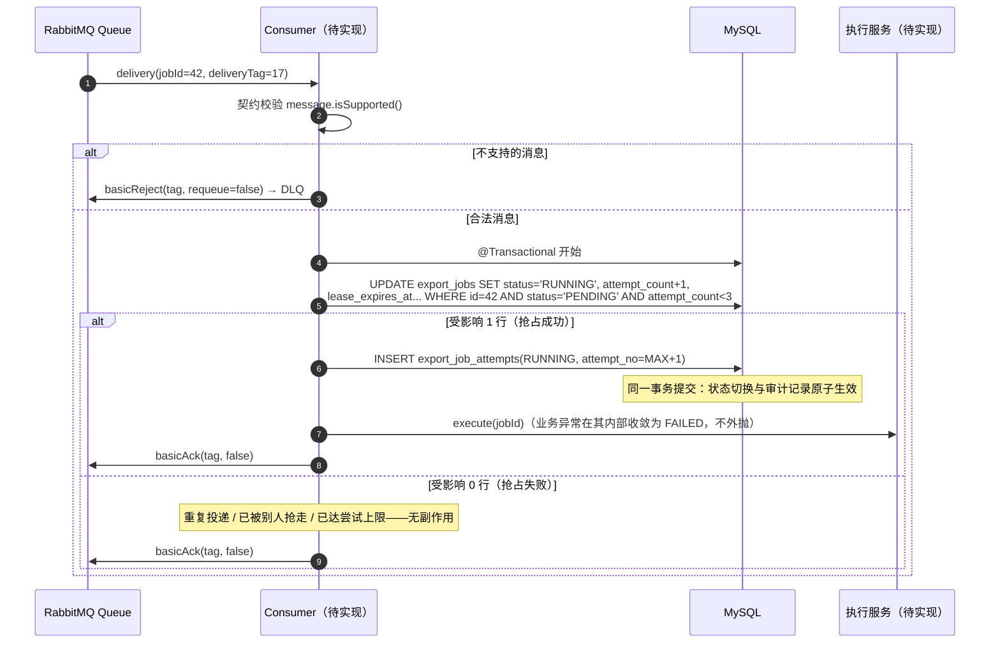
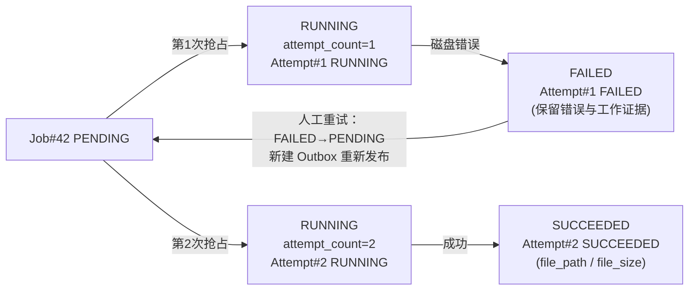
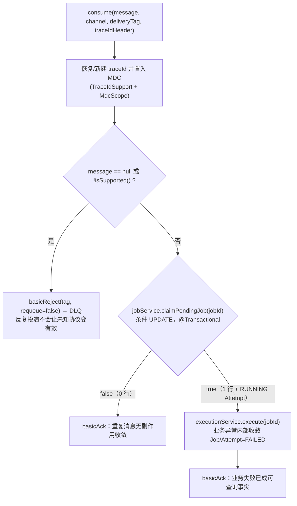
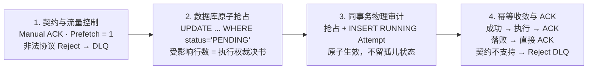

# 学习笔记：消费端安全消费——条件抢占与 Attempt 审计

> 对应教程章节「Consumer 安全消费：手动确认、CAS 抢占与 Attempt 审计」（第 14 章）。
> ✅ 实现状态：本章内容已按第 7 节规划落地——`ExportJobConsumer`（手动 Ack + 契约 Reject 转 DLQ + 条件抢占分流）、`ExportJobService.claimPendingJob()/markFailed()`（抢占与 Attempt 同事务、失败收敛同事务）、`ExportJobAttemptMapper`（MAX+1 插入 + RUNNING 定位收敛）、`ExportExecutionService` 执行壳（失败收敛链路打通，执行体第 15 章替换）与 listener 配置（manual/prefetch=1/concurrency=2）；集成测试 `ExportJobConsumerTest` 10 用例（重复投递单 Attempt / trace 三分支 / 事务回滚无孤儿 RUNNING 等），全量 135 测试通过。lease 恢复、人工重试与 DLQ 运维属第 19 章范畴未实现。

---

## 1. 一句话总结

第 13 章解决「消息能不能从发布方**可靠到达** Broker」；本章解决「Broker 交给执行端后，**谁能执行、什么时候可以确认、执行证据留在哪里**」——把喧嚣的「重复消息轰炸」收敛为**最多一次有效执行**（At-Most-Once Effective Execution），且每一次真实开工都有据可查。

生活类比（一张有编号的工作单）：

| 系统对象 | 类比 |
|---|---|
| RabbitMQ Queue | 前台，把工作单递给某位操作员 |
| Consumer Ack | 操作员签字「这张单我已按规则处理完」 |
| 条件抢占（CAS UPDATE） | 工作台上的状态牌——只有还写着「待领取」的单才能被第一位操作员拿走 |
| Attempt | 每次实际开工留下的操作记录 |

注意：类比只建立顺序。RabbitMQ 不知道 MySQL 里 Job 是否 RUNNING，MySQL 也不会替 Broker 确认消息——三者的协作靠 Consumer 中的**调用顺序**。

---

## 2. 要解决的问题

用户真正关心的四个问题：任务有没有被后台接到？是否真的开始生成文件？消息重复/机器中断时为什么文件不会生成两次？失败时能看到哪一次执行、因为什么失败？

缺少三件套（可靠消费确认 / 唯一执行权 / Attempt 审计）时的三类不可解释状态：

| 缺少的能力 | 用户或维护者会看到什么 | 根本问题 |
|---|---|---|
| 可靠的消费确认 | Consumer 刚收到消息就崩溃，任务永远停在 PENDING | Broker 不知道该不该再次投递 |
| 唯一执行权 | 同一 Job 的两条消息被两个 Worker 同时处理，生成两份文件 | 「收到消息」被误当成「可以执行」 |
| Attempt 记录 | Job 最终失败，却无法知道运行过几次、每次何时开始、哪次写了文件 | Job 当前状态**覆盖**了执行过程 |

本章核心问题的答案不靠 Queue「保证只发一次」，也不靠 Java 内存里的 `Set<jobId>`（重启即失忆、多实例不共享），而是落在**所有 Consumer 都能共同看到的 MySQL Job 状态**上。

---

## 3. 全链路一览



先记住架构职责分工：**RabbitMQ 负责把工作交给 Consumer；MySQL Job 负责裁决谁拥有这一次执行权；Attempt 负责保存真正发生过的执行历史。**

---

## 4. 核心设计点

### 4.1 两种确认的边界：Publisher Confirm ≠ Consumer Ack

| 确认名称 | 谁发出 | 谁收到 | 它真正说明什么 |
|---|---|---|---|
| Publisher Confirm | Broker | Producer / Dispatcher | Broker 已对这次**发布**给出接收结果（第 13 章已实现） |
| Consumer Ack | Consumer | Broker | Consumer 已完成对这一条 **delivery** 的处理路径 |

「已完成处理路径」由应用定义。本项目教学实现选择**同步执行后 Ack**：Ack 位于文件生成与终态收敛**之后**，让消息确认和一次完整执行尝试在同一调用链上可读。另一些系统会先快速落库再 Ack 交独立 Worker 执行——选择由「丢失代价、重复代价、执行时长、恢复机制」决定，没有唯一正解。

### 4.2 手动确认三动作与自动确认的失败语义

deliveryTag 只在当前 Channel 范围内有效。三类动作：

| 操作 | 含义 | 本项目使用位置 |
|---|---|---|
| `basicAck(tag, false)` | 本次 delivery 已按应用规则处理完成，Broker 可移除 | 正常执行完成；重复消息不再执行 |
| `basicReject(tag, false)` | 拒绝且不重新入队，Broker 按配置转入 DLQ | 消息契约不支持（schema 未知/字段非法）→ `export.job.dlq` 排查 |
| Nack / Reject with requeue | 告诉 Broker 重新入队，可能再次交付 | 当前正常业务异常路径不显式使用 |

**自动确认不是「性能更高的手动确认」，而是选择了不同的失败语义**：Broker 一交付就认为完成，Consumer 在后续代码开始前崩溃时消息已被移除，任务可能永远停在 PENDING/RUNNING。手动确认保留重投窗口——Ack 前崩溃会导致重复 delivery，但**不丢失执行机会**；重复 delivery 是需要被应用接住的**正常边界**。

Ack 前后的崩溃时序差异：

| 中断位置 | Broker 视角 | Job / Attempt 可能状态 | 后续责任 |
|---|---|---|---|
| 收到消息前 | 消息仍在 Queue | PENDING | 正常交付 |
| 条件更新前 | delivery 未 Ack | PENDING | Broker 可重投 |
| 抢占+Attempt 提交后、执行前 | delivery 未 Ack | RUNNING / RUNNING Attempt | 重投会抢占失败；lease 恢复（第 19 章） |
| 执行成功后、Ack 前 | delivery 未 Ack | SUCCEEDED / SUCCEEDED Attempt | 重投抢占失败并 Ack |
| Ack 后 | delivery 已完成 | 终态 | Broker 不再重投；数据库已保留事实 |

### 4.3 prefetch 辨析：它不等于「同一时刻只处理一个任务」

```yaml
spring:
  rabbitmq:
    listener:
      simple:
        acknowledge-mode: manual
        concurrency: 2
        prefetch: 1
```

| 参数 | 当前值 | 实际含义 |
|---|---|---|
| listener concurrency | 2 | 最多两个监听线程可并行处理消息 |
| prefetch | 1 | 每个 Consumer 在确认当前 delivery 前**不会预取**更多消息 |
| 业务执行方式 | 同步 | 线程执行 Excel 时仍持有当前 delivery |
| 批量读取 size | 1000 | **数据库**读取批次（第 15 章），与 RabbitMQ prefetch 无关 |

最容易混淆的点：并发是 2 ⇒ 最多两个未确认 delivery、两个 RUNNING Job。prefetch 只限制**每个 Consumer 的 in-flight 数量**；它不是分布式锁、不是数据库连接池、也不是 Excel 批大小。**单任务防双执行靠的是 4.4 的条件更新。**

### 4.4 数据库 CAS 条件抢占：把执行权裁决交给数据库

「至少一次」投递的副作用是同一 `job_id` 可能被推给多个 Consumer 节点。**先查后改**有竞态（A、B 都 SELECT 到 PENDING → 都开始写文件）；进程内的 `ConcurrentHashMap`/`synchronized` 重启即失忆、多实例不共享。正确性落在一条**条件 UPDATE** 上：

```sql
UPDATE export_jobs
SET status = 'RUNNING', processed_rows = 0,
    attempt_count = attempt_count + 1,
    started_at = #{now}, last_heartbeat_at = #{now},
    lease_expires_at = #{leaseExpiresAt}, updated_at = #{now},
    version = version + 1
WHERE id = #{jobId}
  AND status = 'PENDING'
  AND attempt_count < 3
```

MySQL 对这一行的并发更新产生**确定结果**：

| Consumer | 受影响行数 | 是否拥有执行权 |
|---|---|---|
| A | 1 | 是，任务进入 RUNNING |
| B | 0 | 否，已不是 PENDING 或已达尝试上限 |

它不是 Redis 分布式锁，也不需要额外申请带租期的锁对象：状态在 MySQL、`WHERE` 声明「只允许从 PENDING 转换」、数据库原子地判断+更新、受影响行数就是裁决书。第 19 章的 lease 是**抢占成功后**的失联恢复信号，不替代本章对首次抢占的原子判断。

服务层包装（`@Transactional`）：

```java
@Transactional
public boolean claimPendingJob(long jobId) {
    LocalDateTime now = ExportTime.utcNow(clock);
    if (exportJobMapper.claimPending(jobId, now, now.plusMinutes(5)) != 1) {
        return false; // 没抢到：不插 Attempt、不调执行服务
    }
    exportJobAttemptMapper.insertRunning(jobId, now);
    publishChanged(jobId);
    return true;
}
```

### 4.5 抢占与 Attempt 插入必须同一事务

顺序必须固定为「先条件更新、后插 Attempt」，且两步不可拆开——**两个方向**的拆分都会产生脏事实：

- **先提交状态、后插 Attempt**：第二步一旦失败，留下**没有 Attempt 的孤儿 RUNNING**——执行服务找不到 Attempt、恢复逻辑无从判断；
- **先插 Attempt、后抢占**：Consumer A 插入 RUNNING Attempt 后条件更新失败，而 Consumer B 抢占成功——库里留着 A 的**伪执行记录**（B 才是真正的执行者），之后恢复逻辑甚至可能把这条伪记录标为失败，审计失去可信度。

同一事务保证提交后只有两种可见结果：

| 条件更新 | Attempt 插入 | 提交后 Job | 提交后 Attempt | Consumer 后续动作 |
|---|---|---|---|---|
| 0 行 | 不执行 | 原状态/已被别人推进 | 无本次记录 | Ack 当前重复 delivery |
| 1 行 | 成功 | RUNNING | 新建 RUNNING Attempt | 调用执行服务 |
| 1 行 | 抛异常 | **PENDING（事务回滚）** | 无本次记录 | 不 Ack，让消息保留重投机会 |

第三行是关键：回滚后 Job 仍是 PENDING，Broker 重投时可重新抢占——比留下半条 RUNNING 状态可恢复得多。落地时应补一项事务性测试：模拟 `insertRunning()` 失败，断言 `status` 没停在 RUNNING、`attempt_count` 没增加。

`insertRunning` 用 `MAX(attempt_no) + 1` 子查询生成序号，保证重试后不覆盖旧行（叠加 V1 的唯一索引 `uk_attempt_job_no(job_id, attempt_no)` 从库层防重复）：

```sql
INSERT INTO export_job_attempts (job_id, attempt_no, status, started_at, created_at)
SELECT #{jobId}, COALESCE(MAX(attempt_no), 0) + 1, 'RUNNING', #{now}, #{now}
FROM export_job_attempts WHERE job_id = #{jobId}
```

### 4.6 多维事实分离：Job / Attempt / 各计数器各司其职

| 记录 | 保存位置 | 意义 |
|---|---|---|
| attempt_count | export_jobs | 当前 Job 已成功进入 RUNNING 的次数（最大尝试上限判断） |
| version | export_jobs | Job 状态/进度变化时递增，供 SSE/HTTP 状态校准 |
| attempt_no | export_job_attempts | 某一次真实执行尝试的顺序号（可审计历史） |
| message_id | RabbitMQ 消息 | 一次 Outbox 事件的稳定投递标识，可重复交付 |

**Job 与 Attempt 解耦**：Job = 用户要什么 + 全局当前状态；Attempt = 一次真实执行的开始/结束/成败/产物。重复 delivery 若抢占失败，**不能**增加 attempt_count、**不能**插入 Attempt——否则运行中的任务收十次重复消息就会长出十条虚假「执行尝试」。

Attempt 的价值在第一次失败后才显现。人工重试保留历史而非覆盖：



注意区分：**Broker 因未 Ack 而重投**遇到 RUNNING/SUCCEEDED Job 不会生成新 Attempt；只有 FAILED Job 被明确转回 PENDING 后新抢占才创建下一条 Attempt——防止网络抖动被误记成多次业务执行。

### 4.7 消息不合法 vs 业务执行失败：两条分流路径

| 失败类型 | 当前动作 | 创建/更新 Attempt？ | Job 结果 |
|---|---|---|---|
| 不支持的消息版本/空字段 | `basicReject(requeue=false)` → DLQ | 否 | 不以这条消息改变业务 Job |
| Job 已不是 PENDING | Ack 后退出 | 否 | 保持数据库已有事实 |
| 抢占成功后文件写入失败 | 执行服务捕获异常收敛，随后 Ack | 是，标 FAILED | RUNNING → FAILED |
| Consumer 在 Ack 前进程中断 | 无法 Ack | 取决于中断点 | Broker 重投，由抢占与恢复处理 |

「执行失败后 Ack」不是吞错误：先把错误写进 Job 与 Attempt（成为用户可查询的事实），再确认 delivery——避免同一条消息因暂时性文件故障无限重放、不断制造重复 Attempt。用户看到失败原因后按人工重试规则重新进入 PENDING。

### 4.8 Consumer 完整分支控制流



五维标识各司其职、互不替代，常出现在同一条日志里：

| 标识 | 关联维度 |
|---|---|
| job_id | 要处理哪个业务任务 |
| message_id | 消息投递（Outbox 事件指纹） |
| attempt_no | 一次真实执行 |
| trace_id | 跨边界日志串联 |
| deliveryTag | 仅当前 Channel 的确认 |

traceId 缺失不应阻塞导出（它是诊断信息，不是执行权）：Header 合法则恢复到 MDC，非法/缺失则新建。

### 4.9 自检：四种情况的正确反应

| 情况 | Consumer 应做什么 | 创建 Attempt？ | Ack / Reject | 原因 |
|---|---|---|---|---|
| `schema_version = 2`，当前只支持 1 | 不调用任何 Service | 否 | Reject，不 requeue | 反复投递不会让未知协议变有效 |
| 同一 Job 的第二条消息在第一条**执行期间**到达 | 条件更新失败后退出 | 否 | Ack | 已有 Consumer 拥有 RUNNING 执行权 |
| 消息携带合法 jobId，但 Job 已 SUCCEEDED | 不执行 | 否 | Ack | 终态 Job 不应回到 RUNNING |
| 抢占成功后写文件失败 | 执行服务记录失败 | 是，标 FAILED | Ack | 业务失败已成为可查询事实，用户可后续人工重试 |

### 4.10 运维排查速查：先按 Job 状态缩小范围

排查时先看 Job 状态，再看 Attempt 与消息标识，避免把所有 RabbitMQ 日志当成同一种故障：

| 现象 | 最可能的含义 |
|---|---|
| PENDING 且 Queue 堆积 | 尚未交付，或 Consumer 不在线 |
| RUNNING 且同一 messageId 重复出现 | 先前 Consumer 可能在 Ack 前中断 |
| SUCCEEDED 但仍收到 delivery | 可安全忽略的重复投递 |

若 `basicAck` 自身因 Channel 已关闭而失败，**不能假装消息已确认**：关键观测保留在 Job、Attempt、messageId、deliveryTag 和 traceId 上——Broker 可能重投，后续 Consumer 再次进入条件抢占；只要 Job 已 RUNNING 或终态，重投只会走 Ack 或恢复路径，**不会新增有效执行**。

### 4.11 三种投递语义的取舍

| 语义 | 系统更害怕什么 | 允许发生什么 | 适配性 |
|---|---|---|---|
| 至多一次 | 重复处理 | Consumer 崩溃后消息丢失 | 不适合——PENDING Job 可能永远无人执行 |
| **至少一次** | 消息丢失 | 同一 Job 的消息重复到达 | **适合**——但必须用条件抢占消除重复有效执行 |
| 严格一次效果 | 丢失和重复业务副作用 | 实现成本、协调与状态约束显著增加 | 当前项目不承诺 |

「严格一次效果」不是加个注解就能获得：Consumer 在「文件已生成」与「Ack 已发出」之间中断时，仍需业务状态决定重投后能否再次生成。ExportFlow 把这个判断放在 MySQL Job 状态上——**目标不是消息物理上绝不重复，而是重复消息进入业务层后变成无副作用的 Ack 路径**。

### 4.12 从零实现的推荐顺序

1. 定义最小、版本化的消息体（本仓库 `ExportJobMessage` 已就绪）；
2. 配置手动 Ack，用无业务副作用的处理器验证 deliveryTag 能被确认；
3. 实现 `UPDATE ... WHERE status='PENDING'`，测试两个并发调用只有一个成功；
4. 条件更新与 RUNNING Attempt 插入放入同一事务；
5. 抢占失败直接 Ack，不调执行服务；
6. 不支持的消息 Reject 且不重新入队；
7. 接入执行服务，把业务异常收敛为 Job/Attempt FAILED 后正常返回；
8. 最后处理 lease、恢复、人工重试与 DLQ 运维（第 19 章）。

不要先写「收到消息就生成 Excel」的长方法再回头补抢占——那样重复消息、失败收敛和状态会缠在一起。

---

## 5. 与本仓库的对照

**已就绪（直接复用）**：

| 组件 | 位置 | 说明 |
|---|---|---|
| `export_job_attempts` 表 | `V1__init_schema.sql` | job_id/attempt_no/status/started_at/finished_at/created_at + 唯一索引 `uk_attempt_job_no`（库层防重复 Attempt） |
| Attempt 执行列 | `V4__add_export_execution_state.sql` | error_code/error_message/file_path/file_size_bytes |
| 抢占所需 Job 列 | V1 + V4 + V5 | status、version、attempt_count、processed_rows、started_at、last_heartbeat_at、lease_expires_at、max_order_id_at_create |
| 消息契约 + 版本校验 | `export/mq/ExportJobMessage` | `isSupported()`（schema_version=1）即 4.8 契约校验的实现依据 |
| DLQ 落点 | `export/mq/RabbitConfig` | 业务队列带 DLX 参数，`export.job.dlq` 已绑定原 routing key，Reject 消息有去处 |
| trace 基础设施 | `common/web/trace/` | `X-Trace-Id` Header 已由 Dispatcher 写入消息（V7/OutboxDispatcher），`TraceIdSupport`/`MdcScope`/`MdcTaskDecorator` 可直接复用 |
| Outbox 投递 | `export/mq/OutboxDispatcher` | 第 13 章产物：消息已能到达 `export.job.queue`，等待消费 |

**已实现（本章落地）**：

| 组件 | 位置 | 说明 |
|---|---|---|
| `ExportJobConsumer` | `export/mq/ExportJobConsumer` | `@RabbitListener(JOB_QUEUE, ackMode="MANUAL", concurrency="2")`，4.8 控制流：trace 恢复/新建 → 契约 Reject 转 DLQ → 抢占失败 Ack → 执行后 Ack；claim 事务/Channel 异常穿出不确认 |
| listener 配置 | 主/测试两份 `application.yml` | 主配置 `listener.simple`（manual/prefetch=1/concurrency=2）；测试配置 `auto-startup: false` 静默容器（Consumer 逻辑直接方法调用验证，消费参数不经容器不生效故无需两处同步） |
| `ExportJobMapper.claimPending` / `markFailed` | `resources/mapper/ExportJobMapper.xml` | 4.4 条件 UPDATE（attempt_count+1、version+1、lease/心跳回填）与 RUNNING→FAILED 单向收敛（version+1 即 P1 的最小落地） |
| `ExportJobAttemptMapper` | `export/mapper/` + XML | 4.5 的 MAX+1 INSERT…SELECT（聚合恒返回一行，首条亦插 attempt_no=1）与按 job_id+RUNNING 定位的 FAILED 收敛 |
| `ExportJobService.claimPendingJob()` / `markFailed()` | `export/service/ExportJobService` | @Transactional：0 行返回 false / 1 行插 Attempt（MAX_ATTEMPTS=3、lease 5 分钟）；失败收敛 Job+Attempt 同事务原子，errorMessage 截断 500 |
| `ExportExecutionService.execute()` | `export/service/ExportExecutionService` | try/catch 收敛 FAILED（`FILE_GENERATION_FAILED`）后不外抛；执行体占位抛「尚未实现」（第 15 章替换为批量读取 + SXSSF 流式生成） |
| `publishChanged` 事件机制 | ❌ 未实现 | 仅 claim SQL 递增 version；事件发布随 `docs/export-sse-design.md` 的 SSE 前置条件落地 |
| 集成测试 | `ExportJobConsumerTest`（10 用例） | 重复投递单 Attempt 双 Ack / trace 合法恢复·缺失·非法新建 / 事务回滚无孤儿 RUNNING / 契约不支持与坏 JSON 转 DLQ / 执行失败收敛 FAILED / 任务不存在·达上限 Ack |

---

## 6. 明确不做的事（边界）

- ❌ 业务自动重试（失败后由用户人工重试，第 19 章）；
- ❌ 跨进程分布式锁 / Redis 锁（数据库条件更新即裁决）；
- ❌ Exactly-once 语义承诺（受控的重复 + 幂等收敛）；
- ❌ 复杂 DLQ 运维（DLQ 只作排查落点，不做自动回捞）。

本章提供的最小可解释保证：**消息可以重复到达；只有 PENDING Job 能被一个 Consumer 抢占为 RUNNING；每次成功抢占都创建一条新 Attempt；重复 delivery 不创建 Attempt、不重复生成文件。**

---

## 7. 落地规划（建议顺序）

| # | 任务 | 要点 |
|---|---|---|
| P0-1 | ✅ `application.yml` 增加 `spring.rabbitmq.listener.simple` | `acknowledge-mode: manual`、`prefetch: 1`、`concurrency: 2`；测试 yml 只加 `auto-startup: false` 静默监听容器（消费参数对直接方法调用不生效，无需两处同步） |
| P0-2 | ✅ `ExportJobMapper.claimPending` | 4.4 条件 UPDATE 落入 `resources/mapper/ExportJobMapper.xml`；含 `version = version + 1` 与 lease 字段回填（另含 markFailed 单向收敛） |
| P0-3 | ✅ `ExportJobAttemptMapper.insertRunning` | 4.5 的 `MAX(attempt_no)+1` INSERT…SELECT + XML（另含按 RUNNING 定位的 markFailed） |
| P0-4 | ✅ `ExportJobService.claimPendingJob()` | @Transactional：0 行 → false；1 行 → insertRunning；事务回滚语义见 4.5 表（markFailed 同事务收敛 Job/Attempt） |
| P0-5 | ✅ `ExportExecutionService.execute()` 壳 | try/catch 收敛 Job/Attempt → FAILED（写 error_code/error_message/finished_at）；真正的数据读取与流式生成按第 15 章展开 |
| P0-6 | ✅ `ExportJobConsumer` | 4.8 控制流；复用 `TraceIdSupport`/`MdcScope`；Reject 走 DLQ |
| P0-7 | ✅ 测试三件套 | ① 重复消息集成测试（1 Job / 1 Attempt / 两 delivery tag 均 Ack）② TraceId Header 合法恢复/缺失新建 ③ 事务回滚测试（insertRunning 失败 → 无孤儿 RUNNING）；另补契约分流、执行失败收敛、任务不存在、达上限四类用例 |
| P1 | ◐ `publishChanged` 事件机制 | claim SQL 中递增 version 已落地；事件发布随 `docs/export-sse-design.md` 的 SSE 前置条件一起落地 |
| 后续 | lease 过期恢复、人工重试、DLQ 排查手段 | 第 19 章范畴，不在本章范围 |

> 落地完成后需同步更新 `AGENTS.md`（export/mq 描述、已实现清单）与 README——按仓库「重大改动须同步文档」约定执行。

---

## 8. 本章沉淀



- **放弃「保证只送一次」的幻觉，拥抱受控的重复**：至少一次是底线，正确性建立在业务层幂等收敛上，而非网络层承诺；
- **数据库 CAS 是唯一物理裁决**：严禁先查后改；受影响 1 行 = 独占执行权，0 行 = 无副作用 Ack 释放资源；
- **Job 与 Attempt 解耦**：Job 记用户意图与全局状态，Attempt 记每次真实开工的证据（耗时/重试号/文件/异常），抢占与审计原子绑定；
- **五维标识支撑全链路排查**：job_id / message_id / attempt_no / trace_id / deliveryTag 各司其职、互不替代。

> 下一章（第 15 章）预告：抢占成功后的 RUNNING Job 如何读数据——游标查询与深度分页防漂移，既不拖垮 MySQL 也不撑爆 JVM。
