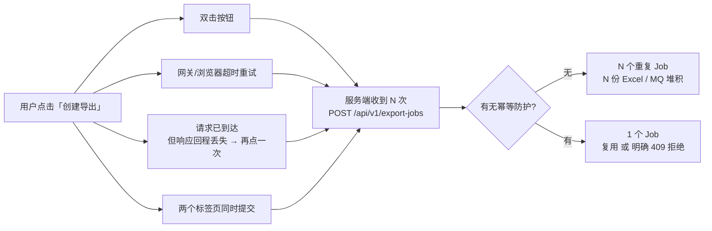
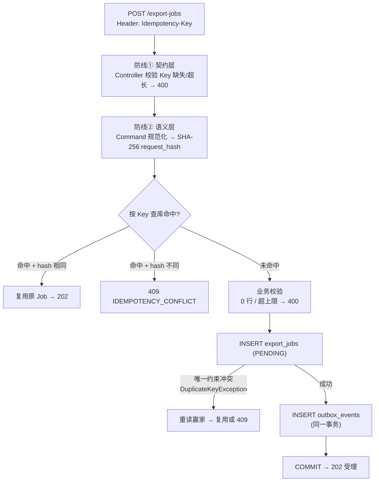
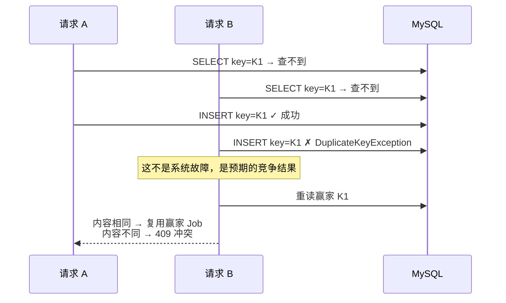
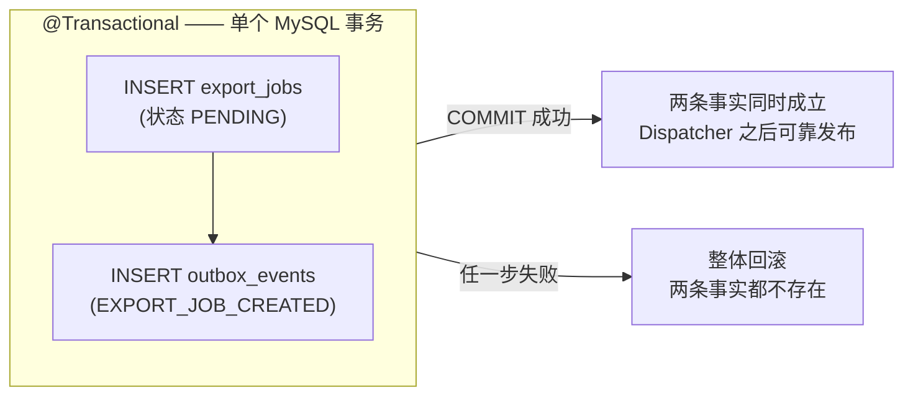
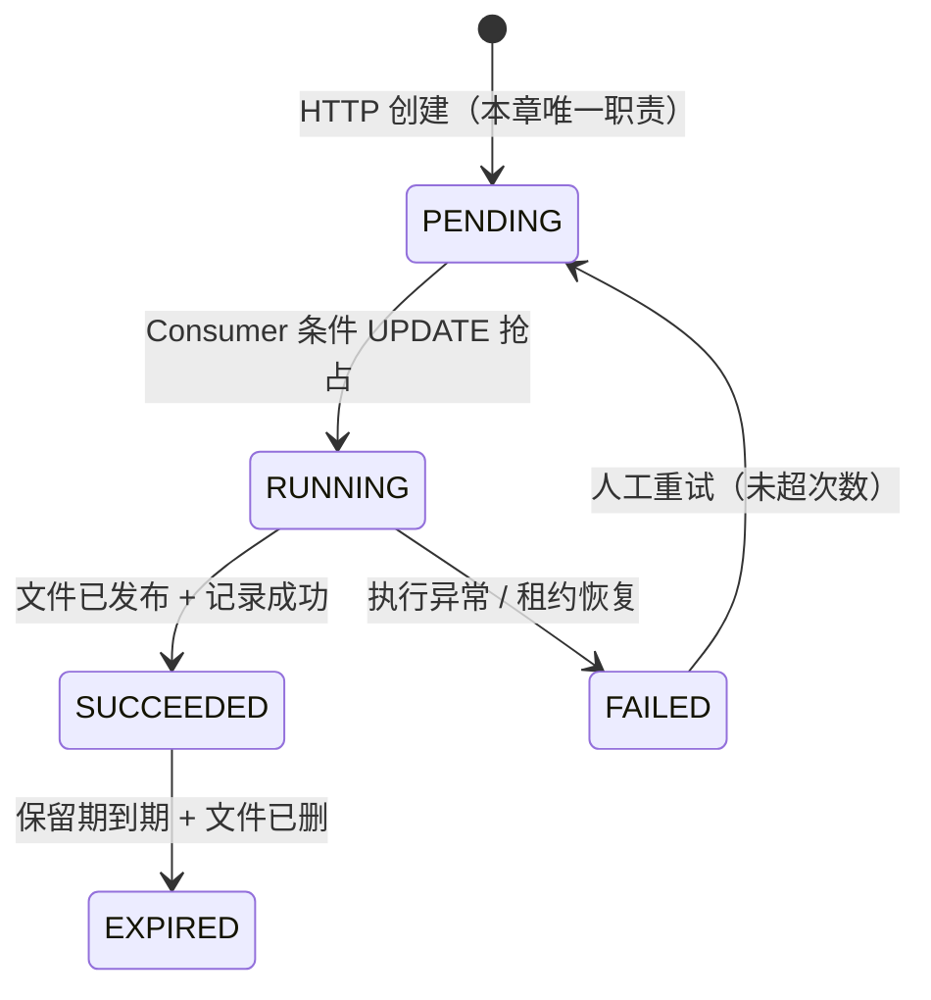

# 学习笔记：创建导出任务的幂等防腐与事务边界

> 对应教程章节「用户点击创建导出后，如何保证同一次意图只产生一个 Job」。
> 本笔记不是全文复述，而是提炼骨架，并结合本仓库 `backend/.../export/` 实际代码逐一印证（含差异对照，见第 7 节）。

---

## 1. 一句话总结

**一次点击 ≠ 一次请求。** 双击、超时重试、响应丢失、多标签页，都会让"同一个用户意图"变成 N 次 HTTP 请求；本章教的是如何让数据库里**永远只出现 1 个 PENDING 任务 + 1 条 Outbox 事件**。

四个核心概念的生活类比：

| 概念 | 类比 | 回答的问题 |
|---|---|---|
| Idempotency-Key | 奶茶店的**取餐号** | 哪几次请求属于同一次意图？ |
| request_hash | 点单内容的**指纹** | 同一个号，点的东西一样吗？ |
| 数据库唯一约束 | 银行**总账** | 几百个柜员同时办卡，凭什么只开一个户？ |
| @Transactional | 一单**打包两件货** | Job 和"要发消息的记录"能否同生共死？ |

幂等的定义（背下来）：**同一业务意图被重复执行后，系统最终产生的业务效果与执行一次相同。**

---

## 2. 重复从哪来

关键认知：**目标不是让系统"只收到一次请求"**（做不到），而是识别哪些重复属于同一意图，让重复请求返回已有结果或安全地不产生新效果。

---

## 3. 四层防线（本章骨架）

### 防线① 契约层：Idempotency-Key 认出"同一次意图"

- 前端生成 UUID 放进请求头；服务端在 `ExportJobController.java:43` 读取，缺失/超长（>128）直接 400。
- **Key 的粒度是业务决策**：什么时候算"同一次意图"、什么时候算"新意图"，必须明确写进契约（本仓库见 `docs/prd.md` 7.4.2）。

### 防线② 语义层：规范化让"同义请求"得到相同指纹

直接哈希原始 JSON 是错的——`[18,23,42]` 和 `[42,18,23]`、`" paid "` 和 `"paid"` 语义相同，指纹却不同，安全重试会被误判为冲突。所以先规范化（`CreateExportJobCommand.from()`），再对规范化结果算 SHA-256 存入 `request_hash CHAR(64)`：

| 字段 | 规范化方式 | 代码 | 为什么 |
|---|---|---|---|
| 订单 ID / 排除 ID | 剔空 + 去重 + 升序 | `normalizeIds` | 是**集合**，顺序不表达业务差异 |
| 空字符串筛选条件 | 折叠为 null | `ParamUtils.trimToNull` | 没填 ≈ 传了空串 |
| 金额 | `compareTo` 比较 | `ParamUtils.parseDecimal` | 15 与 15.00 是同一金额 |
| 文件名 | trim + 剔除 `\ / : * ? " < > \|` 等非法字符 | `normalizeFileName` | 保存与下载需要安全稳定名称 |
| 导出列 | trim + 白名单校验 + 去重 | `normalizeColumns` | 未知列立即报错，绝不静默忽略 |

⚠️ **最常见的误区**：规范化 ≠ 一律排序。集合可以排序；**有序列表不能乱排**——列顺序会改变 Excel 表头，排序它就破坏了业务语义。（本仓库在这点上与教程文章不同，见第 7 节。）

### 防线③ 物理层：数据库唯一约束是并发的最终裁判

"先 SELECT 再 INSERT"挡不住并发——两个请求可以同时 SELECT 都查不到。SELECT 只是**快路径**（让大多数重复请求不进统计/插入），真正兜底的是 V2 迁移加的唯一约束 `uk_export_jobs_idempotency_key`：

代码位置：`ExportJobService.java:98`（catch 分支）、`V2__add_export_job_idempotency.sql:28`。无论多少请求同时到达，数据库中**只有一行**携带该 Key 的 Job——内存锁、进程内 Map 都做不到这一点（多节点部署下根本不共享内存）。

### 防线④ 原子层：@Transactional 让 Job 与 Outbox 同生共死

异步任务需要两条事实：**Job**（业务状态）和 **Outbox 事件**（"有一条消息要发给 MQ"的记录）。分开写就会产生"任务存在但没有投递记录"或"事件指向不存在的任务"的半成品：

**严格限定**：事务只覆盖 MySQL，**不覆盖 RabbitMQ**。"数据库已提交但消息还没发出"的窗口由下一环节（Outbox Dispatcher，第 13 章）负责收口。Outbox 模式一句话：**先在数据库里把"要发消息"记成事实，再由后台进程照单发货**——彻底避免在 HTTP 线程里直发 MQ 造成的"DB 成功 MQ 失败"。

---

## 4. 状态机：创建阶段只负责写 PENDING

异步任务禁止用一个模糊的 `done` 布尔值；五个状态各有明确的允许迁移：

| 当前状态 | 允许的后继 | 触发者 | 反例（禁止） |
|---|---|---|---|
| PENDING | RUNNING | Consumer（条件 UPDATE 影响 1 行） | PENDING 直跳 SUCCEEDED——没有可审计的执行过程 |
| RUNNING | SUCCEEDED / FAILED | 执行服务 | 用户"取消"运行中任务——MVP 无安全取消 |
| FAILED | PENDING | 人工重试 | 保留历史 Attempt，而不是删掉重来 |
| SUCCEEDED | EXPIRED | 维护任务 | EXPIRED 回 PENDING——过期重导应是新任务 |

本仓库当前只实现到**创建段**（写 PENDING + Outbox）；执行态列已在 V4/V5 迁移中预留，Consumer/执行器是后续章节。

**202 的含义**：返回成功 ≠ 文件已生成，而是"这个 Job 和它的待发布意图已成为数据库事实"。执行进度由后续的 SSE/轮询观察。

---

## 5. 三个"再来一次"不是一回事

| 情况 | 时间点 | 目标 | 处理方式 |
|---|---|---|---|
| HTTP 重复请求 | 创建响应不确定 / 重复点击 | 不重复建 Job | 相同 Key + 相同内容 → 复用 |
| 人工重试 | 已有 Job 进入 FAILED | 给同一任务再执行一次 | FAILED → PENDING，保留历史 Attempt |
| MQ 重复消息 | 任务已创建且可能已投递 | 不重复执行 | PENDING → RUNNING 条件 UPDATE 拒绝第二个 Consumer |

不要把人工重试实现成"前端再 POST 一次创建接口"，也不要以为 HTTP 幂等顺带解决了 MQ 的至少一次投递——它们在不同层次，用不同的事实记录。

---

## 6. 四件事不能互相替代

| 对象 | 回答的问题 | 不能替代什么 |
|---|---|---|
| Idempotency-Key | 哪几次请求属于同一次意图 | 不能说明请求内容是否相同 |
| request_hash | 两份规范化命令语义是否相同 | 并发下不能代替数据库约束 |
| 唯一约束 | 两个并发写入能否都用同一 Key | 不能解释"同 Key 不同内容"的业务冲突 |
| 事务 | Job 与 Outbox 是否一起提交/回滚 | 不保证消息已到达 RabbitMQ |

---

## 7. 教程文章 vs 本仓库实际代码（差异对照）

| 教程文章的描述 | 本仓库实际实现 | 说明 |
|---|---|---|
| `canonicalForm()` 拼接字符串后 SHA-256 | `Sha256Utils.sha256Hex(writeJson(command))`：规范化 record 序列化为 JSON 再哈希（`ExportJobService.java:190`） | 思路一致：先规范化、再对**确定性表示**哈希 |
| 导出列"小写化并**保留用户顺序**"，列序不同 → hash 不同 | `normalizeColumns` 按 `ExportColumn` **白名单定义序**输出（`EnumSet` 去重重排，`CreateExportJobCommand.java:117`） | 本仓库把列序视为无业务差异：`[a,b]` 与 `[b,a]` 得到相同 hash、相同导出结果；两种取舍都成立，关键是契约明确 |
| 筛选上限 200_000 硬编码 | `export.filter-max-rows` 可配置，默认 500000，且错误码区分 `EXPORT_FILTER_ZERO_ROWS` / `EXPORT_FILTER_TOO_MANY_ROWS` | 上限是业务配置而非代码常量 |
| 输家 `FOR UPDATE` 读赢家 | 撞唯一约束后普通 `selectByIdempotencyKey` 重读（`ExportJobService.java:102`） | 简化了锁；最终裁判仍是唯一索引本身 |
| 前端"响应丢失后复用同一个 Key 重试" | 当前每次**明确点击**生成新 UUID（`OrderListPage.tsx:105`，PRD 7.4.2 前半条）；超时重试复用 Key 的机制尚未实现 | Key 的"意图粒度"是产品决策：本仓库定义"一次明确点击 = 一个新意图" |
| 状态机五个状态全流程 | 仅实现创建段：PENDING + Outbox 落库；执行态列 V4/V5 已预留 | 后续章节逐段补齐 |

---

## 8. 一页记忆卡

1. 幂等 = 重复执行同一次意图，效果与执行一次相同；目标是**安全地处理重复**，不是消灭重复。
2. HTTP 方法名不自动决定幂等：`POST` 默认非幂等，靠 Idempotency-Key + request_hash 把这个特定接口做成业务幂等。
3. **先规范化，再哈希**——集合排序去重、空串折叠 null；有序列表（导出列）不能乱排。
4. SELECT 查重只是快路径，**数据库唯一约束才是并发最终裁判**；撞 `DuplicateKeyException` 后重读赢家，收敛为"复用或 409"。
5. Job 与 Outbox 在**同一个 MySQL 事务**里提交或回滚；事务不覆盖 RabbitMQ，发布由 Outbox Dispatcher 收口。
6. 创建阶段唯一的职责：写一条 **PENDING** Job + 一条未发布的 Outbox 事件，返回 202（受理 ≠ 完成）。
