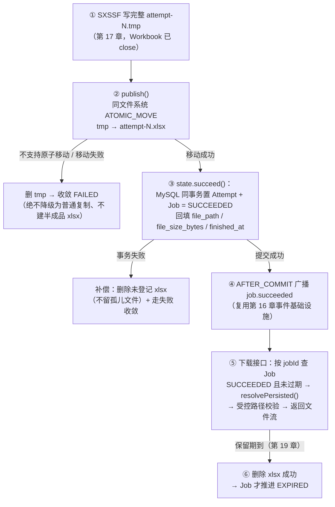
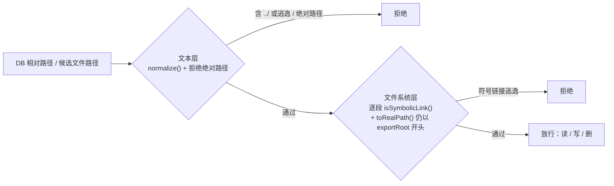

# 学习笔记：文件发布协议——原子可见、路径安全与跨存储一致性

> 对应教程章节「文件发布协议（File Publishing Protocol）：原子移动与安全下载」（第 18 章）。
> ✅ 实现状态：**本章主体已按第 7 节规划落地（2026-09-09）**——① `ExportFileService` 重写为受控文件边界（exportRoot 启动期提纯 `toAbsolutePath+normalize+createDirectories+toRealPath`、层级目录 `<UTC 日期>/<jobId>/attempt-N.tmp|xlsx`、`publish` 同文件系统 `ATOMIC_MOVE`、`PublishedFile`、`resolvePersisted` 双层校验含 Windows 无盘符根组件拒绝、`deletePublished`）；② `ExportJobService.markSucceeded`（同事务置 Job/Attempt SUCCEEDED，回填 file_path/file_size_bytes/finished_at/expired_at，保留期 `export.files.retention-hours` 默认 24h，AFTER_COMMIT 事件）；③ 执行体接线（publish → markSucceeded → catch 补偿删除）；④ 下载接口 `GET /api/v1/export-jobs/{job_id}/download`（SUCCEEDED 且未过期 → 受控解析 → 文件流 + RFC 5987 文件名，5 个新错误码）；⑤ `ExportFileServiceTest` 8 用例 + `ExportJobDownloadControllerTest` 7 用例 + 执行体发布/补偿用例，全量 184 测试通过。**未做（第 19 章）**：候选扫描清理、孤儿文件回收、RUNNING 僵尸恢复、EXPIRED 推进。

---

## 0. 名词人话速查表（先看这个）

本章全部围绕一个问题：「**文件写完了**」到「**文件可以放心交给用户下载**」之间还差什么。类比场景：**外卖出餐**——后厨做完菜（写 tmp）→ 打包贴封签（原子移动成 xlsx）→ 收银系统记账（DB 标 SUCCEEDED）→ 骑手才能取餐（下载）。任何一环没走完，顾客都不该拿到餐。

### 文件与路径

| 名词 | 人话 |
|---|---|
| attempt-N.tmp | 后厨的**半成品**——内容完整但没「上架」，下载接口绝不能碰 |
| attempt-N.xlsx | 贴了封签的**成品**——对外要么看不见、要么完整，不存在「写一半」的状态 |
| 文件发布（publish） | 「上架」动作：tmp 变 xlsx 的那一刻，文件才具备被下载的资格 |
| exportRoot | 服务端**受控仓库根目录**（来自 `@Value` 配置）。所有文件读写都不得越过它 |
| file_name（用户填的） | 只是 HTTP 响应里的**展示名**，不参与磁盘路径拼接——防 `../secret.txt` 注入 |
| PublishedFile | 发布结果「三联单」：`relativePath`（存 DB）/ `sizeBytes`（展示+证据）/ `absolutePath`（当前进程补偿删除用） |

### 机制词汇

| 名词 | 人话 |
|---|---|
| 原子移动（ATOMIC_MOVE） | 文件系统原语：**一瞬间**完成改名——其他读取者要么看不到 xlsx，要么看到完整的，绝不看到「越长越大」的文件 |
| AtomicMoveNotSupportedException | 文件系统不支持原子移动（常见于跨盘/跨文件系统）。本项目**不降级**：让任务失败并清理 |
| 补偿删除（Compensation） | 「文件先成功、数据库失败」时，把刚移动的 xlsx 删掉——手工把两个存储域掰回一致 |
| 孤儿文件 | 磁盘上存在、数据库不知道的 xlsx。是数据不一致的种子，必须补偿清理 |
| 路径穿越（Path Traversal） | 用 `../../` 让系统读写根目录之外的文件（如 `/etc/passwd`） |
| 符号链接（Symlink） | 目录里的「快捷方式」陷阱——路径看起来在 root 内，解析后指向外面 |
| normalize() | **文本层**消毒：把 `a/../b` 折叠成 `b`，暴露出 `..` 逃逸企图 |
| toRealPath() | **文件系统层**验真：解出真实路径（符号链接现出原形），确认仍在 root 内 |
| resolvePersisted() | 把 DB 里的相对路径**重新安全解析**成真实文件——每次访问都验，不信任历史 |
| EXPIRED / 保留期 | 文件的「保质期」：到期文件被删除后，任务才从 SUCCEEDED 推进到 EXPIRED |
| 候选扫描（第 19 章） | 清理任务先列「疑似该删」的候选名单，不直接见旧文件就删 |

---

## 1. 一句话总结

第 17 章解决了「**怎么把文件写完整**」；本章解决「**什么时候才允许用户看见它**」——用「tmp 写入 → 原子移动发布 → 数据库登记 → 补偿清理」四步协议，让文件系统与 MySQL 这两个**不能共同提交事务**的存储域，收敛出「用户看到的永远是完整、已登记、在安全目录内的文件」。

| 生活类比 | 机制 |
|---|---|
| 后厨做完菜不上架，打包封签后才进取餐口 | 写 tmp → 原子移动成 xlsx 才可见 |
| 收银系统记上账，骑手才能取餐 | DB 标 SUCCEEDED 后下载接口才有资格返回文件 |
| 记账失败就把打包好的餐撤回 | 数据库提交失败 → 补偿删除未登记 xlsx |
| 保质期到了下架 | 保留期后删除文件 → Job 推进 EXPIRED |

核心铁律一句话：**文件系统没有 COMMIT/ROLLBACK，一致性靠「明确的收敛顺序 + 失败补偿」手工合成。**

---

## 2. 要解决的问题：三重隐患

「文件写出来就给下载」的天真版本，会在生产环境暴露三重隐患：

| 隐患 | 成因 | 用户看到的 |
|---|---|---|
| 半成品文件暴露 | 写入是渐进 IO 过程，若一开始就叫最终名，下载接口会在写入中途读到它 | 损坏、缺行、解压失败的伪 xlsx |
| 文件系统与数据库「2PC 缺失」 | 磁盘 IO 不支持 MySQL 事务语义：文件成功 DB 失败 / DB 成功文件失败 | 「可下载」点进去 404，或磁盘有文件任务却显示失败 |
| 路径穿越与符号链接 | 下载接口盲目信任 DB 路径或用户输入，`../` 或 Symlink 越界 | 攻击者读取 root 外任意系统文件 |

第 17 章已把第一重解决了一半（写入只针对 tmp），本章补齐**发布门禁、跨存储收敛与路径安全**。

---

## 3. 全链路一览

### 3.1 发布协议主流程（含失败分支）



### 3.2 文件时间线：「磁盘有什么」≠「用户能用什么」

以 Attempt 1 为例——每一刻都同时看**磁盘**和**数据库**两个事实源：

| 阶段 | 磁盘 | MySQL Job/Attempt | 下载是否允许 |
|---|---|---|---|
| 开始写入 | attempt-1.tmp（内容可能未完） | RUNNING / RUNNING | 不允许 |
| Workbook 关闭 | .tmp 内容完整 | 仍 RUNNING / RUNNING | 不允许 |
| 原子移动成功 | attempt-1.xlsx 出现 | 仍可能是 RUNNING | 不允许（等状态提交） |
| succeed 事务提交 | .xlsx 已登记 file_path | SUCCEEDED / SUCCEEDED | **允许** |
| 提交后 DB 失败补偿 | .xlsx 被删除 | 成功状态未提交 | 不允许 |
| 保留期清理（19 章） | .xlsx 被删除 | EXPIRED | 不允许 |

「磁盘上已有 xlsx 但仍是 RUNNING」正是**下载接口必须查 Job 状态而不能只看文件存在**的原因：文件存在只是发布过程的一部分，**数据库状态才是向用户公开下载能力的业务事实**。

---

## 4. 核心设计点

### 4.1 用户文件名 ≠ 磁盘路径：三层内部定位

用户填的 `file_name`（如「八月订单」）只用于 HTTP 下载响应的展示命名。磁盘定位用三个**服务端生成**的维度：

```text
<exportRoot>/<日期>/<jobId>/attempt-N.tmp      ← 发布前
<exportRoot>/<日期>/<jobId>/attempt-N.xlsx     ← 发布后
```

| 维度 | 隔离什么 | 收益 |
|---|---|---|
| 日期 | 时间分代 | 清理任务可按目录直接圈定候选范围 |
| jobId | 不同任务 | 同名文件名互不覆盖 |
| attemptNo | 同一任务多次执行 | 重试的新文件不覆盖旧 Attempt 的证据 |

用户两次都填「八月订单」也不会冲突——**展示名可以相同，服务端文件身份唯一、可追踪**。

### 4.2 四种「改名」的可见性差异

「把文件换个名字」看似一个动作，四种实现的安全语义完全不同：

| 方式 | 最终路径在写入期间可能被看到什么 | 结论 |
|---|---|---|
| 直接写最终路径 | 文件逐渐变大 | ✗ 半成品暴露 |
| 复制到最终路径再删 tmp | 复制中途就出现不完整文件 | ✗ |
| 普通移动 | 语义受文件系统/跨设备影响 | ✗ 不作为保证 |
| **同文件系统 ATOMIC_MOVE** | 切换前不可见，切换后完整 | ✓ 本项目选择 |

两个必须说清的限制：

- **原子移动通常要求源/目标在同一文件系统**——这正是把 .tmp 与 .xlsx 放同一 Job 目录的原因（目录设计不只是为了整齐，是给 ATOMIC_MOVE 创造前提）。未来若临时文件在本地盘、正式文件在对象存储，发布协议必须重新设计；
- **ATOMIC_MOVE 不是 MySQL 事务**——移动成功 ≠ 数据库成功，仍需补偿删除兜底；
- 本项目**不静默降级**为普通复制：不支持时删除 tmp 让 Attempt 失败，比发布可能半可见的文件更可解释。

### 4.3 发布收敛顺序：先文件、后数据库、失败必补偿

文件系统与 MySQL 没有共同事务，因此选一条**有补偿的固定顺序**：

1. 完整写入 attempt-N.tmp（第 17 章）；
2. 原子移动为 attempt-N.xlsx；
3. MySQL 事务中把 Attempt 与 Job 标 SUCCEEDED，回填相对路径、大小、完成时间（影响行数不足即抛异常回滚；提交成功后才发 JobChanged 事件）；
4. 第 3 步失败 → 删除已移动但**未登记**的 xlsx（补偿）。

**为什么不能反过来先写 SUCCEEDED 再移动文件？** 若移动失败，用户从数据库看到「已成功」，点下载却找不到文件——业务状态撒了谎。反过来（先文件后 DB），文件成功而 DB 失败时虽需补偿删除，但用户**从未见过 SUCCEEDED**，没有谎言暴露给用户。

已知残余风险：进程可能在「移动成功、补偿删除前」崩溃，留下孤儿文件——第 19 章的恢复与清理处理，本章保证的是**正常异常路径有补偿**。

### 4.4 路径安全双层防腐：normalize + toRealPath 缺一不可



| 层 | 拦什么 | 为什么另一层不能替代 |
|---|---|---|
| 文本规范化层 | 绝对路径、`../`、normalize 后仍逃出 root 的相对路径 | 只做字符串检查会漏掉符号链接 |
| 文件系统真实路径层 | 已有目录里的符号链接、toRealPath 解析后越界 | 只等文件系统报错可能已经碰到不该碰的路径 |

`exportRoot` 本身在服务初始化时也要「提纯」：`toAbsolutePath().normalize()` → `createDirectories()` → `toRealPath()`，后续所有校验都以这个 canonical 根为基准。

### 4.5 每个入口都重新校验，不信任「历史上正确」

路径校验只做一次是不够的：**写入**（创建 tmp）、**下载**（DB 记录可能被污染）、**清理**（扫描到的候选路径）都要走同一条受控校验。DB 里的记录可能被错误迁移、人工修改或其他缺陷波及——安全边界靠**每次访问时验证**，不靠「这文件当初是我生成的」。

### 4.6 PublishedFile 三个字段，三种调用方

```java
public record PublishedFile(String relativePath, long sizeBytes, Path absolutePath) {}
```

| 字段 | 谁用 | 为什么 |
|---|---|---|
| relativePath | MySQL Job / Attempt | DB 不存机器绝对路径（防注入 + 便于受控解析），下载/清理都围绕它 |
| sizeBytes | 任务列表 / 下载响应 | 用户可见文件大小 + 审计证据，无需扫描磁盘 |
| absolutePath | 当前执行服务 | 仅用于「DB 提交失败」时的补偿删除，不落库 |

### 4.7 下载接口只按 Job 查，不接受任意 path 参数

正确姿势：浏览器请求 **Job ID** → Controller 校验 Job 为 SUCCEEDED 且未过期 → 文件服务 `resolvePersisted()` 解析 DB 里的相对路径并重过受控校验 → 确认存在且在 root 内 → 返回文件流（Content-Disposition 用用户展示名）。

文件记录存在而磁盘文件丢失时**不应临时重新生成 Excel**——那会改变原 Attempt 的数据边界与证据，还把耗时工作塞回下载请求。正确做法是返回明确错误，让用户重新创建任务。

### 4.8 「存在」≠「可使用」：四种状态拆开判断

`Files.exists()` 只回答「目录项在不在」，远不等于可下载。ExportFlow 把判断拆给不同角色：

| 判断 | 负责方 |
|---|---|
| 路径在 exportRoot 内、无符号链接逃逸 | ExportFileService |
| .tmp 是否已发布为 .xlsx | publish() 与原子移动 |
| 文件是否已登记到 Attempt / Job | succeed() 事务 |
| Job 是否允许下载 / 是否过期 | Controller 与 Job 状态规则 |
| 文件是否仍在磁盘 | 下载时的受控文件访问 |

合成一个 `if (file.exists())` 会让「任务还在 RUNNING」「刚发布未登记」「文件被清理」「路径校验拒绝」四种故障不可区分——用户失败时系统必须知道是哪一种，才能给出正确动作。

### 4.9 生命周期对称性：生成与清理共用同一条纪律

```text
生成阶段：文件成功发布 → 数据库才允许 SUCCEEDED
清理阶段：文件删除成功 → 数据库才允许 EXPIRED
```

两端都是「**文件系统动作先行成功，再改用户可见状态**」——绝不先改状态再赌文件系统一定成功。文件系统是外部资源，创建/移动/删除都可能失败；状态机必须把这些失败保留为可继续处理的事实（删除失败则保持 SUCCEEDED，后续清理重试）。

### 4.10 失败路径矩阵

| 失败位置 | Job/Attempt | 磁盘结果 | 用户看到 |
|---|---|---|---|
| Workbook 写入失败 | FAILED | 删除 .tmp | 失败原因，不能下载 |
| 原子移动不支持/失败 | FAILED | 删除 .tmp，不建 .xlsx | 失败原因，不能下载 |
| 移动成功 + DB 成功 | SUCCEEDED | 有登记的 .xlsx | **可以下载** |
| 移动成功 + DB 失败 | 成功状态不提交 | 删除未登记 .xlsx | 失败/恢复路径，无半完成下载 |
| 下载时路径不合法/文件丢失 | 按控制器规则 | 不读 root 外文件 | 结构化错误，建议重新导出 |

服务端还应把错误归位到正确阶段（创建 tmp / POI 写入 / ATOMIC_MOVE / DB 登记 / 下载路径），保留 error_code、attempt 与 traceId 供排障——用户侧统一是「导出失败」，服务端必须能区分。

### 4.11 本章确认表

| 判断 | 正确结论 |
|---|---|
| 为什么不直接写 attempt-N.xlsx？ | 写入期间可能被下载/清理，用户会看到半成品 |
| 原子移动 = MySQL 事务？ | 否。移动成功后仍可能因 DB 失败补偿删除 |
| 为什么 DB 只存相对路径？ | 防 Job 指定机器任意路径，且每次访问都过 exportRoot 校验 |
| normalize() 足够防逃逸？ | 否。还要逐段符号链接检查 + toRealPath 验真 |
| 磁盘上有文件 = 可下载？ | 否。需同时满足：业务状态允许 + 路径受控 + 文件存在 |
| 文件丢失时重新生成？ | 不。改变 Attempt 证据与数据边界，返回错误让用户重建任务 |

---

## 5. 与本仓库的对照

### 5.1 已就绪（本章前置）

| 本章要求 | 本仓库现状 |
|---|---|
| 内容完整的临时文件 | ✅ 第 17 章 `ExcelExportWriter.WorkbookSession`（close 链 write→close→dispose），执行体写完即得完整 `job-{id}-attempt-{n}.tmp` |
| 临时文件分配与失败清理 | ✅ `ExportFileService.temporaryPath`（`ExportFileService.java:30`）+ `deleteQuietly`（`:35`），执行体 catch 中清理（`ExportExecutionService.java:131`） |
| DB 成功终态落点 | ✅ V4 迁移已备列：`export_jobs`/`export_job_attempts` 均有 `file_path VARCHAR(512)`、`file_size_bytes`、`expired_at`、`finished_at`；过期索引 `idx_export_jobs_expiration (status, expired_at)` |
| 状态收敛模式参考 | ✅ `ExportJobService.markFailed`（`ExportJobService.java:166`）：单向条件 UPDATE + 影响行数判定 + AFTER_COMMIT 事件——`markSucceeded` 可对称套用 |
| 成功后广播 | ✅ 第 16 章 `ExportJobChanged` + `ExportSseService` AFTER_COMMIT 重读广播（发送前重读 Job，SUCCEEDED 自然带出 downloadable 语义，`ExportJobEventPayload` 已有 `downloadable` 字段） |
| 下载前端契约 | ✅ `frontend/src/api/exportApi.ts:120` 已按 fe-td.md 7.1 契约先行调用 `GET /api/v1/export-jobs/{job_id}/download`（后端未实现前必然失败，走统一错误提示） |
| 租约/尝试上限（19 章伏笔） | ✅ MAX_ATTEMPTS=3、LEASE_MINUTES=5 已在 claim 侧预置（`ExportJobService.java:53,56`） |

### 5.2 文章描述 vs 本仓库现状差异（2026-09-09 落地后）

| 文章描述（参考项目） | 本仓库现状 |
|---|---|
| `ExportFileService`：exportRoot 提纯、层级目录 `<日期>/<jobId>/attempt-N`、`publish()`/`resolvePersisted()`/`deletePublished()` | ✅ 已落地（`publish` 签名为 `(temporary, attemptNo)`——目标路径由临时文件同目录推导，无需 jobId 参数）；候选扫描属第 19 章 |
| `publish()`：ATOMIC_MOVE + REPLACE_EXISTING；不支持原子移动不降级 | ✅ 已落地（原样上抛 `AtomicMoveNotSupportedException` 交由执行体收敛 FAILED） |
| `PublishedFile` record（relativePath/sizeBytes/absolutePath） | ✅ 已落地（relativePath 统一正斜杠，避免平台分隔符进入 DB） |
| 成功终态同事务登记（文章名 `state.succeed()`） | ✅ 已落地为 `ExportJobService.markSucceeded`（Job 条件更新 0 行抛异常回滚；Attempt 侧与 markFailed 对称仅审计，不阻断收敛） |
| 执行体接线：publish → succeed → 补偿删除 | ✅ 已落地（`published != null` 补偿删除正式文件，`temporary != null` 清理半成品） |
| 下载接口 `GET /{job_id}/download`：SUCCEEDED 且未过期 → 受控解析 → 文件流 | ✅ 已落地（新增 5 错误码：NOT_FOUND ×3 / 409 / 410；`Content-Disposition` ASCII 兜底 + RFC 5987 filename*） |
| 路径安全测试（`../`/绝对路径/符号链接/原子移动不支持/补偿删除/下载契约） | ✅ 已落地（`ExportFileServiceTest` 8 用例、`ExportJobDownloadControllerTest` 7 用例、执行体发布/补偿/原子移动不支持 3 用例） |
| 保留期清理与崩溃恢复（候选扫描/孤儿回收/僵尸任务/EXPIRED 推进） | ❌ 属第 19 章 |

---

## 6. 明确不做的事（边界）

- 不做对象存储（MinIO/S3）与多实例共享磁盘——当前协议明确以「单机本地同一文件系统」为前提；跨存储时发布协议需重新设计，不假装可沿用 `Files.move`。
- 不做下载时临时重新生成 Excel——丢失即报错，让用户重建任务。
- 不在 DB 存绝对路径、不接受用户输入参与磁盘路径拼接。
- 本章不做清理任务与崩溃恢复（第 19 章）：候选扫描、孤儿文件回收、RUNNING 恢复、EXPIRED 推进都不提前混进发布主线。
- 不承诺文件内容业务级正确性——`sizeBytes` 只是「路径可访问且有字节」的证据，不是内容正确性证明。

---

## 7. 落地规划（建议顺序）

> ✅ **本节第 1-6 步已于 2026-09-09 全部落地**（测试编号见第 5.2 节）；其中 `publish` 签名简化为 `(temporary, attemptNo)`（目标由临时文件同目录推导）；下载错误码落位：`EXPORT_JOB_NOT_FOUND`/`EXPORT_FILE_MISSING`/`EXPORT_PATH_INVALID` → 404、`EXPORT_JOB_NOT_DOWNLOADABLE` → 409、`EXPORT_FILE_EXPIRED` → 410。第 19 章（过期清理/崩溃恢复）不在本章。

1. **`ExportFileService` 升级为受控文件边界**（核心批）：
   - exportRoot 初始化提纯（`toAbsolutePath().normalize()` → `createDirectories()` → `toRealPath()`，校验失败 fail-fast）；
   - 层级目录 `<root>/<UTC 日期>/<jobId>/attempt-N.tmp|xlsx`（与现有 `temporaryPath` 调用方兼容改造），tmp/xlsx 同目录保证同文件系统；
   - `publish(temporary, jobId, attemptNo)`：Workbook 关闭后才调用，`Files.move(..., ATOMIC_MOVE, REPLACE_EXISTING)`，`AtomicMoveNotSupportedException` 原样上抛由执行体收敛；
   - `PublishedFile` record；`resolvePersisted()`/`deletePublished()` 与双层路径校验（normalize 层 + 逐段符号链接/toRealPath 层）；
   - 注意：现有平铺路径 `export-files/job-{id}-attempt-{n}.tmp` 是否迁移为层级布局，落地时一次性切换（教学项目无历史数据包袱）。
2. **成功终态 `markSucceeded`**（`ExportJobService`，对称复用 `markFailed` 模式）：同事务条件 UPDATE Attempt + Job → SUCCEEDED，回填 `file_path`/`file_size_bytes`/`finished_at`/`expired_at`（保留期配置 `export.files.retention-hours` 待定），影响行数 ≠ 预期即抛异常回滚；提交后 `publishEvent(ExportJobChanged)`。
3. **执行体收尾接线**（`ExportExecutionService.runJob`）：删除占位 throw；`published = files.publish(...)` → `temporary = null`（所有权转移，catch 不再误删）→ `markSucceeded(...)`；catch 中 `published != null` 先补偿删除 xlsx 再删 tmp。
4. **下载接口**：`ExportJobController` 新增 `GET /{job_id}/download`——查 Job（SUCCEEDED 且未过期，否则 404/410 语义错误码）→ `resolvePersisted()` → 存在性 + root 校验 → `@RawResponse` 流式返回 + `Content-Disposition`（`filename*=UTF-8''` 用户展示名）；错误走统一 Envelope。
5. **测试**：
   - `ExportFileServiceTest`：路径逃逸三连拒（`../`、绝对路径、符号链接）；`AtomicMoveNotSupportedException` → tmp 删除且 xlsx 不存在；publish 返回三字段；
   - 执行体扩展：发布成功 + succeed 抛异常 → xlsx 被补偿删除 + 收敛 FAILED；正常链路 → Job SUCCEEDED 且 DB 记录与文件一致；
   - 下载契约测试：SUCCEEDED 可下、RUNNING/EXPIRED 拒、路径非法拒、文件丢失结构化错误。
6. **文档同步**：README/AGENTS 更新（新端点、`ExportFileService` 职责扩展、保留期配置）、本笔记状态行改「已落地」。

依赖关系：①→②→③→④→⑤→⑥ 线性推进；① 与 ② 可并行开发但接线在 ③ 汇合。第 19 章（崩溃恢复/过期清理/僵尸任务）不在本章范围。

---

## 8. 本章沉淀（记忆卡）

- **发布是「状态断代」**：不是把文件复制到另一个目录，而是定义「哪一个时刻起这份内容才算完成品」——tmp 期间对外不可见，ATOMIC_MOVE 一瞬间切换，SUCCEEDED 提交后才具备下载资格。
- **跨存储一致性 = 固定顺序 + 补偿**：先物理文件、后数据库提交、失败删文件。顺序反过来（先 SUCCEEDED）会让业务状态对用户撒谎。
- **路径安全是双层防腐**：normalize 拒文本逃逸，toRealPath/逐段符号链接拒物理逃逸；且写入、下载、清理**每个入口都重验**，不信任「历史上正确」。
- **展示名与存储身份解耦**：用户 file_name 只活在 HTTP 响应里；磁盘身份由 日期/jobId/attemptNo 三维服务端定位，同名不冲突、重试不覆盖证据。
- **存在 ≠ 可使用**：目录项存在、内容完整、已登记 DB、状态允许读取是四件事，拆给四个角色判断，故障才可区分。
- **生成与清理对称**：文件成功 → 才许 SUCCEEDED；删除成功 → 才许 EXPIRED。状态机永远让文件系统先表态。
- **读码清单（8 步）**：读任何下载功能，先找——临时路径在哪创建？正式路径在哪生成？是否关闭 Writer 后才发布？是否同文件系统安全移动？DB 何时存路径与大小？DB 失败后删不删孤儿？下载是否只按业务 ID 查受控路径？清理是否重复校验 root？
- 至此「有限内存生成」与「完整安全发布」闭环。下一章（19）：进程中断恢复、过期文件自动清理与僵尸任务治理——kill -9 之后磁盘上的半成品与 RUNNING 僵尸如何自愈。
