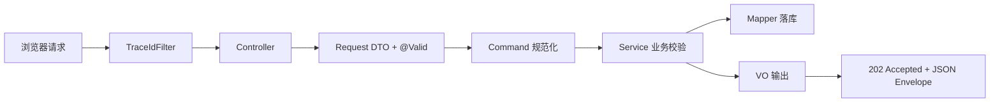
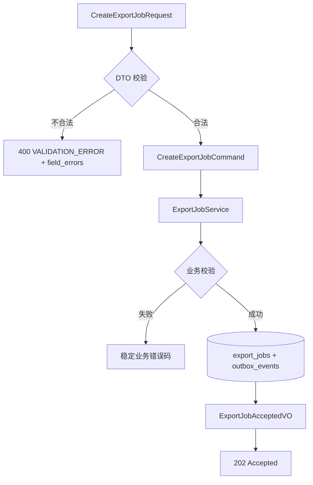
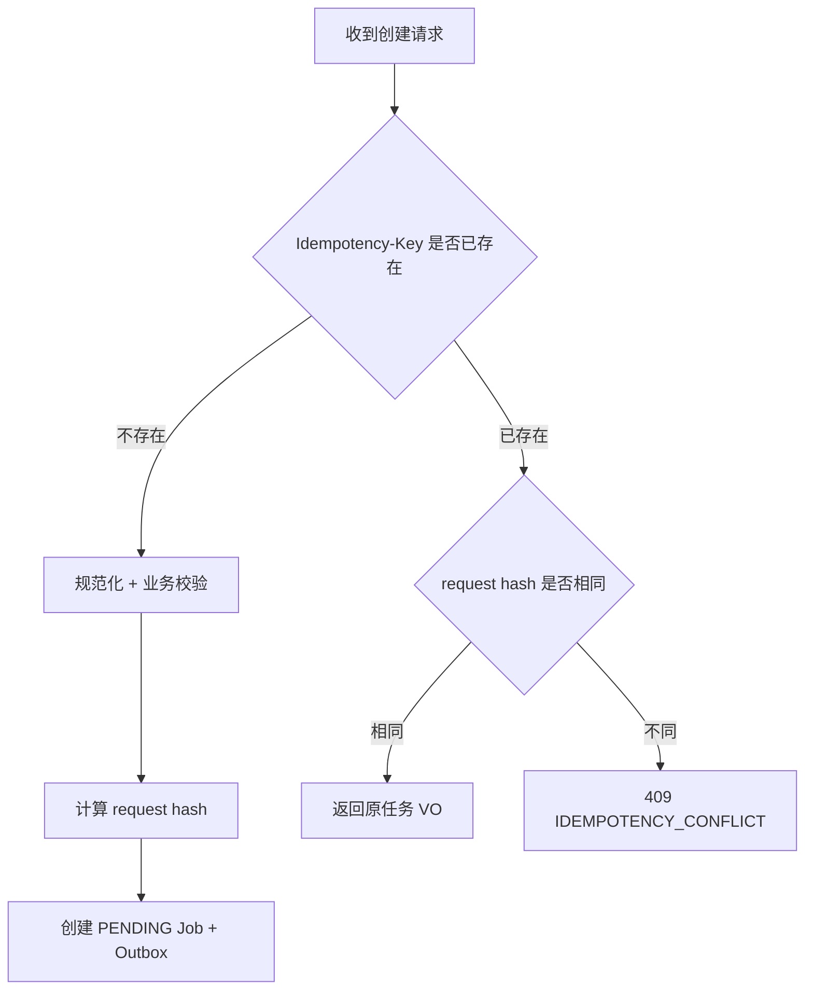
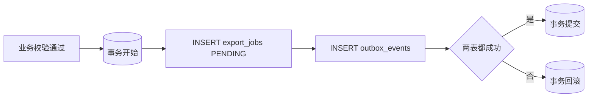

# FlowHub HTTP 请求边界补全计划

## 1. 文档定位

本文只补全当前章节「后端请求处理架构 / HTTP Domain Boundary」在本仓库中缺失的部分，不规划整个异步导出系统。

本章关注：浏览器请求进入后端后，如何完成参数绑定、DTO 校验、对象分层、业务校验、统一响应、错误收敛和 trace_id 传递。真正执行 Excel 生成、RabbitMQ 消费、SSE 推送、文件下载等内容属于后续章节，不在本文实施范围。

| 文档属性 | 内容 |
| --- | --- |
| 代码基线 | `master @ 1a10b8d` |
| 范围 | `POST /api/v1/export-jobs` 的同步命令接收边界 |
| 明确排除 | RabbitMQ、Redis、Consumer、SXSSF、SSE、下载、重试、过期清理 |



## 2. 本章能力现状

| 能力 | 当前状态 | 位置 |
| --- | --- | --- |
| API 统一前缀 `/api/v1` | 已实现 | `ApiWebMvcConfiguration.java:14` |
| 普通 JSON Envelope | 已实现 | `ApiResponseAdvice.java:24` |
| 原生协议跳过包装 | 已实现 | `ApiResponseAdvice.java:47` |
| 全局异常收敛 | 已实现基础结构 | `GlobalExceptionHandler.java:23` |
| 字段级错误 `data.field_errors` | 未实现 | 全局异常处理只返回 message |
| trace_id 请求入口 | 已实现 | `TraceIdFilter.java:20` |
| 异步线程 MDC 透传 | 已实现 | `MdcTaskDecorator.java:12` |
| Bean Validation | 已具备依赖 | `backend/pom.xml` |
| 导出创建接口 | 未实现 | `ExportJobController.java:19` 只有空列表占位 |
| 创建 DTO / Command / VO | 未实现 | 当前 export 模块没有创建请求对象和命令对象 |
| 幂等键处理 | 未实现 | 当前 Controller 没有读取 `Idempotency-Key` |
| 同事务写入 Job + Outbox | 未实现 | DB 表结构已就绪，但应用层没有写入流程 |

## 3. 本章交付目标

只交付一个可用的同步入口：

```http
POST /api/v1/export-jobs
Idempotency-Key: <uuid>
Content-Type: application/json
```

成功结果：

- Controller 返回 `202 Accepted`；
- 响应仍由 `ApiResponseAdvice` 包装为 `{code, message, data, trace_id}`；
- `data.status` 为 `PENDING`；
- 同一事务写入 `export_jobs` 和 `outbox_events`；
- `trace_id` 写入 Outbox 记录，为后续异步链路保留起点。

本文不要求任务被消费或生成文件。

## 4. 对象分层设计

| 对象 | 职责 | 禁止事项 |
| --- | --- | --- |
| `CreateExportJobRequest` | 接收 JSON 请求体，做结构校验 | 不访问数据库，不包含状态字段 |
| `ExportSelectionRequest` | 接收 `SELECTED_IDS` 或 `FILTER` 分支 | 不允许两个分支同时生效 |
| `CreateExportJobCommand` | 规范化 ID、列、文件名和筛选快照 | 不携带 HTTP 注解语义 |
| `ExportJobService` | 业务校验、幂等判断、事务、Outbox 写入 | 不拼 JSON Envelope，不做文件生成 |
| `ExportJobEntity` / `OutboxEventEntity` | 映射数据库表 | 不直接暴露给 Controller |
| `ExportJobAcceptedVO` | 输出 `job_id/job_no/status/total_rows` | 不暴露内部路径、request hash、Attempt 信息 |
| `ExportJobController` | 参数绑定、调用 Service、返回 202 | 不写 SQL、不判断业务事实 |



## 5. DTO 校验设计

### 5.1 `CreateExportJobRequest`

建议使用 record：

```java
public record CreateExportJobRequest(
        @NotNull @Valid ExportSelectionRequest selection,
        @NotEmpty @Size(max = 9) List<@NotBlank String> columns,
        @Size(max = 255) @JsonProperty(file_name) String fileName
) {
    public CreateExportJobCommand toCommand() {
        return CreateExportJobCommand.from(selection, columns, fileName);
    }
}
```

### 5.2 `ExportSelectionRequest`

必须使用跨字段校验保证分支一致：

- `mode = SELECTED_IDS`：`order_ids` 非空，`filter` 为空，`excluded_order_ids` 为空。
- `mode = FILTER`：`filter` 非空，`order_ids` 为空。
- `excluded_order_ids` 仅在 `FILTER` 分支有意义，最大 1000。

可使用 `@AssertTrue`，并用 `@JsonIgnore` 避免校验方法被序列化。

`file_name` 是可选字段；前端未传时由后端按业务规则生成，前端已传时清理非法字符并校验长度。

### 5.3 需要新增的错误码

新增 `ExportErrorCode`：

| 错误码 | HTTP | 场景 |
| --- | --- | --- |
| `EXPORT_COLUMNS_INVALID` | 400 | 列为空、列数超过 9、列名不在白名单 |
| `EXPORT_SELECTED_EMPTY` | 400 | 勾选模式没有 ID |
| `EXPORT_SELECTED_TOO_MANY` | 400 | 勾选 ID 超过 1000 |
| `EXPORT_SELECTION_EMPTY` | 400 | 服务端确认选择结果为空 |
| `EXPORT_FILTER_ZERO_ROWS` | 400 | 筛选命中 0 行 |
| `EXPORT_FILTER_TOO_MANY_ROWS` | 400 | 筛选超过配置上限 |
| `IDEMPOTENCY_CONFLICT` | 409 | 相同 Key 但请求内容不同 |

DTO 结构错误仍统一使用 `VALIDATION_ERROR`，不与业务错误码混用。

## 6. Service 校验与规范化

### 6.1 Command 规范化

DTO 只证明“格式正确”，Service 前置的 Command 规范化负责让相同业务请求生成稳定形态：

1. `order_ids` 去重、剔除空值、按自然顺序排序。
2. `excluded_order_ids` 做同样处理。
3. `columns` 去重后必须仍然非空，并按导出列白名单定义顺序输出；不信任前端顺序作为业务契约。
4. `file_name` 保留业务名，清理路径分隔符、非法字符和首尾空白；文件扩展名由服务端决定，不信任请求体。
5. 筛选快照统一转换为后端 `OrderCriteria`，不能把原始 JSON 直接当作查询条件。

### 6.2 业务校验

| 校验项 | 处理方式 | 失败结果 |
| --- | --- | --- |
| 勾选 ID 是否存在 | 用订单表按 ID 精确查询并取交集 | 有效结果为空返回 `EXPORT_SELECTION_EMPTY`；部分不存在只按存在的 ID 导出 |
| 勾选数量 | DTO 上限 1000，Service 不重复承担超限职责 | 超过时返回 `EXPORT_SELECTED_TOO_MANY` |
| 筛选命中数量 | 复用订单查询的 `COUNT(*)` 条件，不先把全量数据载入内存 | 0 行返回 `EXPORT_FILTER_ZERO_ROWS`；超过配置上限返回 `EXPORT_FILTER_TOO_MANY_ROWS` |
| 列白名单 | 与现有导出列定义保持一致 | 返回 `EXPORT_COLUMNS_INVALID` |
| 幂等冲突 | 相同 `Idempotency-Key` 但 request hash 不同 | 返回 `IDEMPOTENCY_CONFLICT` |

### 6.3 幂等语义

Controller 只读取请求头 `Idempotency-Key`，Header 缺失或空白属于 DTO 校验失败；Service 负责幂等判断。



幂等命中时仍然返回 `202 Accepted` 和原任务 VO，不重新创建任务、不重复写 Outbox、不触发业务校验失败。

## 7. 持久化与事务

### 7.1 前置结论

不需要新增 Flyway migration。现有迁移已提供 `export_jobs`、`outbox_events` 及关联字段；本章只补应用层写入流程。

### 7.2 同事务写入

`ExportJobService` 在一个 `@Transactional` 方法内完成：

1. 写入 `export_jobs`，初始状态固定为 `PENDING`。
2. 保存筛选或勾选的 request snapshot、列快照和文件名快照。
3. 保存 `total_rows`、`max_order_id_at_create`、`trace_id`。
4. 同事务写入 `outbox_events`，事件负载必须包含 `job_id`、`job_no`、`request_snapshot`、`columns`、`file_name`、`trace_id`。



本章不写 Redis 状态、不发布 RabbitMQ 消息、不创建文件。Outbox 事件落库成功即认为入口职责完成。

## 8. 全局错误契约补全

`GlobalExceptionHandler` 当前只返回稳定的 `code/message/trace_id`，还缺少 Bean Validation 的字段级信息。补全为：

响应示例：`code` 为 `VALIDATION_ERROR`，`message` 为请求参数校验失败，`data.field_errors` 使用对象映射保存字段路径与文案，`trace_id` 继续保持原机制。

实现要求：

1. 保持现有统一异常处理器入口，不新增模块级 Advice。
2. 字段错误放入 `data.field_errors`。
3. `field_errors` 推荐输出对象映射，与前端 `ApiError.fieldErrors: Record<string, string>` 一致，避免前端解析逻辑变更。
4. `trace_id` 继续由现有 MDC/过滤器机制写入。
5. 业务异常仍然走各自的稳定错误码，不把业务失败伪装成 `VALIDATION_ERROR`。

## 9. 实施任务

| 序号 | 任务 | 完成标准 |
| --- | --- | --- |
| 1 | 新增创建导出任务 DTO 和跨字段校验 | 缺 Header、缺分支、非法分支、空列、超长字段都能进入统一 400 |
| 2 | 新增 Command 与规范化逻辑 | ID 去重排序、列按白名单排序、文件名清理、筛选条件转换完成 |
| 3 | 扩展 `ExportJobService` | 完成存在性校验、命中数校验、request hash 计算和幂等冲突判断 |
| 4 | 补同事务写入 | `export_jobs` 与 `outbox_events` 同时成功或同时失败，Outbox 暂不发布 |
| 5 | 扩展 `ExportJobController` | 读取 `Idempotency-Key`，成功返回 `202 Accepted` 和 `ExportJobAcceptedVO` |
| 6 | 补全局字段错误 | `VALIDATION_ERROR.data.field_errors` 返回对象映射并保留 `trace_id` |
| 7 | 补错误码 | 新增本章错误码，避免复用泛化 400 文案 |

## 10. 测试要求

### 10.1 Controller / DTO

1. 合法 `SELECTED_IDS` 和 `FILTER` 请求都返回 `202`。
2. 缺 `Idempotency-Key`、缺 `selection`、空 `columns`、超过 9 列、未知列返回 `VALIDATION_ERROR`。
3. `SELECTED_IDS` 携带 `filter` 返回字段错误；`FILTER` 携带 `order_ids` 返回字段错误。

### 10.2 Service / 事务

1. 勾选 ID 全部不存在返回 `EXPORT_SELECTION_EMPTY`。
2. 筛选命中 0 行和超过上限分别返回对应错误码。
3. 相同幂等 Key、相同 request hash 只返回第一个任务，不新增记录。
4. 相同幂等 Key、不同 request hash 返回 `409 IDEMPOTENCY_CONFLICT`。
5. Outbox 写入失败时回滚 `export_jobs`，不留下 PENDING 孤儿任务。

### 10.3 边界与回归

1. `202` 响应仍被 `ApiResponseAdvice` 包装为统一 Envelope。
2. `trace_id` 同时出现在响应头/响应体约定和 Outbox 记录中。
3. 现有订单查询接口和前端行为不被本章改动破坏。

## 11. 本章明确不做

- 不实现 RabbitMQ 发布、Consumer 消费和任务执行。
- 不实现 Redis 幂等缓存、进度缓存和状态缓存。
- 不实现 Excel 生成、SXSSF、临时文件和文件下载。
- 不实现任务详情、任务列表、重试、取消、过期清理。
- 不实现 SSE 事件和前端实时进度消费。
- 不改变订单查询 API 的对外契约。

这些能力仍然属于后续导出闭环，不应为了验证本章入口而在同一批改动中提前实现。

## 12. 验收标准

1. `POST /api/v1/export-jobs` 能从请求边界一路创建 `PENDING` 任务和 Outbox 记录。
2. Controller 不包含业务判断；Service 不拼接 HTTP Envelope；Mapper 只承担数据访问。
3. 所有结构错误返回 `VALIDATION_ERROR.data.field_errors`，所有业务失败返回稳定业务错误码。
4. 幂等语义可测试：相同请求可复用，冲突请求可拒绝，重复任务不产生。
5. Job 和 Outbox 的同事务关系可测试：任一写入失败都整体回滚。
6. 后端 `./mvnw test` 通过，现有功能无回归。
