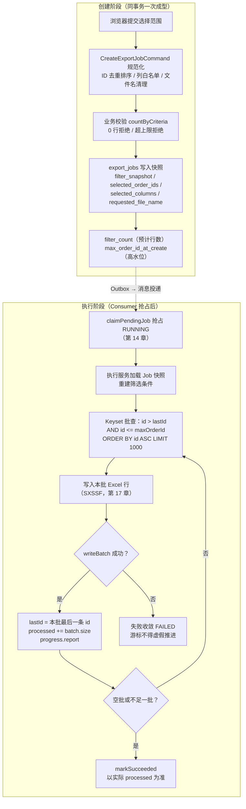

# 学习笔记：确定性数据读取——任务快照、ID 高水位与 Keyset 游标

> 对应教程章节「后台导出的数据读取架构：快照 + 高水位 + Keyset」（第 15 章）。
> ✅ 实现状态：**本章主体已按第 7 节规划落地**——高水位口径收敛为 `ExportOrderMapper.snapshotByCriteria` 单查询（命中 COUNT + 范围内 MAX(id)）；`ExportJobMapper.selectById/updateProcessedRows`；`ExportOrderRow` 投影 + `findBatch`（跨 Mapper 复用 `OrderMapper.criteriaConditions` 共享筛选片段，`ORDER BY id ASC LIMIT`）；执行体 `runJob` Keyset 循环（查询 → 累计 → 推进 lastId → 落 `processed_rows`，空批/不足一批双结束）+ `filter_snapshot` 反序列化重建 `OrderCriteria`；集成测试 `ExportExecutionIntegrationTest` 7 用例（高水位阻断/批次边界/快照重建端到端/排除 ID/空值防御/round-trip），全量 145 测试通过。**未做（后续章节）**：SXSSF 写 Excel（第 17 章，writeBatch 扩展点已预留）、进度 Redis 投影与 SSE（第 16 章）、文件发布与成功终态（第 18 章）——执行体读取完成后仍以「尚未实现」收敛 FAILED。

---

## 1. 一句话总结

第 14 章解决了「这次导出由谁来执行」；本章解决「执行的人**读哪些数据、怎么读才不重不漏、怎么读才不拖垮数据库**」——用**任务快照固定语义、ID 高水位固定上界、Keyset 游标固定推进**，把「用户点击那一刻想导出的范围」变成一次可追踪、可分批、边界确定的数据读取过程。

生活类比（拍合影）：

| 机制 | 类比 |
|---|---|
| 任务请求快照 | 拍照前写好的「合影名单」——之后谁走来走去都无关，照片只拍名单上的人 |
| ID 高水位线 | 按快门那一刻在门口挂的「编号上限牌」——之后新进门的人（更大 ID）不参与这张照片 |
| Keyset 游标 | 摄影师记住「最后一位已入镜者的编号」——下一张从他后面接着拍，绝不从头数人数 |

注意：高水位挡不住「名单上的人中途换了衣服」（已存在行被更新），也不让「中途离场的人重新出现」（已存在行被删除）——这三层机制各管一种变化，见 4.1。

---

## 2. 要解决的问题：后台导出面对的是「流动的河水」

用户在 10:00:00 点击「导出筛选结果」，创建接口 202 返回后浏览器即可关闭；Consumer 可能几秒甚至几分钟后才开始读数据。这段时间里生产库正在高频写入/更新/删除。若直接「读当前订单列表」，会踩三个经典陷阱：

| 陷阱 | 成因 | 后果 |
|---|---|---|
| 深 OFFSET 性能塌方 | `OFFSET 109000` 要求数据库定位并丢弃前面 10.9 万行候选，越往后越贵 | 批次越靠后越慢，IO/CPU 拉满，慢 SQL 爆发 |
| 页漂移（Page Drift） | 批次间隙有插入/删除，OFFSET 跳过的是「当前结果集前 N 行」而非「上次已读的 N 行」 | 导出行数对不上 filter_count（预计 10,000 实际 10,002），重复/遗漏，排障口径混乱 |
| 幻读混入 | 任务创建后才落库的新订单被无节制读入 | 文件内容取决于 Consumer 何时跑，而不是用户何时点 |

核心认知：**浏览器只负责第一次提交；`export_jobs` 才是后台任务之后唯一持续依赖的输入。** Keyset 只是「读取方法」，不能独自回答「用户当时到底想导出什么」。

---

## 3. 全链路一览



三个「每次取一些数据」的动作不是同一件事，职责必须分开：

| 动作 | 服务谁 | 典型量 | 目的 |
|---|---|---|---|
| 订单页分页（OFFSET） | 浏览器用户 | 20 / 50 行 | 让人浏览与选择，可接受刷新后略变 |
| 后台 Keyset 批次 | Consumer / 数据库 | 1000 行 | 多批次间保持同一数据边界，稳定向前 |
| SXSSF 内存窗口 | Java Workbook | 第 17 章配置 | 控制内存中保留的最近 Excel 行 |

Excel Writer 不决定 SQL 从哪继续；页面分页的交互语义也不能套到后台批次上。分清三者后，`lastId`、`filter_count`、`processedRows` 才不会变成一组难记的数字。

---

## 4. 核心设计点

### 4.1 三层机制各管一种变化

| 机制 | 主要防什么 | 单独不能防什么 |
|---|---|---|
| 任务请求快照（语义隔离层） | 前端改筛选/刷新/关页面后任务语义丢失 | 创建后新增订单混入 |
| ID 高水位线（上界隔离层） | 创建后得到更大 ID 的新订单混入 | 同一 ID 记录被更新或删除 |
| Keyset 游标（物理推进层） | 批次之间 OFFSET 跳过导致的重复/漏扫 | 任务范围定义漂移 |
| 稳定 `ORDER BY id ASC` | 相同批次边界的返回顺序不确定 | 业务字段更新的历史回放 |

### 4.2 任务请求快照：语义隔离层

RUNNING 的 Job 必须自己说清楚要导出什么——Consumer 手里只有 `job_id`，不能回头问浏览器，也不能拿当前筛选草稿猜。`export_jobs` 的快照字段：

| 字段 | 创建时写入 | 执行时用途 |
|---|---|---|
| filter_snapshot | 规范化筛选条件 + 排除 ID | 重建 FILTER 查询条件 |
| selected_order_ids | 勾选 ID 集合（FILTER 时空数组） | 限定显式勾选导出 |
| selected_columns | 导出列（顺序有业务意义） | 第 17 章 Excel 表头与单元格 |
| requested_file_name | 清洗后的显示文件名 | 第 18 章受控文件路径与下载名 |
| filter_count | 创建时命中预计行数 | 进度总数与范围检查依据 |
| max_order_id_at_create | 创建时最大订单 ID | 排除创建后新增的更大 ID |

三种「快照」辨析（不要混为一谈）：

| 名称 | 谁保存 | 生命周期 | 本项目是否采用 |
|---|---|---|---|
| 任务请求快照 | export_jobs 普通字段 | Job 生命周期内可查询 | ✅ 即上表 |
| InnoDB 一致性读快照 | 数据库事务内部 | 通常受事务范围控制 | ❌ 不做长事务快照读 |
| 文件快照 | 已写出的 .xlsx 文件 | 文件发布后直到清理 | 第 18 章建立 |

长时间保持一个事务读数万行会放大 undo、连接与事务资源压力；本项目选择「创建时固化语义 + 短查询批次读取」的轻量方案。它控制的是「哪些新增订单不能混入」，不宣称在所有并发更新下提供完整历史版本。

### 4.3 OFFSET 为什么不能承担长任务读取

深 OFFSET 的成本随读取进度线性增长（每批 1000 行、共 11 万行）：

| 批次 | 起点 | 数据库至少要跨过的此前结果 |
|---|---|---|
| 1 | OFFSET 0 | 0 |
| 50 | OFFSET 49000 | 49000 |
| 110 | OFFSET 109000 | 109000 |

页漂移示例：结果集 1..10 每批 3 行，第一批得 1,2,3；第二批查询前前部插入一行或某早期行被删，`OFFSET 3 LIMIT 3` 跳过的是「当前结果集前三行」，不再是「上次实际导出的三行」——重复或遗漏就此产生。网页浏览可接受刷新后微变；一次要生成确定文件的后台任务不可接受。

### 4.4 Keyset：用上一次真实读到的键继续向前

```sql
SELECT id, order_no, ...
FROM orders
WHERE id > #{lastId}          -- 下界：上次读到的最后一条
  AND id <= #{maxOrderId}     -- 上界：创建时高水位
  AND ...快照筛选条件...
ORDER BY id ASC
LIMIT #{batchSize};
```

- `lastId` 不是前端页面号、不是 RabbitMQ 消息偏移量——只是本次执行中「已成功交给 Excel Writer 的最后一个订单 ID」。
- 第一批 `lastId = 0`；此后每批推进到**本批实际返回的最后一条 id**，不是机械 `+ batchSize`（排除 ID 会造成空隙：66 被排除，下一条可能直接是 67，lastId 仍按实际返回计）。
- 单键游标成立的条件：**排序键唯一且单调**。主键 `id` 满足；只按 `created_at` 排序则多行可能同刻，需 `(created_at, id)` 组合游标；**没有 ORDER BY 则 Keyset 根本不成立**——数据库不承诺返回顺序。

| 排序方式 | 游标是否足够 | 原因 |
|---|---|---|
| ORDER BY id ASC | lastId 足够 | ID 唯一且单调推进 |
| ORDER BY created_at ASC | 不够 | 多行可能同一时间 |
| ORDER BY created_at ASC, id ASC | 需 lastCreatedAt + lastId 组合键 | 组合键才唯一 |
| 没有 ORDER BY | 不成立 | 数据库不承诺返回顺序 |

- 适用边界：Keyset 擅长「按稳定键单向扫描」（长任务、时间线、连续读取），不擅长「直接跳到第 5000 页」。本项目网页列表保留 OFFSET 分页、后台导出用 Keyset，正是按交互目标分工。

### 4.5 高水位：创建时刻的确定性上界

只有 `id > lastId` 不够：Job 创建时最大 ID 是 10,000，执行期间插入 10,001，没有上界就会混进文件。创建时用**同一套筛选条件**统计数量与最大 ID：

```sql
SELECT COUNT(*) AS filterCount, COALESCE(MAX(id), 0) AS maxOrderIdAtCreate
FROM orders WHERE ...同一套任务筛选条件...;
```

- 语义窄而关键：「**订单 ID 比任务创建时高水位更大的记录，不属于这次导出**」。它不是隔离级别、不是缓存版本、更不是「本次导出一定有这么多行」的保证。
- 创建时统计为 0 → 入口直接拒绝创建（本仓库 `EXPORT_FILTER_ZERO_ROWS` / `EXPORT_SELECTION_EMPTY`），不会生成高水位为 0 的空任务交给 Consumer；执行阶段的空批只表示「符合条件的行已读完」。
- SELECTED_IDS 模式同样保存高水位：两种模式共享同一个 Keyset 主干（`id > lastId AND id <= maxOrderId`）；勾选订单在执行前被删除，批次查询自然不返回它，实际行数相应减少。**创建校验与执行事实不能混成一次判断。**

### 4.6 统计与执行必须共享同一份范围定义

`filter_count` 不是展示数字——它决定能否创建、进度分母与「为什么预计 N 行」的解释依据。创建统计的 WHERE 与执行批查的 WHERE 必须基于同一份筛选语义。四层核对：

| 层次 | 创建阶段 | 执行阶段 | 常见错误 |
|---|---|---|---|
| 选择模式 | 区分 SELECTED_IDS 与 FILTER | 相同模式决定 IN 或筛选条件 | 执行端把显式 ID 当成全部筛选结果 |
| 普通筛选 | 统计时间/金额/订单号/状态/渠道 | 重新构造相同 WHERE | COUNT 含状态条件、批查漏掉 |
| 排除集合 | FILTER 统计时排除 excluded_order_ids | 批查同样 NOT IN | 页面取消勾选的订单又出现在 Excel |
| 高水位 | 记录命中范围 MAX(id) | 每批限制 id <= maxOrderId | 执行延迟后混入新订单 |

教程给出的参考项目**审计点**：其 `parseConfig()` 已重建时间/金额/排除 ID，但漏了 `orderNo`/`orderStatus`/`salesChannel`——「快照字段已保存」不等于「执行端一定完整消费」。每个筛选字段都要走完整链路：**请求 DTO 接收 → Command 规范化 → 快照保存 → 创建统计使用 → 执行重建 → 批查 SQL 应用 → 测试让不匹配记录被排除**。这段对照见第 5 节：本仓库可结构性规避此坑。

### 4.7 游标推进的顺序：先写成功，再推进

```java
// 顺序即屏障：查询 → 写入 → 推进 → 上报
List<ExportOrderRow> batch = orders.findBatch(
        lastId, job.getMaxOrderIdAtCreate(), BATCH_SIZE, config.filter(), config.orderIds());
if (batch.isEmpty()) {
    break;
}
workbook.writeBatch(batch);            // ① 本批真实进入 Workbook
processed += batch.size();             // ② 才允许累计已处理数
lastId = batch.getLast().id();         // ③ 才允许推进游标
progress.report(jobId, processed, job.getFilterCount());
if (batch.size() < BATCH_SIZE) {       // 双结束条件之二
    break;
}
```

- 「已经查询到」≠「已经完成处理」。若查出后立即持久化 lastId，后续写入失败时，重试会跳过一批**从未进入文件**的数据。
- `lastId` 的更新必须严格发生在 `writeBatch` 成功之后——失败批次不得被伪装为已处理。这不保证磁盘与数据库完全原子（第 18 章处理文件发布与终态窗口），但保证单次循环不把「查询到了」写成「处理完了」。
- 结束条件有两个：空批（没有更多符合条件）+ 不足一批（按 id ASC 已到结果集末尾）。第二个条件依赖「唯一键 + 固定上界 + 固定 WHERE + LIMIT」可信；将来改不稳定排序或复杂分页 token 时需重新审视，不能只因「以前这样写过」而保留。
- `BATCH_SIZE = 1000` 是数据库读取粒度；第 17 章 SXSSF 的 `ROW_WINDOW` 是另一个值，控制 Workbook 内存窗口。两个数字都参与资源控制，但对象不同。

### 4.8 三个数字各说各的话

| 数字 | 语义 | 写入时机 |
|---|---|---|
| filter_count | 创建时的范围统计（进度分母 / 预计规模） | 创建时一次 |
| processed_rows | 实际成功写入文件的行数（成功终态事实） | 每批推进 |
| max_order_id_at_create | 排除创建后新增 ID 的边界 | 创建时一次 |

删除和更新仍会影响实际行数：创建后某订单被删 → filter_count=100 而文件 99 行；执行中字段被改 → 短查询读到查询时可见值。**高水位只限 ID，不冻结行内容**——进度页不得虚构「读取了不存在的行」，成功终态（`markSucceeded`）以实际 processed 为准。

### 4.9 本章确认表

| 变化 | Keyset 是否阻止 | 高水位是否阻止 | 结果 |
|---|---|---|---|
| 创建后插入 id > 高水位的订单 | ❌ | ✅ | 新订单不进入文件 |
| 批次之间前面位置插入/删除一行 | ✅（lastId 免 OFFSET 漂移） | ❌ | 从已读最后 ID 继续 |
| 已存在订单在读取前被删除 | ❌ | ❌ | processedRows 可能 < filterCount |
| 已存在订单字段被更新 | ❌ | ❌ | 短查询读到查询时可见值 |
| 浏览器在创建后修改筛选草稿 | 不涉及 | 不涉及 | Job 仍使用保存的任务快照 |

### 4.10 查询索引与 SQL 形状一起审查

`id > lastId AND id <= maxOrderId ... ORDER BY id ASC LIMIT n` 能否稳定推进，取决于 WHERE、ORDER BY 与索引是否匹配。主键 `id` 为连续范围扫描提供最直接顺序；SELECTED_IDS 的 `IN (...)` 是受限集合（≤1000）；FILTER 附加条件可能影响优化器选择。生产环境应对常见筛选组合跑 `EXPLAIN`。本项目演示规模（11 万行）不为导出字段另建专用索引——真实业务按 EXPLAIN 决定是否加组合索引，并重新验证游标与排序字段的协同。

---

## 5. 与本仓库的对照

### 5.1 已就绪（本章前置全部成立）

| 本章要求 | 本仓库现状 |
|---|---|
| 快照持久化（filter_snapshot / selected_order_ids / selected_columns / requested_file_name） | ✅ V3 迁移四列；`ExportJobService.createJob` 同事务 `writeJson(command.criteria())` 等落库 |
| 规范化快照（ID 去重排序、排除集归一、列白名单、文件名清理） | ✅ `CreateExportJobCommand.from`（`[91,66,91] → [66,91]` 同类规则，服务 request hash 与 SQL 参数稳定） |
| 创建时 0 行拒绝 / 超上限拒绝 | ✅ `countMatchedRows`：`EXPORT_SELECTION_EMPTY` / `EXPORT_FILTER_ZERO_ROWS` / `EXPORT_FILTER_TOO_MANY_ROWS` |
| 高水位列 | ✅ V1 `max_order_id_at_create`，创建时写入 |
| 统计与执行共享范围定义 | ✅ 强于教程口径：`OrderMapper.xml` 的 `<sql id="criteriaWhere">` 已被 countByCriteria / selectPage 共享，未来 `findBatch` 直接 `<include>` 同一片段，WHERE 天然同源 |
| 快照值对象完整 | ✅ `OrderCriteria` 单一值对象携带 ids/excludedIds/statuses/salesChannels/currencies/customerName/orderNo/customerPhone/amount 区间/created_at 区间 |
| 抢占与执行壳 | ✅ 第 14 章 `claimPendingJob` / Attempt 同事务；`ExportExecutionService.execute` 失败收敛就绪，`runJob` 占位抛「尚未实现」 |

### 5.2 与教程实现口径的两处差异（均非错误，但需知情）

1. **高水位计算方式**：教程参考项目用 `ExportSelectionMapper.snapshot()` **一次查询**返回「命中范围内的 `COUNT(*) + COALESCE(MAX(id),0)`」；本仓库是 `countByCriteria(criteria)` + `selectMaxId()` 两次查询，高水位取**全表** MAX(id) 而非命中范围 MAX(id)。
   - 正确性等价：自增 ID 保证创建后新订单 id > 全表 max ≥ 创建时刻任何已存在 id；(范围 max, 全表 max] 区间内的行即使存在也不匹配 WHERE，本来就被过滤。
   - 两次查询同处 `createJob` 事务，InnoDB RR 一致性读下看到同一快照。
   - 差别在语义精确度与往返次数：范围 MAX 更贴合「本任务边界」（如勾选少量旧 ID 时，范围 max 远小于全表 max），且一次查询完成。**已按规划 ① 对齐**：`ExportOrderMapper.snapshotByCriteria` 单查询范围口径（`ExportJobControllerTest` 对应断言由全表 max 同步调整）。
2. **执行端快照重建尚不存在**：教程的审计点（手工逐字段重建漏掉 orderNo/orderStatus/salesChannel）在本仓库可**结构性规避**——filter_snapshot 存的就是 `OrderCriteria` 序列化 JSON，执行端直接 `objectMapper.readValue` 反序列化即得完整条件，不存在手工抄字段环节；仅需 round-trip 测试护航（规划 ③）。注意 filter_snapshot 中还含 sortField/sortDirection（列表排序语义），批查恒按 id ASC，属于无害冗余。

### 5.3 本章落地前的缺口盘点（已于 2026-09 按第 7 节规划补齐，见头部实现状态）

| 缺口 | 说明 |
|---|---|
| `findBatch` Keyset 批查 | `id > lastId AND id <= maxOrderId` + 复用 criteriaWhere + `ORDER BY id ASC LIMIT`，返回 `ExportOrderRow` 投影 record |
| 执行器加载 Job 快照 | `ExportJobMapper` 现只有 insert / selectByIdempotencyKey / claimPending / markFailed，缺 `selectById` |
| 执行体 Keyset 循环 | `runJob` 占位抛「尚未实现」；查询→写入→推进→上报循环未实现 |
| `ExcelExportWriter`（SXSSF） | 第 17 章 |
| 进度持久化与上报 | `progress.report` 第 16 章（MySQL 唯一事实源 + Redis 投影 + SSE） |
| 文件发布与终态 | `markSucceeded` / file_path 原子发布，第 18 章 |
| 集成测试矩阵 | 教程同款「新增订单不混入」及批次边界用例，见第 7 节 ⑧ |

---

## 6. 明确不做的事（边界）

- 不做 CDC、行版本历史、长事务一致性快照、跨库一致性——高水位只限 ID，不冻结行内容。
- 不承诺「文件反映创建时每个字段的精确历史值」；如业务需要，另设计版本表 / 事件流 / 数据库快照策略，不能给 `max_order_id_at_create` 赋予过多含义。
- 不为导出筛选字段建立专用导出索引（当前 11 万行演示规模 + 有限筛选字段）；频繁大范围的特定导出应基于 EXPLAIN 与实际查询决定组合索引。
- 不用 Keyset 取代网页 OFFSET 分页——两者交互目标不同，本项目按「页面浏览 vs 后台批次」分工。

---

## 7. 落地规划（建议顺序）

按教程「从零实现时的顺序」与本仓库现状排布，①②③ 是同一批改动：

1. **（决策点）高水位口径收敛**：`OrderMapper` 增加 `snapshotByCriteria(criteria)` 一次返回 `filterCount + COALESCE(MAX(id),0)`（限命中范围），`createJob` 改用之，`max_order_id_at_create` 语义精确为「命中范围最大 ID」；或保留现全表 max 口径并注释等价性论证。取舍：语义精确度 + 少一次往返 vs 改动面与既有测试。
2. **执行器加载快照**：`ExportJobMapper.selectById`（返回 maxOrderIdAtCreate / filterSnapshot / selectedOrderIds / selectedColumns / requestedFileName / filterCount / status）。
3. **快照重建**：执行端 `readValue(filterSnapshot, OrderCriteria.class)` + selected_order_ids JSON → List；补 round-trip 测试（落库 JSON 无损还原为与 Command 一致的 OrderCriteria），结构性杜绝教程审计点。
4. **`ExportOrderRow` 投影 + `findBatch`**：record 投影（覆盖 9 列白名单所需字段），SQL 为 Keyset 主干 + `<include refid="criteriaWhere"/>` + `ORDER BY id ASC LIMIT #{batchSize}`；SELECTED_IDS / FILTER 由 `criteria.ids` 是否为空自然区分，两模式共享同一条 SQL。
5. **执行体 Keyset 循环**：按 4.7 顺序实现（查询 → writeBatch → processed → lastId → progress.report；空批 / 不足批双结束）；`BATCH_SIZE`（1000）走配置。
6. **进度上报**：`progress.report` 先落 `processed_rows`（MySQL 事实源），第 16 章接入 Redis 投影与 SSE。
7. **SXSSF Writer（第 17 章）与文件发布/终态（第 18 章）** 按各自章节落地，替换占位执行体。
8. **集成测试矩阵**（每项独立成测，不用一次「导出成功」糊全套）：
   - 创建后插入更大 ID 订单（教程同款）→ 不混入，processedRows=2 而非 3，证明 `id <= max_order_id_at_create` 边界；
   - 1001 条数据、批次 1000 → 两批边界不重不漏，实际行数 1001；
   - 排除 ID 落在批次边界附近 → 不写入文件，lastId 从实际最后返回 ID 继续；
   - Writer 某批抛异常 → Job 与 Attempt 收敛 FAILED，不把失败批次伪装为已处理；
   - FILTER 端到端：`order_status=PAID AND sales_channel=WEB`，匹配/不匹配订单混插 → 文件只含匹配行（证明创建统计与执行批查同语义，对应教程审计点的测试）；
   - 空值用例：全 null 条件 / 空集合 / 区间单端（编码规范第 3 条）。

---

## 8. 本章沉淀

- **职责分离**：网页分页求灵活，后台批次求稳定；页面 OFFSET 与后台 Keyset 按交互目标分工，SXSSF 窗口另管内存，三者不互相越权。
- **软快照**：拒绝长事务一致性读的重型方案，用「请求快照 + 高水位」轻量锁定任务语义与数据上界——防的是新 ID 混入，不冒充全行历史版本。
- **强契约对齐**：创建统计与执行批查必须同源（本仓库以共享 `criteriaWhere` 片段 + `OrderCriteria` 直存直取实现）；「字段已保存」不等于「执行端完整消费」，每个字段要走到 SQL WHERE 与测试为止。
- **失败屏障**：先写入成功、后推进游标——`lastId` 与 `processed` 只能反映「真实进入文件的数据」，失败批次绝不伪装为已处理。
- 至此「安全的物理数据拉取通道」成型：以恒定内存与 CPU，按确定顺序从数据库吐出一批批 `ExportOrderRow`。下一章（16）进入「任务状态与实时进度的持久化与通知」——MySQL 唯一事实源 + Redis/SSE 降级投影。
