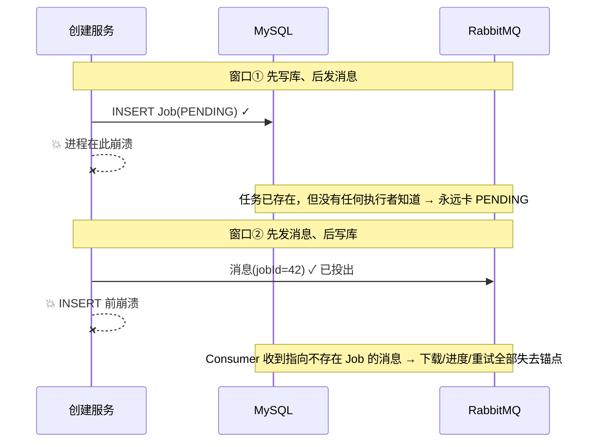
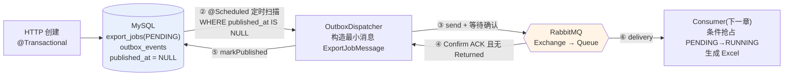
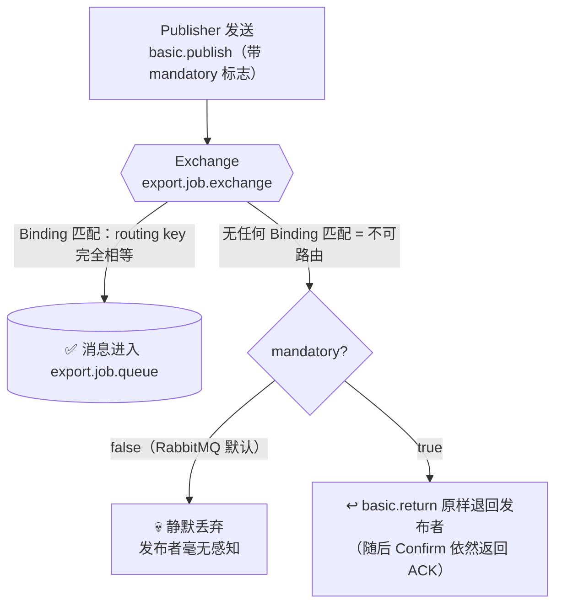
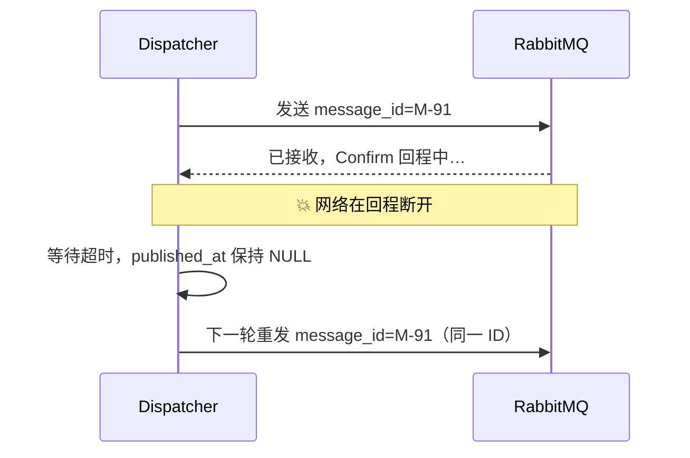

# 学习笔记：Outbox 可靠投递与发布确认闭环

> 对应教程章节「Transactional Outbox：把发布意图可靠送达 RabbitMQ」（第 13 章）。
> ✅ 实现状态：投递管道（P0）已按本文规划落地——`export/mq/`（RabbitConfig / OutboxDispatcher / ExportJobMessage）+ Mapper 两条语句 + amqp 依赖与发布确认配置；**Consumer（第 14 章）未实现**（详见第 5、6 节）。

---

## 1. 一句话总结

上一章解决了"Job 和 Outbox **一起写进 MySQL**"（原子性），这一章解决"写进库之后，**消息怎么可靠地送达 RabbitMQ**"——即使 RabbitMQ 宕机、进程崩溃、网络抖动，每条未投递的意图最终都能补发出去。

生活类比：**寄快递前先在台账登记**。
- `outbox_events` 表 = 寄件台账（"这单必须寄出"）
- Dispatcher = 快递员（照台账取件发货）
- Publisher Confirm = 快递公司回执（**没拿到回执就不许在台账上打勾**）
- 补发机制 = 没打勾的记录下一轮继续寄，宁可寄重、绝不寄丢

---

## 2. 要解决的问题：双写困境（Dual-Write Problem）

MySQL 和 RabbitMQ 是两个独立系统，**不存在能同时提交或回滚两边的事务**。在 HTTP 线程里"写库 + 发消息"两条命令，中间任何一次崩溃/断网都会留下半完成状态：

Outbox 的答案一句话：**把"要发消息"这件事本身也写进数据库，和 Job 同一个事务；发送交给事务提交后的独立组件；拿到 Broker 的接收证据才标记完成。**

---

## 3. 全链路一览

关键认知：**Dispatcher 不是 HTTP 线程里"顺手发一下"**，而是独立后台组件。只要台账里还有 `published_at IS NULL` 的记录，RabbitMQ 恢复后就能继续补投——这就是"用可重扫的事务表，换分布式最终可达性"。

---

## 4. 核心设计点

### 4.1 Outbox 是设计模式，不是可 import 的库

| 容易混淆的对象 | 与 Outbox 的区别 |
|---|---|
| Java 类库 | 没有任何框架"实现了 Outbox"；表、Mapper、发布流程要自己拼（Spring 只提供 @Transactional/@Scheduled/RabbitTemplate 等积木） |
| MySQL 内建功能 | MySQL 只负责两行同事务提交，不会主动连 RabbitMQ |
| RabbitMQ Queue | Queue 保存 **Broker 已接收**的消息；Outbox 保存**尚未获得发布证据**的意图 |
| Job | Job = 用户要的任务；Outbox = "这个 Job 还需要被投递" |
| 分布式两阶段提交 | Outbox 不让 MQ 成为 MySQL 的事务参与者，用可重扫记录换最终恢复，成本和故障模式都小得多 |

### 4.2 `send()` 返回 ≠ 消息已送达：发布确认闭环

`send()` 只说明请求交给了客户端库。之后有两条相互独立的反馈通道（都是 AMQP 协议方法，不是 Spring 发明的）：

- **Confirm（`basic.ack`/`basic.nack`）**：Broker 是否**接收**了这次发布——接收即接管责任，但不代表消息进了任何队列；
- **Returned（`basic.return`）**：消息进得了 Exchange，却**没有任何 Binding 匹配 routing key**（不可路由）时，Broker 把消息**原样退回发布者**的通知。RabbitMQ 默认对不可路由消息**静默丢弃**（发布方毫无感知），开启 `mandatory: true` 才改为退回。

「成功路由（消息确实进了 Queue）」不是一个事件，而是**推断**出的结论：`Confirm ACK` 且 `无 Returned` ⇒ 在本项目的 direct exchange 下消息已进入 `export.job.queue`：

注意：不可路由退回时 Confirm 仍是 ACK——ACK 只回答「发布已处理」，不回答「进了队列」，所以两个证据必须同时看。判定组合如下：

| Confirm（Broker 接收？） | Returned（不可路由被退回？） | published_at | 下一步 |
|---|---|---|---|
| ACK ✓ | null | **写入当前时间** | 不再扫描这条 |
| NACK ✗ | — | 保持 NULL | 下轮扫描重试 |
| ACK ✓ | 非 null（routing key 没匹配到 Queue） | **保持 NULL** | 修复路由后重试（只看 ACK 会误标！） |
| 等待超时 / send 抛异常 | — | 保持 NULL | 保守重发（可能重复，见 4.4） |

对应的三个配置各管一件事：`publisher-confirm-type: correlated`（能对上每一次发送的确认）、`publisher-returns: true`（退回可见）、`template.mandatory: true`（不可路由不静默丢弃）。

### 4.3 Outbox 没有 FAILED 状态

状态只有：`Unpublished → Publishing → Published`。发布失败、超时、退回都**不**把 Job 改成 FAILED——因为 Job 还没开始执行，MQ 暂时不可用是"可恢复的投递问题"，不是"业务执行失败"。把它标失败会毁掉 MQ 恢复后的自动补发。

`markPublished` 的 SQL 带 `AND published_at IS NULL`，让"打勾"单向不可逆——正确性放在数据库前提里，而不是依赖"调度绝不会重入"的假设。

### 4.4 至少一次投递：重复是受控的代价

Dispatcher 无法区分"Broker 没收到"和"收到了但回执丢了"，所以**宁可重发**。这里"猜一次可能已成功"的聪明做法，会让真正丢失的消息永远失去恢复入口。重复不是缺陷，而是要被下游接住的边界：

> **责任链**：第 13 章 Outbox 保证"**不丢**"（哪怕重复发）＋ 第 14 章 Consumer 保证"**不重**"（PENDING→RUNNING 条件 UPDATE，重复消息抢不到第二次执行权）。两章合起来才是端到端幂等。

### 4.5 四个状态互不同步（排障入口才清晰）

| 对象 | 生命周期 | 由谁推进 | 排障含义 |
|---|---|---|---|
| Job | PENDING→RUNNING→SUCCEEDED/FAILED | Consumer/执行服务 | 业务任务现在怎样了 |
| Outbox | 未发布→已发布 | Dispatcher | 是否拿到 Broker 接收证据 |
| MQ 消息 | 发布→路由→delivery→ack | Broker/Consumer | 传输载体还需要 Broker 保存吗 |
| Attempt | RUNNING→终态 | 执行服务 | 某一次执行发生了什么 |

Job 已 RUNNING 而 Outbox 早已 published、Outbox 未发布而 Job 停在 PENDING——都正常。**不要发明一条同步状态线**。排障口诀：`published_at IS NULL` → 查 Dispatcher/MQ 连通性/路由；`published` 有值但 Job 长期 PENDING → 查 Queue 和 Consumer。

### 4.6 消息契约最小化 + durable/persistent 区分

- **ExportJobMessage 只带执行定位信息**（schema_version、message_id、job_id、event_version），不带筛选 JSON/列/文件名——那些已在 Job 里，执行必须以数据库为准。Outbox 的 payload 只做审计，不复用为消息正文，避免审计字段变动破坏消费格式。
- `message_id` 由 `outbox:<event.id>` 派生稳定 UUID：同一条 Outbox 重发携带同一 ID，用于观察重复（实现落点：`ExportJobMessage.messageIdFor`）。
- **durable** 管 Exchange/Queue 的**定义**（Broker 重启后路由规则还在）；**persistent** 管单条**消息**（Broker 接受后可落盘）；**Publisher Confirm** 管"Producer↔Broker 交接"；**Consumer Ack**（下一章）管"Consumer↔Broker 交接"。谁都不替代 MySQL 的业务审计。
- trace_id 全链路贯穿：HTTP 响应头 → `outbox_events.trace_id` → MQ Header `X-Trace-Id` → Consumer MDC 日志（仅诊断用，不能当去重键）。

---

## 5. 教程文章 vs 本仓库代码（实现现状对照）

| 教程描述的对象 | 本仓库现状 |
|---|---|
| `outbox_events` 表（published_at、payload、trace_id、扫描索引） | ✅ **已建**：V1 建表含 `published_at TIMESTAMP NULL` 与 `idx_outbox_unpublished(published_at, created_at)`；V7 补 `trace_id` 列——**扫描所需的全部物理基础已就绪** |
| 创建事务同写 Job + Outbox（第 12 章） | ✅ 已实现（`ExportJobService.createJob`，见前一篇笔记） |
| `OutboxEventMapper.insert` | ✅ 已实现（XML mapper） |
| `spring-boot-starter-amqp` 依赖、`spring.rabbitmq.*` 配置 | ✅ 已引入：`backend/pom.xml` + `application.yml`（correlated confirm + publisher-returns + template.mandatory） |
| `RabbitConfig`（Exchange/Queue/Binding/DLX 常量与 Bean） | ✅ `export/mq/RabbitConfig.java`（durable direct + DLX/DLQ 绑同 key） |
| `OutboxEventMapper.findUnpublished()` / `markPublished()` | ✅ 接口 + `OutboxEventMapper.xml`（UPDATE 带 `AND published_at IS NULL` 单向条件） |
| `OutboxDispatcher`（@Scheduled 扫描 + Confirm 等待） | ✅ `export/mq/OutboxDispatcher.java`（单轮上限 100、逐条隔离、deferred 日志） |
| `ExportJobMessage` 消息契约 record | ✅ `export/mq/ExportJobMessage.java`（`messageIdFor` 稳定派生 + `isSupported()`） |
| Dispatcher/Confirm 相关集成测试 | ✅ `OutboxDispatcherTest`（7 用例）+ `ExportJobMessageTest`（4 用例），全量 125 测试通过 |
| Consumer / 执行器 | ❌ 无（下一章起） |

> 结论：本章的投递管道（P0）已按上文规划实现，配置命名取仓库风格（`export.outbox.dispatch-delay-ms` / `export.outbox.confirm-timeout-ms`，默认 5000）；消费者仍缺位，`export.job.queue` 中的消息暂时无人消费。

---

## 6. 新规划：本项目尚未实现清单

按依赖顺序分四批（P0 依赖 P1 之前必须完成），与 AGENTS.md「已实现 vs 计划实现」对齐并细化到本章粒度：

### P0 —— 可靠投递管道（本章范围，最先做）✅ 已全部实现

1. ✅ 引入 `spring-boot-starter-amqp` 依赖；`application.yml` 配置连接 + `publisher-confirm-type: correlated`、`publisher-returns: true`、`mandatory: true`。
2. ✅ `RabbitConfig`：Exchange/Queue/Binding/DLX 常量与 Bean（durable、direct、routing key `export.job.create`）；`@EnableScheduling` 置于主启动类 `FlowHubApplication`。
3. ✅ `ExportJobMessage` 消息契约 record（schema_version/message_id/job_id/event_version + `isSupported()`），消息 Header 写入 `X-Trace-Id`。
4. ✅ `OutboxEventMapper` 补 `findUnpublished()`（WHERE published_at IS NULL AND 聚合/类型过滤，ORDER BY created_at,id）与 `markPublished()`（带 `AND published_at IS NULL` 单向条件）。
5. ✅ `OutboxDispatcher`：@Scheduled 扫描 → 构造消息（message_id 由 outbox id 派生）→ send + 等待 Confirm → ACK 且无 Returned 才 markPublished；异常/NACK/Returned/超时统一保留并记 `outbox_publish_deferred` 日志。
6. ✅ 集成测试：Confirm 后 published_at 才非空；send 抛异常时 published_at 保持 NULL 且 Job 不变 FAILED（另覆盖 NACK/Returned/契约/批量隔离）。

### P1 —— 消费与执行（第 14 章起）

7. `ExportJobConsumer`：消费消息 + Consumer Ack；**PENDING→RUNNING 条件 UPDATE 抢占**（重复消息拒之门外）+ 创建 Attempt。
8. 导出执行器：按 Job 快照（`OrderCriteria` + `max_order_id_at_create` 一致性边界）分批游标读订单，POI **SXSSF** 流式写 Excel 到 `export-files/`，完成后原子改名 + 事务写文件信息与 SUCCEEDED 终态。
9. 失败收敛：异常 → FAILED（错误码/摘要/完成时间）；Redis 进度缓存 + 每批次进度事件。

### P2 —— 周边能力

10. SSE 进度推送（`useExportEvents` 混合同步方案，见 `docs/export-sse-design.md`）+ 导出任务列表/详情/重试/下载接口（下载走 `api/download.ts` 已备好的前端契约）。
11. 文件过期清理任务（SUCCEEDED→EXPIRED）与遗留 RUNNING 的租约恢复。

### P3 —— 前端真实化

12. 导出任务页本体（列表/进度条/下载/失败重试入口）替换占位；筛选条件 URL 同步与路由。

---

## 7. 一页记忆卡

1. Outbox 解决的是"**发布意图丢失**"：Job 已提交而消息系统不可用时，留一条可重扫的记录作为恢复入口。
2. `published_at` 的语义是"**Broker 接收且成功入队**"（Confirm ACK 且无 Returned）——不是"Java 调了 send"，也不是"Broker ACK 了"（退回发生时同样 ACK）。
3. Outbox **没有 FAILED**：MQ 不可用是投递问题不是业务失败，Job 保持 PENDING 等补发。
4. 标记已发布必须带 `AND published_at IS NULL`——单向打勾，不依赖调度不重入。
5. 至少一次投递 = 宁可重复、绝不丢失；重复由下一章 Consumer 的条件抢占接住，两章才是完整闭环。
6. Job / Outbox / 消息 / Attempt 四个状态独立演进，**状态不同步是设计**，不是缺陷。
7. 本仓库现状：P0 投递管道已建成（表 + 双写 + Dispatcher + Confirm 闭环，125 个测试全绿）；「不重」的 Consumer 待下一章。
