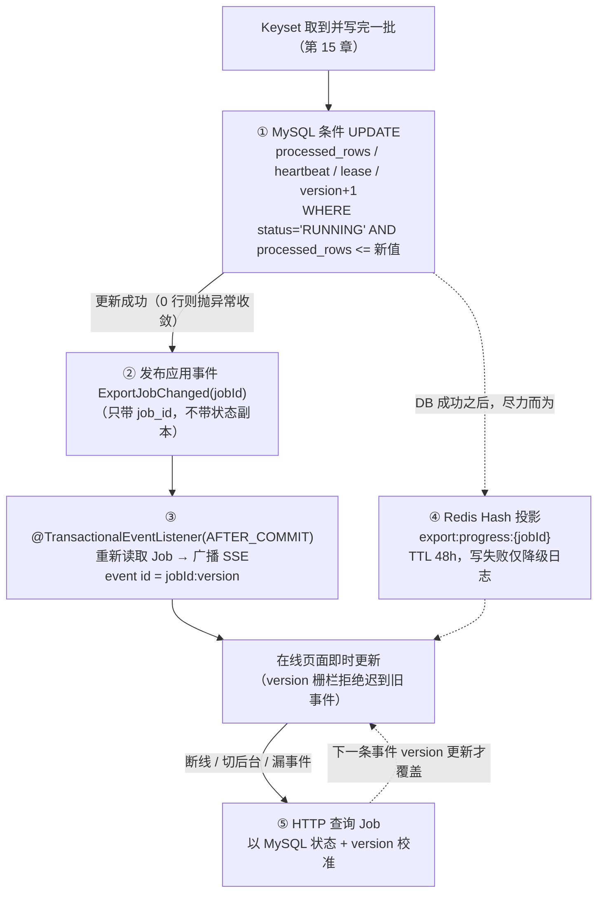

# 学习笔记：状态持久化与实时通知——事实源、投影与校准

> 对应教程章节「任务状态与实时进度的持久化与通知：MySQL 事实源 + Redis 投影 + SSE 通知」（第 16 章）。
> ✅ 实现状态：**本章主体已按第 7 节规划落地（2026-09）**——① 进度条件守卫 SQL（`processed_rows` 单调 + `status='RUNNING'` 单向 + heartbeat/lease 续期，0 行 fail-fast）；② 实体 version/processedRows/error* 读出；③ `ExportJobChanged` 事件 + `ExportSseService`（AFTER_COMMIT 广播、15s 心跳、坏连接隔离、事件 id=`jobId:version`）+ 端点 `GET /api/v1/export-jobs/events`（4 类事件契约对齐 `docs/export-sse-design.md` 3.2）+ `markFailed` 同事务后广播失败终态；④ FAILED 侧终态缓存随 ③（SUCCEEDED 侧等第 18 章）；⑤ Redis 投影（TTL 48h、失败降级）；⑦ 测试矩阵 14 用例（回滚不广播经 TransactionTemplate 验证），全量 159 测试通过。**未做**：前端 `useExportEvents`（独立交付计划，联调依赖 P-4 列表接口真实化）、SUCCEEDED 终态（第 18 章 markSucceeded）。

---

## 0. 名词人话速查表（先看这个）

本章反复出现的词，全部翻译成大白话。类比统一用一个场景：**成绩册（MySQL）、走廊快报（Redis）、广播站（SSE）、学生自己去教务处查（HTTP）**。

### 三个主角

| 名词 | 人话 |
|---|---|
| 事实源（Single Source of Truth，指 MySQL） | **唯一算数的账本**。别处说的都不算数，数字打架时以它为准 |
| 投影（Projection，指 Redis） | 从账本**抄出来的小抄**。为了快；丢了、撕了都能照着账本重抄，不心疼 |
| SSE（Server-Sent Events） | 服务器的**广播喇叭**：浏览器连上后，服务器一有新消息就主动推过去，不用浏览器反复问 |
| SseEmitter | Spring 框架里那只喇叭的**把手**——后端代码拿着它往连接上塞消息 |
| HTTP 校准 / Refetch（Reconciliation） | 听漏了广播？**自己再问一次账本**，把真相拿回来覆盖页面上的旧数字 |
| 轮询（Polling） | 没有广播时的笨办法：每隔几秒问一次「好了吗？」 |

### 机制词汇

| 名词 | 人话 |
|---|---|
| TTL | 小抄的**保质期**。48 小时后 Redis 自动销毁这条小抄；销毁不影响账本 |
| Redis Hash | Redis 里「一个 key 挂一小组字段」的存法——像一张卡片上印好 5 个格子（状态/行数/总数/百分比/时间） |
| CAS 条件更新 | 「**满足条件才许改**」的 SQL：约束全写在 WHERE 里，条件不满足就一行都改不动（受影响 0 行） |
| 单调递增 | **只许前进不许后退**：进度能从 60% 涨到 80%，永远不许从 80% 掉回 60% |
| version / 版本栅栏（Fencing） | 账本每改一次就 +1 的**序号**。前端只认更大的序号，序号小的消息直接扔 |
| 乱序 | 网络不保证先发先到：80% 的消息可能比 60% 的消息**晚**到达 |
| 应用事件（ExportJobChanged） | **同一个 Java 程序内部的传纸条**：数据库更新成功后喊一嗓子「42 号任务变了」，不携带内容只带编号 |
| 事务 / 事务回滚 | 事务 = 一组数据库操作**打包**，要么全成功、要么全不算数；回滚 = 打包失败，当作完全没发生过 |
| @TransactionalEventListener(AFTER_COMMIT) | 一条规矩：「**等账本真正落笔之后**才许广播」。防止账本没写成、广播已经喊了「成功」 |
| 幻觉通知 / 伪状态广播 | 数据库明明没写成功，前端却收到了「成功」——本章的大敌 |
| heartbeat（心跳） | 每 15 秒发一个「喇叭还通着」的空信号。**只证明连接活着，不代表任务有进展** |
| lease（租约） | 执行器的**工位预订单**：每处理一批续一次期；超时没续 = 人跑了，别人可以接管（第 19 章的事） |
| 最终一致性 | 短时间内账本、小抄、页面的数字可能不完全一样，但**迟早都会对上账本** |
| 降级（Graceful Degradation） | 某个零件坏了就**绕过它**：Redis 挂了就都去查 MySQL。功能变笨一点，但不停摆 |
| fail-fast | 一发现不对劲**立刻停下报错**，绝不带病继续跑 |

---

## 1. 一句话总结

第 15 章解决了「后台**怎么读**数据」；本章解决「读出来的进度**怎么让数据库、缓存、浏览器三方达成一致**」——同一份状态按「诉求与耐受度」分四层保存：**MySQL 定真相、Redis 做投影、SSE 尽力喊、HTTP 兜底校准**，任何一层故障都不污染其他层。

生活类比（一场考试出分）：

| 机制 | 类比 |
|---|---|
| MySQL 事实源 | 教务处的成绩册——只有登记成功才算数，其他都是抄写 |
| Redis 投影 | 走廊里贴的「成绩快报」——为快而生，撕了（过期/宕机）可以重贴 |
| SSE 推送 | 广播站——尽力喊给在场的人，没听到的自己去看快报或问教务处 |
| HTTP 校准 | 学生自己去教务处查——任何时候都能拿回真相 |

核心铁律一句话：**成绩册没写上，广播不许喊；广播站塌了，成绩册照常登记。**

---

## 2. 要解决的问题：「谁说了算」

进度变化要同时被三方观察，但三方诉求与故障模式完全不同：

| 观察者 | 想要什么 | 不能承担的责任 |
|---|---|---|
| MySQL Job | 可追溯事实（状态/行数/版本/心跳） | 无法主动推到浏览器 |
| 浏览器任务列表 | 「到第几行了」「成功了吗」 | 不能凭本地计时器猜后台进度 |
| Redis | 快速读取活跃进度 | 不能单独决定成功/失败/可下载 |
| SSE | 实时通知在线页面 | 不是事件账本，断线就丢事件 |

若不建立**状态所有权（State Ownership）**，会掉进三个泥潭：缓存反噬事实（Redis 里 80%、MySQL 里 70%，页面该信谁？）、伪状态广播（事务回滚了，前端却收到「成功」）、前端乱序覆盖（迟到的旧事件把 80% 刷回 60%）。

FlowHub 的答案：**MySQL 保存任务事实；Redis 保存可重建的进度投影；SSE 尽力通知在线页面；HTTP 查询在断线、终态和页面恢复时重新校准。**

---

## 3. 全链路一览



实线顺序是铁律：**不能先向浏览器宣布「60%」，再发现数据库更新失败。** 浏览器可以暂时慢，但不能长期看到一份从未成为数据库事实的进度。

四层职责（教程架构图）：

| 层 | 是什么 | 关键动作 | 故障时 |
|---|---|---|---|
| 1 物理事实源（MySQL） | 任务状态的唯一裁决依据 | 单调递增 CAS SQL，决定任务物理生死 | 只能明确失败或等待恢复，**不能「降级到 Redis」** |
| 2 内存状态投影（Redis） | 可删除、可重建的活跃进度副本 | HSET + TTL 48h | 缺失/旧值，HTTP 仍能拿到真相 |
| 3 实时通知通道（SSE） | 尽力而为的推送 | AFTER_COMMIT 后发送，断连即移除 | 页面走重连/轮询/refetch 校准 |
| 4 兜底校准（HTTP） | 最终一致性入口 | 前端以 MySQL 返回的 version+状态覆盖本地推测 | — |

---

## 4. 核心设计点

### 4.1 事实源：进度不是 setProgress(60)，是状态机的一部分

事实源不是「所有读都查它」，而是**数据冲突时以它为最终依据**。`export_jobs` 保存 status / processed_rows / attempt_count / version / last_heartbeat_at / lease_expires_at / file_path / error_code / error_message——这些字段跨重启、下载、重试、清理都要可查询，不能只活在 Redis 或 Java 内存里。

进度推进 SQL 用**条件更新同时保护三件事**：

```sql
UPDATE export_jobs
SET processed_rows = #{processedRows},
    last_heartbeat_at = #{now},
    lease_expires_at = #{leaseExpiresAt},
    updated_at = #{now},
    version = version + 1
WHERE id = #{jobId}
  AND status = 'RUNNING'                 -- ① 成功/失败/过期任务继续写进度
  AND processed_rows <= #{processedRows} -- ② 迟到的旧批次把进度回退
-- version = version + 1                 -- ③ SSE/HTTP 用版本判断新旧
```

| 条件 | 防什么 |
|---|---|
| `status = 'RUNNING'` | 终态任务被再次写入进度 |
| `processed_rows <= 新值` | 旧批次/重投消息把进度倒退 |
| `version = version + 1` | 派生层（SSE/HTTP）无法区分新旧 |
| heartbeat / lease 续期 | 第 19 章判断 Worker 是否失联 |

更新受影响 0 行 = 抛异常走失败收敛，**进度推进的成功证据是数据库更新结果，不是代码执行到了某一行**。

### 4.2 投影：可删除、可重建的 Redis Hash

投影 = 从事实源派生、为某一种读取场景服务的数据。**它可以过期、丢失、短暂落后；只要能从事实源重新得到，丢失就不改变业务结论。**

- Key：`export:progress:<jobId>`，Hash 字段 status/processedRows/totalRows/percent/updatedAt（Hash 把同一 Job 的一小组字段放在一起按字段更新，这正是选 Redis 而非其他缓存的结构性理由）。
- TTL 48h 只是「投影在缓存里活多久」——**不是文件保留期，也不是 Job 业务过期时间**。Key 过期后页面照样查 MySQL；Job 的 SUCCEEDED/FAILED 事实不随缓存消失。
- 缓存选型是 ROI 取舍而非组件竞赛：进程内 Map 重启即丢且多实例不共享；Memcached 结构操作不如 Hash 直接；Hazelcast 对单体 Demo 成本高于收益；只用 MySQL 正确但高频刷新体验弱。**当前需要的是「有 TTL、可按字段更新、可在故障时放弃」的活跃进度投影**——单机低频场景只查 MySQL 也许就够了。

关键一句话：**投影能被删除，业务状态不能被删除。**

### 4.3 SSE：尽力通知，不是事件账本

`SseEmitter` 是服务器端持有的 HTTP 长连接对象（进程内 `Map<connectionId, SseEmitter>`），它不是消息队列：不保存历史事件、不保证浏览器在线、应用重启连接全消失。

| SSE 可以做 | SSE 不该做 |
|---|---|
| 尽快把已提交的进度/终态推给在线页面 | 作为任务最终状态的唯一存储 |
| 用 `job_id:version` 让页面识别新旧事件 | 代替断线后的历史事件回放 |
| heartbeat 维持连接可观察性（15s 心跳 ≠ 任务推进） | 保证任何网络下永不丢事件 |
| 发送失败只移除坏连接 | 因一个浏览器发送失败阻塞任务执行 |

发送前**重新读取 Job** 再广播（不信任事件里的旧副本）；事件只带 `jobId`，不带状态快照。

### 4.4 事件必须晚于事实提交：AFTER_COMMIT 屏障

进度/终态变化发布同一种轻量应用事件 `ExportJobChanged(jobId)`（record，无状态副本，仅单体进程内有效——**不是分布式事件总线**，多实例需另建跨实例通知通道）。

终态路径（succeed/fail）在 `@Transactional` 事务里更新 Job/Attempt 后发布事件，监听器用：

```java
@TransactionalEventListener(phase = TransactionPhase.AFTER_COMMIT, fallbackExecution = true)
```

- **AFTER_COMMIT**：事务真正提交后才广播——事务回滚，监听器不执行，杜绝「数据库没提交、前端已收到成功」的幻觉通知。
- **实现细节辨析**（教程特别强调）：进度路径 `report()` 自身**没有** `@Transactional`——它先确认 Mapper 更新成功（!=1 即抛异常），再发布事件；`fallbackExecution = true` 允许无事务上下文时监听器照常执行。所以准确表述是「**数据库进度更新成功后才发事件**」，而非「所有 SSE 都在事务提交后发送」。框架提供阶段监听能力，项目编排决定哪条路径在事务内。

顺序原则：**任何派生数据（缓存、通知）都不能抢在 MySQL 事实之前变成对外结论。** 缓存先失败、通知先失败、都失败——已提交的 Job 不受影响。

### 4.5 版本栅栏：让页面拒绝迟到状态

SSE 事件 id = `<jobId>:<jobVersion>`，version 来自 MySQL——每次进度/状态变更由 Mapper 递增。前端只接受比缓存版本更新的事件：

- 浏览器已见 `42:8`（80%），迟到的 `42:7`（60%）到达 → 按版本忽略，**到达顺序不等于状态顺序**；
- 断线期间漏掉 `42:9` 成功事件 → 重连/终态/页面恢复时 HTTP 查询补齐 MySQL 当前 version 与状态。

版本栅栏是**无锁的最终一致性**：不依赖网络包顺序，不依赖分布式锁。

### 4.6 进度百分比为何封顶 99

RUNNING 状态的缓存 percent 最高 99：最后一批已写完时，Workbook 可能还在关闭、临时文件可能还没发布、MySQL 终态可能尚未提交。页面若先显示 100%，用户会认为文件已可下载。**只有 Job 真正 SUCCEEDED，终态缓存才允许 100**——这是用户语义规则，不是数学技巧。

### 4.7 降级矩阵：每层挂了会怎样

| 情况 | MySQL Job | Redis 投影 | SSE 页面 | 页面下一步 |
|---|---|---|---|---|
| 一切正常 | 最新 | 最新 | 立即看到变化 | 正常展示 |
| Redis 不可用 | 最新 | 缺失/旧值 | 仍可能收到事件 | HTTP 查询仍得真相；日志记 `redis_progress_write_failed` |
| SSE 断线 | 最新 | 可能正常 | 当前页面停更 | 第 9 章重连/轮询/refetch 校准 |
| MySQL 更新失败 | 未推进/回滚 | 不应成为可信新状态 | 不应广播成功结果 | 执行服务失败收敛 |

**MySQL 不可用 ≠ 降级到 Redis**——Redis 没有完整 Job/Attempt/文件/状态机，不能在事实源失效时独立完成可靠导出。事实源挂了只能明确失败或等待恢复。

### 4.8 时间线：多副本最终一致的真实节奏

三层不会在同一微秒变化，追求的是「最终能解释」：

| 时刻 | MySQL | Redis | SSE 页面 |
|---|---|---|---|
| T0 | processed_rows=2000 | 2000 | 显示 2000 |
| T1 | 条件 UPDATE 成功 → 3000，version+1 | 旧投影 | 未收到事件 |
| T2 | —（应用事件触发，SseService 重读 Job） | 旧投影 | 在线页面收到 3000 |
| T3 | — | Hash 写入 3000 | 可能已显示 3000 |
| T4 | — | — | 某页面断线，停更 |
| T5 | — | — | 恢复后 HTTP 查询，回到 MySQL 当前值 |

**页面短暂显示旧进度不是错误**；真正要修的是状态永不收敛，或派生数据反过来改写事实源。

### 4.9 排障：先分清故障发生在哪一层

| 现象 | 先查什么 | 可能说明 |
|---|---|---|
| 页面一直 0% | MySQL processed_rows 是否增长 | 不增长 → 问题在读取/写入/Job 状态，不是前端连接 |
| MySQL 已增长，页面不动 | SSE 连接状态 + HTTP refetch | 事件断线或页面没校准 |
| MySQL 已增长，Redis 无 Key | `redis_progress_write_failed` 日志 | 缓存降级，不应停止任务 |
| 页面收到旧进度 | job_version 对比 | 网络乱序，前端应忽略旧版本 |
| 已 SUCCEEDED 仍显示 99% | HTTP 详情 | 页面漏终态事件，查询覆盖 |

排查口径：**先确认事实是否仍在 MySQL，再问投影与通知能否恢复**——不要把所有现象归咎 Redis 或浏览器。

### 4.10 本章确认表

| 判断 | 正确结论 |
|---|---|
| Redis Key 到期后 Job 丢失？ | 否，Job 仍在 MySQL，缓存只是投影 |
| 漏掉一条 SSE 成功事件就下载不了？ | 否，HTTP 查询拿 MySQL 终态 |
| Redis 写失败要把 Job 标 FAILED？ | 否，DB 已成功时只记缓存降级 |
| 事务回滚还应发 `job.succeeded`？ | 不应，终态事件提交后才广播 |
| `job_version` 的作用 | 帮页面拒绝迟到事件，**不能代替 MySQL 查询** |

### 4.11 四个故障演练（验证分层是否成立的判断标准）

| 演练 | 预期 MySQL | 预期 Redis/SSE | 结论 |
|---|---|---|---|
| Redis 写入抛异常 | processed_rows 继续增长，任务可成功 | Hash 缺失，日志降级 | 缓存不是事实源 |
| 断开 SSE | 正常推进 | 当前页面停更 | 恢复后 HTTP 能校准 |
| Job 状态条件不满足 | 更新失败，走错误处理 | 不广播伪进度 | 事件不能抢在事实之前 |
| 旧事件晚到 | version 不回退 | 前端忽略旧 version | 到达顺序 ≠ 状态顺序 |

### 4.12 从零实现的顺序

1. 先让 MySQL 能持久化 processed_rows/状态/version，不接 Redis/SSE；
2. 每批用条件 UPDATE 推进（拒绝终态写入与回退更新）；
3. 加 `ExportJobChanged` 小事件，先只打日志验证时机正确；
4. SseEmitter 管理进程内连接，**发送前重读 Job**；
5. 最后接 Redis Hash + TTL，定位为可失败投影；
6. 为「Redis 写失败 / SSE 断线 / 事务回滚 / 版本乱序」分别补测试或可观测日志。

**绝不能反过来**先在 Redis 里累加百分比再同步回 MySQL——那会让缓存临时状态变成事实来源，重启或过期后无法解释。

---

## 5. 与本仓库的对照

### 5.1 已就绪（本章前置）

| 本章要求 | 本仓库现状 |
|---|---|
| version 列与每次状态变更递增 | ✅ V1 `version` 列；`claimPending`/`markFailed`/`updateProcessedRows` 三处 `version+1`，XML 注释已注明「供 SSE/HTTP 状态校准（P1 最小落地，事件发布随 SSE 设计后续接入）」 |
| 每批进度落库 | ✅ 第 15 章 `updateProcessedRows`（查询→累计→推进→落库循环内调用） |
| heartbeat / lease 列 | ✅ V4/V5；`claimPending` 抢占时回填（执行中续期未做，第 19 章） |
| SSE 响应不被 Envelope 包装 | ✅ `ApiResponseAdvice` 已放行 `SseEmitter`/流式响应 |
| 终态收敛（失败侧） | ✅ `ExportJobService.markFailed`（RUNNING 单向条件，同事务收敛 Attempt） |
| 前端消费设计 | ✅ `docs/export-sse-design.md`：`useExportEvents` + `job_version` 版本栅栏 + HTTP 校准 + 轮询降级（蓝本参考项目 project-export-flow） |
| trace 链路贯穿异步线程 | ✅ `MdcTaskDecorator` + `flowHubTaskExecutor` |

### 5.2 与教程口径的三个实现差距（本章落地的核心工作）

1. **`updateProcessedRows` 缺条件守卫**：当前 SQL 只有 `WHERE id = #{jobId}`，没有教程强调的 `status = 'RUNNING'` 单向条件与 `processed_rows <= #{processedRows}` 单调条件。当前单 Job 单执行权（抢占保证）下风险低，但与「终态不可再写进度、旧批次不得回退」的语义约定不符，应按 4.1 升级（规划 ①）。
2. **version 只写不读**：`ExportJobEntity` 无 `version` 字段、`selectById` 的列清单不含 version——SSE 事件 id（`jobId:version`）与前端栅栏的数据源缺失（规划 ②）。
3. **Redis 与 SSE 全链未引入**：pom 无 `spring-boot-starter-data-redis`；无 `ExportJobChanged` 事件、无 `SseEmitter` 服务、无进度/终态缓存。`updateProcessedRows` 即教程 `report()` 的最小版（只有 DB 侧），事件发布与缓存两点待接入（规划 ③④）。

### 5.3 尚未实现（本章主体缺口）

| 缺口 | 说明 |
|---|---|
| 条件防回退进度 SQL | `updateProgress`：status 单向 + processed_rows 单调 + heartbeat/lease 续期 |
| Redis 投影 | 依赖引入（可选运行）+ `export:progress:<jobId>` Hash + TTL 48h + 写失败降级日志 |
| 应用事件 + SSE 服务 | `ExportJobChanged` + `ExportSseService`（连接 Map/heartbeat/坏连接移除）+ AFTER_COMMIT 监听 |
| 实体 version 读出 | `ExportJobEntity` 补字段 + `selectById` 列清单 |
| 成功终态路径 | `markSucceeded`（依赖第 18 章文件发布）+ 终态缓存 100% 语义 |
| 降级/边界测试 | Redis 写失败任务仍成功、条件更新拒绝回退、断线校准等（4.11 演练矩阵） |

---

## 6. 明确不做的事（边界）

- 不做 Redis Cluster、跨实例 emitter 广播、Redis Pub/Sub 转发——单体进程内 ApplicationEvent 足够，多实例扩展属第 20 章生产化。
- 不做 SSE 事件持久化 / Last-Event-ID 历史回放——断线恢复靠 HTTP 校准，不靠事件账本。
- 不做缓存强一致——投影允许短暂落后，最终以 MySQL 为准。
- 不把 heartbeat 的 15s 节奏当作任务推进信号；TTL 48h 不等于文件保留期。

---

## 7. 落地规划（建议顺序，已按 `docs/export-sse-design.md` 契约校准）

> 校准说明：SSE 端点形状、事件类数与测试深坑以 `docs/export-sse-design.md`（P-3/P-4 前置条件）为准——**统一连接端点 `GET /api/v1/export-jobs/events`**（非按 jobId 的子路径），服务端向所有连接广播、前端按 `job_id` 过滤；Redis 投影属该文档定义的「软前置」（对前端透明，可独立穿插）。

1. **进度 SQL 升级守卫**：`updateProcessedRows` → 条件更新（`status='RUNNING'` + `processed_rows <= 新值` + heartbeat/lease 续期一并回填，续期时长参数化或配置化）。**0 行 = fail-fast 抛异常**走执行失败收敛（对齐教程：状态已被并发推进时带病继续写 Excel 只会浪费资源且终态语义混乱；markFailed 的单向条件保证收敛无副作用）；补「迟到旧批不回退」「终态不可写」单测。
2. **version 读出**：`ExportJobEntity` 补 `version` 字段、`jobColumns` 片段与 `selectById`/`selectByIdempotencyKey` 增列。连带改动面：`insert` 仍不写 version（走默认值 0），但 record 构造器新增参数会波及 `createJob` 的 `new ExportJobEntity(...)` 调用点。
3. **事件 + SSE 服务**（核心批）：`ExportJobChanged(jobId)` record；`ExportSseService`（进程内连接 Map + `@Scheduled` 15s heartbeat——主类已 `@EnableScheduling` + completion/timeout/error 回调移除坏连接 + **发送前重读 Job**）；SSE 端点 `GET /api/v1/export-jobs/events`（`text/event-stream`，Envelope 免包装由 ApiResponseAdvice 已有放行覆盖）；事件按 export-sse-design.md 的 **4 类**（对齐 be-td.md 4.10）；事件 id = `jobId:version`；AFTER_COMMIT + fallbackExecution 监听。**失败终态一并接入**：`markFailed` 内发布 `ExportJobChanged`（FAILED 路径已存在，不应等第 18 章）——页面收不到失败通知是体验缺陷。
4. **终态缓存语义**：`cacheTerminal`——FAILED 侧随 ③ 同批落地（error_code/error_message 入缓存）；**SUCCEEDED 侧（含 percent=100 放行）依赖第 18 章 markSucceeded**，仅预留规则与测试占位。
5. **引入 Redis（可选依赖，软前置）**：`spring-boot-starter-data-redis`（Lettuce 懒连接，操作失败 try/catch 降级，应用照常启动）；`ExportProgressService`：DB 成功 → 发布事件 → 尽力写 `export:progress:<jobId>` Hash + TTL 48h，降级日志 `redis_progress_write_failed`；注意 `/actuator/health` 将因 redis 组件 DOWN（对齐 rabbit 行为，README/AGENTS 同步说明）；RedisDown 测试（SpyBean 抛异常的 StringRedisTemplate，写失败任务仍推进/成功）。可与 ③ 独立穿插，不互相阻塞。
6. **前端 `useExportEvents`**：**独立交付计划**，按 `docs/export-sse-design.md` 执行（前端代码就绪 + 单测全绿不依赖后端）；但端到端联调还依赖 **P-4 任务列表接口真实化**（`GET /api/v1/export-jobs` 当前为空占位，属 be-td.md 4.6 的独立后端工作，不在本章范围）——排期时勿把「页面看到进度」误认为本章 ③ 就绪即达成。
7. **测试矩阵 + 文档同步**：条件更新守卫（回退/终态/0 行 fail-fast）、version 单调、Redis 降级、SSE 单连接失败不扩散、回滚事务不广播终态；**特别注意** export-sse-design.md P-3 提示的测试深坑——AFTER_COMMIT 监听器在 Spring 测试事务回滚下不触发，终态广播集成测试需 `@Commit` 或独立事务路径；外加 99% 封顶用例（RUNNING 缓存 percent ≤ 99，SUCCEEDED 才 100）。每步落地同步 README/AGENTS.md。

依赖关系：①② 独立可先行（纯后端小改动）；③ 为核心批（含 markFailed 事件接入）；④ FAILED 侧随 ③、SUCCEEDED 侧等第 18 章；⑤ 软前置可独立穿插；⑥ 独立前端计划（联调依赖 P-4）；⑦ 随各步补充。

---

## 8. 本章沉淀

- **状态所有权对齐**：所有状态变更以 MySQL 记录为准；条件防倒退更新（status 单向 + processed_rows 单调）保证进度单调递增，杜绝并发/重投下的旧数据覆盖。
- **投影与通知的优雅降级**：Redis 只是带 TTL 的可重建快照，宕机仅记警告日志绝不标 FAILED；SseEmitter 只服务在线页面，断线由 HTTP 校准接管——**每层失败先问事实是否还在 MySQL**。
- **事件晚于事实的最终一致边界**：AFTER_COMMIT 是防「幻觉通知」的唯一法则；进度路径「DB 更新成功才发事件」与终态路径「事务提交后广播」是同一原则的两种编排，不可混为一谈。
- **版本栅栏绝杀乱序**：`job_id:version` 事件 id + 前端版本比较，以极低成本实现端到端最终一致——到达顺序不等于状态顺序。
- 至此「数据批次处理」与「多端状态感知」打通。下一章（17）进入 SXSSF 流式 Excel 生成与有限 JVM 堆内存控制——剖析滑动窗口（Row Window）原理，实现「吞吐百万行，内存恒定几十兆」。
