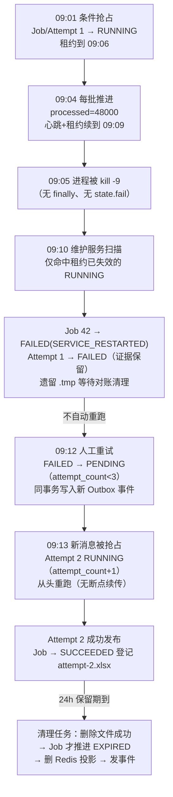

# 学习笔记：恢复与清理——租约自愈、人工重试与孤儿文件对账

> 对应教程章节「崩溃恢复、过期清理与僵尸任务治理」（第 19 章）。
> ✅ 实现状态：**本章主体已按第 7 节规划落地（2026-09-09）**——① `ExportMaintenanceService`（`@EventListener(ApplicationReadyEvent)`+`@Transactional` 启动恢复：Attempt 先行、Job 收尾收敛 FAILED(SERVICE_RESTARTED)，`@Scheduled(cron = export.cleanup-cron:0 0 * * * *)` 定时清理+对账）；② 人工重试 `POST /api/v1/export-jobs/{job_id}/retry`（be-td.md 4.8，FAILED→PENDING + 同事务新 Outbox，202 受理，`EXPORT_JOB_NOT_RETRYABLE` 409）；③ 过期清理「删除成功才 EXPIRED」（`deletePublished` 改返回 boolean 供清理判定，删 Redis 投影 + 发事件）；④ 孤儿三维对账（`OrphanCandidate` + `temporaryCandidatesOlderThan`/`finalCandidatesOlderThan` 候选扫描 + `countRunningWithValidLease` 活跃租约判断 + Job/Attempt 引用检查）；⑤ `ExportMaintenanceIntegrationTest` 6 用例（活跃租约不误伤/重试保留历史+新 Outbox+抢占递增/第四次拒绝/删除即事实+`../` 路径保持 SUCCEEDED/孤儿 tmp 活跃保护/孤儿 xlsx 三态），全量 191 测试通过。测试 yml 以 `export.cleanup-cron: "-"` 静默调度、`export.files.dir` 指向临时目录隔离。**未做（第 20 章）**：多实例部署、对象存储迁移、集群调度。

---

## 0. 名词人话速查表（先看这个）

本章全部围绕一个问题：「**执行者突然消失（kill -9 / 断电 / Pod 驱逐）之后，谁来解释留下的烂摊子**」。类比场景：**夜班保安巡楼**——员工（Worker）下班后工位（RUNNING 任务）还亮着灯，保安（维护服务）不能见灯就关（可能只是去开会了），也不能永远不管（可能是人已经走了）：先看门禁卡有效期（租约），到期才判定人走了（收敛 FAILED），拿工牌登记表（Attempt）留下「谁曾在这里工作过」的证据，垃圾（孤儿文件）攒够一小时且确认无人认领才清走。

| 名词 | 人话 |
|---|---|
| 僵尸任务（Zombie RUNNING） | 进程被强杀，没有 finally 机会执行 `state.fail()`——任务永久停在 RUNNING、进度条僵死 |
| 心跳（last_heartbeat_at） | 「我最近一次有进展是什么时候」的证据。ExportFlow **不单独开心跳线程**：每写完一批顺手更新 |
| 租约（lease_expires_at） | 「执行权最晚有效到几点」的声明。每批推进自动续期（滑动窗口），到期 = 可判定失联 |
| 恢复扫描（Recovery） | 启动/定时把「租约已失效的 RUNNING」收敛为 FAILED(SERVICE_RESTARTED)——**收敛，不自动重跑** |
| 人工重试（Retry） | FAILED → PENDING + 同事务写**新 Outbox 事件**，重走第 13/14 章可靠投递与条件抢占管道 |
| SERVICE_RESTARTED | 恢复收敛写入的稳定错误码：「不是业务失败，是服务中断遗留」 |
| 孤儿文件（Orphan） | 进程暴毙遗留的 .tmp / 未登记 .xlsx——磁盘上有、没人认领 |
| 宽限期（Grace Period） | 文件超过 1 小时才进入清理候选——刚创建的活跃文件不被误判 |
| 三维对账 | 清理候选要同时过三关：**时间宽限 + 活跃租约校验 + 数据库引用检查** |
| 调度幂等 | 清理任务重跑一次不产生错误结论：条件更新 + 「文件不存在视为已清理」 |
| EXPIRED | 成功文件的「下架」状态——**物理文件删除成功后**才允许推进（与第 18 章生成对称） |

---

## 1. 一句话总结

第 12-18 章回答了「任务怎么**正常跑完**」；本章回答「任务**没能跑完**时怎么办」——用租约定义失联边界、用恢复扫描收敛遗留状态、用人工重试重发起执行、用「时间 + 租约 + 引用」三重审查回收文件，让系统在任何非正常停止后都能**自动收敛到可解释状态**。

| 生活类比 | 机制 |
|---|---|
| 员工每做完一件事在签到表打钩，顺带续门禁卡 | 每批写入同步推进 processed_rows + 心跳 + 续租 |
| 门禁卡过期 ≠ 人一定走了，但保安有合法依据处置工位 | 租约到期 = 可判定失联的物理边界（非死亡证明） |
| 收敛为「非正常离职」记录，不替员工决定是否返工 | FAILED(SERVICE_RESTARTED)，保留 Attempt 证据 |
| 返工要重新走一遍入职流程（重新领工牌、排班） | 重试 = 新 Outbox 事件 → 重新条件抢占 → 新 Attempt |
| 垃圾清运前核对：放置时间、认领人是否在岗、登记表 | 宽限期 + 活跃租约 + Job/Attempt 引用三重审查 |
| 货下架前必须先确认真的从货架拿走了 | 文件删除成功 → 才允许 EXPIRED（对称原则） |

核心铁律一句话：**RUNNING 只是一项「暂时成立的声明」——声明在租约有效期内，系统仍愿意把它当作可能继续工作的执行者。**

---

## 2. 要解决的问题：四重危机

进程在任何时刻都可能被 `kill -9` / OOM 强杀 / 断电 / Pod 驱逐——此时 finally、catch、内存变量全部消失，只剩数据库记录与磁盘文件：

| 危机 | 成因 | 用户/系统看到的 |
|---|---|---|
| 僵尸任务 | 强杀没有任何收尾机会，Job 永久 RUNNING | 进度条僵死，用户无休止等待 |
| 脑裂与盲目重试 | 只凭「很久没进展」就悄悄重发执行，而旧 Worker 可能只是长 GC 随时恢复 | 两个 Worker 同时写磁盘/改数据库，产生两份文件 |
| 孤儿文件堆积 | 未落盘的 .tmp、已发布未登记的 .xlsx 无人认领 | 磁盘被日积月累撑爆 |
| 粗暴清理 | 定时任务缺租约校验与路径防腐 | 误删活跃任务的临时文件；或先标 EXPIRED 文件却删失败 |

「可解释」的四条最低要求：RUNNING 停滞能区分「在执行 vs 已失联」；中断的 Attempt 有明确结论且可再次执行；成功文件过期时文件与状态一起变化；磁盘遗留物能被安全判定与回收。

---

## 3. 全链路一览

### 3.1 中断 → 恢复 → 重试 → 清理时间线（以 Job 42 为例）



### 3.2 失败后重试的状态全景表

| 阶段 | Job | Attempt 1 | Attempt 2 | Outbox | 文件 |
|---|---|---|---|---|---|
| 中断后、租约未到期 | RUNNING | RUNNING | 不存在 | 初次事件已确认 | 可能有 .tmp |
| 恢复收敛后 | FAILED（SERVICE_RESTARTED） | FAILED | 不存在 | **不新增** | 遗留文件等对账 |
| 人工重试后 | PENDING | FAILED | 不存在 | 新增一条待发布 | 不动旧证据 |
| 第二次抢占后 | RUNNING | FAILED | RUNNING | 已消费 | attempt-2.tmp |
| 第二次成功后 | SUCCEEDED | FAILED | SUCCEEDED | 完成 | attempt-2.xlsx 登记 |
| 到期清理后 | EXPIRED | FAILED | SUCCEEDED | 无新增 | 正式文件已删除 |

---

## 4. 核心设计点

### 4.1 心跳 / 锁 / 超时 / 租约：职责各不相同

| 机制 | 管什么 | 管不了什么 | ExportFlow 的用法 |
|---|---|---|---|
| 条件抢占 | 谁可以**开始**执行（唯一合法起点） | 开始之后执行者是否还活着 | 第 14 章 `PENDING → RUNNING` 条件 UPDATE |
| 心跳 | 最近一次**有进展**是什么时候 | 静默的长批次是否已死 | 每批写入同步更新（不单独开心跳线程） |
| 租约 | 执行权最晚有效到何时 | Worker 一定已经死亡 | 抢占时写 5 分钟，每批推进续期（滑动窗口） |
| 分布式锁 | 互斥进入临界区 | （本场景不需要） | **不使用**——MySQL 条件更新已保证唯一起点 |

心跳+租约在同一批更新里原子推进（`updateProgress` 的 `WHERE status='RUNNING' AND processed_rows <= 新值` 守卫第 16 章已实现）：旧 Worker 无法复活已结束的任务，也无法倒退进度。

### 4.2 租约是边界，不是死亡证明

| 情况 | 租约会到期吗 | 误判风险 |
|---|---|---|
| 崩溃 / 断电 / 容器重启 | 会 | 应当收敛 ✓ |
| 长 GC / 数据库阻塞 / 超大单批次 | 也可能会 | 可能把仍在执行的任务标失败 ✗ |

所以**租约时长必须与工作粒度一起设计**：批次 1000 行 + 每批续租 → 5 分钟富余充足；若单批次可能跑十几分钟，就要缩小批次或加独立心跳。「恢复不是自动重跑」正是对误判风险的克制：宁可留下明确的 SERVICE_RESTARTED 让人决定，也不在不知道旧 Worker 是否真停时悄悄生成两份文件。

### 4.3 启动恢复：只收敛「租约已失效」的 RUNNING

```sql
UPDATE export_jobs
SET status = 'FAILED', finished_at = #{now},
    error_code = 'SERVICE_RESTARTED', error_message = #{message},
    lease_expires_at = NULL, updated_at = #{now}, version = version + 1
WHERE status = 'RUNNING'
  AND (lease_expires_at IS NULL OR lease_expires_at <= #{now})
```

- Job 与 Attempt 用**同一个「租约失效」前置条件**各更新一次，包在同一个 `@Transactional` 里——不是新的分布式协议，是同事务的两条 SQL；
- **先 Attempt 后 Job** 的顺序配合条件更新，保证不会把仍有有效租约的 Attempt 误写成失败；
- ⚠️ 早期资料曾写「启动时把所有 RUNNING 一律改 FAILED」——**必须细化为只恢复租约失效的**，否则应用重启会误伤正在执行的长任务。

### 4.4 人工重试：三要素缺一不可

1. **条件重置**：`WHERE id = ? AND status = 'FAILED' AND attempt_count < 3`——只有 FAILED 可重试（PENDING 在等、RUNNING 可能活着、SUCCEEDED/EXPIRED 应重新建任务）；`attempt_count` 是**已开始的真实执行次数**（抢占时递增），不是点击重试次数；
2. **证据保留**：失败的 Attempt 一条不删——回答「这个 Job 曾经怎样失败、何时再次执行」；
3. **同事务写新 Outbox**：重试不能直接调执行服务，也不能指望内存线程「碰巧看到」——重用第 13 章 Outbox 把「状态已可执行」与「请求投递」放进同一事务；消费端仍要走完整的条件抢占。

`attempt_count >= 3` 再点重试 → `EXPORT_JOB_NOT_RETRYABLE`。**不做自动重试**的原因：错误分类、退避抖动、重试风暴熔断、断点续传都未建立——人工判断「依赖是否已修复」比隐藏的自动循环更可解释。

### 4.5 过期清理：删除即事实（与第 18 章对称）


与第 18 章的对称：**生成阶段「文件发布成功 → 才许 SUCCEEDED」；清理阶段「文件删除成功 → 才许 EXPIRED」**。两端都拒绝「先改用户可见状态、再赌文件系统会成功」。

### 4.6 孤儿文件三维对账：严禁「见旧文件就删」

| 候选 | 删除前必须确认 |
|---|---|
| 超过 1 小时的 .tmp | 对应 Job/Attempt **无仍 RUNNING 且租约有效**的记录（长批次 Worker 可能正用着它） |
| 超过 1 小时的 .xlsx | Job 表与 Attempt 表**都查不到**该相对路径，且无活跃租约（失败 Attempt 的文件证据要保留） |

候选扫描（`temporaryCandidatesOlderThan` / `finalCandidatesOlderThan`）只圈定受控 exportRoot 内按命名规则解析的候选，返回「候选」不等于「可删」——宽限期、租约、引用三关全过才删。

### 4.7 调度幂等：重跑一次不产生错误结论

| 情形 | 处理 |
|---|---|
| 文件已不存在 | `deletePublished` 视为已清理，不算失败 |
| Job 已被其他流程推进 | `markExpired` 条件更新 0 行 → 不发事件 |
| Redis 删除失败 | 记 warning，不回滚已完成的文件/状态收敛 |
| 路径非法 / 删除失败 | 保持 SUCCEEDED，下一轮再试 |
| 活跃 Attempt 的 .tmp 很旧 | 有有效租约 → 保留 |

调度（cron 每小时）只是给维护逻辑定期执行的机会，不是可靠性本身。当前为**单机边界**：多实例都开 `@Scheduled` 会重复扫描，条件更新能兜底状态推进，但文件扫描仍有竞争——多实例协调属第 20 章扩展。

### 4.8 本章确认表

| 判断 | 正确结论 |
|---|---|
| 租约到期 = 进程死亡？ | 否。只是维护服务可合法判定失联的边界（长 GC 也可能到期） |
| 恢复扫描把 RUNNING 改回 PENDING？ | 否。收敛为 FAILED(SERVICE_RESTARTED)，重跑由人工发起 |
| 重试直接调用执行服务？ | 否。同事务写新 Outbox，重走投递与条件抢占管道 |
| attempt_count 是点击重试次数？ | 否。是已开始的真实执行次数（抢占时递增），上限 3 |
| 文件旧就该删？ | 否。须同时过宽限期 + 活跃租约 + 数据库引用三关 |
| 到期就标 EXPIRED？ | 否。物理文件删除成功后才推进（与生成阶段对称） |

---

## 5. 与本仓库的对照

### 5.1 已就绪（本章前置，全部可复用）

| 本章要求 | 本仓库现状 |
|---|---|
| 心跳与租约字段 | ✅ V5 迁移：`last_heartbeat_at`/`lease_expires_at` + `idx_export_jobs_running_lease (status, lease_expires_at)`——恢复扫描的查询边界已备好索引 |
| 每批续租 | ✅ 第 16 章 `updateProgress`：processed_rows + 心跳 + 租约同一条件更新原子推进（0 行 fail-fast） |
| 抢占写入租约 | ✅ 第 14 章 `claimPending`：抢占成功即写心跳与 5 分钟租约；`MAX_ATTEMPTS=3` 预置 |
| 状态收敛模式 | ✅ `markFailed`/`markSucceeded`（第 18 章）：单向条件 UPDATE + 影响行数判定 + AFTER_COMMIT 事件——`recoverExpiredRunning`/`markExpired` 可对称套用 |
| 过期列与索引 | ✅ V4：`expired_at` + `idx_export_jobs_expiration (status, expired_at)`；第 18 章 `markSucceeded` 已回填（保留期 `export.files.retention-hours` 默认 24h） |
| 受控删除 | ✅ 第 18 章 `ExportFileService.deletePublished`（root 内校验后才删、失败仅告警、不存在视为已清理） |
| 调度基建 | ✅ `@EnableScheduling` 已开启（Outbox 分发器在用）；Attempt 审计表 `export_job_attempts` 就绪 |
| 下载与错误码体系 | ✅ 第 18 章下载接口 + 5 个错误码（`EXPORT_JOB_NOT_RETRYABLE` 待新增） |

### 5.2 文章描述 vs 本仓库现状差异（2026-09-09 落地后）

| 文章描述（参考项目） | 本仓库现状 |
|---|---|
| `ExportMaintenanceService`：启动恢复 + 每小时清理/对账 | ✅ 已落地（`@EventListener(ApplicationReadyEvent)`+`@Transactional` 启动恢复；`@Scheduled(cron = ${export.cleanup-cron:0 0 * * * *})` 定时维护；入口 `MdcScope` 包裹保 trace 链路） |
| `recoverExpiredRunning`：Job + Attempt 同事务收敛 FAILED(SERVICE_RESTARTED)，只命中租约失效行 | ✅ 已落地（Attempt 先行 + 同一租约失效前置条件 + 同事务回滚；恢复不新增 Outbox、不自动重跑） |
| `POST /api/v1/export-jobs/{jobId}/retry` | ✅ 已落地为 `POST /api/v1/export-jobs/{job_id}/retry`（be-td.md 4.8，202 受理 + AcceptedVO）；条件重置与同事务新 Outbox（复用创建事件契约，消息只带执行定位，分发器零改动） |
| `markExpired` + 到期扫描 + Redis 投影删除 | ✅ 已落地（`findExpiredSuccess` 每批 100 → 受控解析 → `deletePublished`（改为返回 boolean 供「删除成功才推进」判定）→ `markExpired` → `deleteProjection` → 发 `ExportJobChanged`） |
| 候选扫描 + `hasActiveLease` 三维对账 | ✅ 已落地（`OrphanCandidate` record + `temporaryCandidatesOlderThan`/`finalCandidatesOlderThan` + `countRunningWithValidLease`（attempt RUNNING + job RUNNING + 租约未到期）+ Job/Attempt `countByFilePath` 引用检查） |
| `Clock`/`ExportTime.utcNow` 统一 UTC 时间 | ⚠️ 保持仓库惯例 `LocalDateTime.now()`：恢复/清理与既有字段同一时间源，租约比较不受影响 |
| 保留期/清理配置命名 | ⚠️ 保留期为 `export.files.retention-hours`（第 18 章）；清理 cron 按仓库惯例命名 `export.cleanup-cron` |

### 5.3 尚未实现

| 缺口 | 说明 |
|---|---|
| 断点续传 | Attempt 2 从快照与数据边界从头重跑（processed_rows 从 0 起）；可恢复游标/分片属生产演进项 |
| 自动重试 | 无错误分类、退避抖动、熔断背压——维持人工重试边界 |
| 多实例调度协调 | `@Scheduled` 多实例重复扫描由条件更新兜底状态推进，文件扫描仍有竞争——属第 20 章 |

---

## 6. 明确不做的事（边界）

- **不做自动重试**：无错误分类、退避抖动、熔断背压——恢复只收敛状态留证据，重跑由人判断发起。
- **不做断点续传**：Attempt 2 从快照与数据边界从头重跑（processed_rows 从 0 起）；可恢复游标/分片属生产演进项。
- **不做多实例调度协调**：单机 Demo 边界；集群调度、时钟来源、网络分区属第 20 章。
- **不做内存锁 / Redis 分布式锁**：MySQL 条件更新已保证唯一执行起点。
- **不做「见到旧文件就删」**：清理必须过宽限期 + 租约 + 引用三关；后台任务不豁免路径校验。

---

## 7. 落地规划（建议顺序）

> ✅ **本节第 1-6 步已于 2026-09-09 全部落地**（用例对照见第 5.2 节与状态行）。实现要点：恢复收敛复用既有条件更新模式（无新表无新迁移）；重试复用创建事件契约使分发器/消费端零改动；`deletePublished` 由 void 改 boolean 以支撑「删除成功才 EXPIRED」；孤儿对账候选扫描只圈定不删除。第 20 章（多实例/对象存储/集群调度）不在本章。

1. **恢复收敛**：`recoverExpiredRunning` SQL ×2（同一租约失效条件）+ `SERVICE_RESTARTED` 常量 + `ExportMaintenanceService` 启动恢复入口（`@Transactional` + MDC）。
2. **人工重试**：`retry()`（FAILED→PENDING 条件更新 + 同事务新 Outbox，payload 含 retry 标记）+ `POST /{job_id}/retry` 端点 + `EXPORT_JOB_NOT_RETRYABLE`；消费端零改动（重试自然走既有抢占管道）。
3. **过期清理**：到期扫描（每批 100）→ 受控解析 → `deletePublished` → `markExpired` → 删 Redis 投影 → 发事件；cron 配置 `export.cleanup-cron`（默认每小时）。
4. **孤儿对账**：候选扫描 + `hasActiveLease` + 引用检查；对账挂在维护服务同一调度内。
5. **测试**（对应 4.3/4.4/4.5/4.6 各一）：活跃租约不误伤；收敛与重试保留历史；第四次拒绝；`../` 路径保持 SUCCEEDED；被引用/失败证据/无主孤儿三态断言。
6. **文档同步**：README/AGENTS/本笔记状态行。

依赖关系：①→②→③→④→⑤→⑥ 线性推进；①③ 都依赖既有条件更新模式，无新表、无新迁移（V4/V5 列与索引已备齐）。

---

## 8. 本章沉淀（记忆卡）

- **RUNNING 是暂时成立的声明**：不是状态机字符串，而是「某 Attempt 在租约有效期内仍可能继续工作」——租约失效即声明过期，可被合法收敛。
- **租约定义边界，不证明死亡**：长 GC 也会到期；恢复收敛为 FAILED(SERVICE_RESTARTED) 而非自动重跑，正是对误判风险的克制——宁可让人决策，不冒脑裂风险。
- **恢复 ≠ 重试**：恢复是系统的事（识别失联、留证据）；重试是人的决策（依赖修好后发起）——重试 = 条件重置 + 同事务新 Outbox，完整重走投递与抢占管道，Attempt 历史一条不删。
- **三维对账拒绝「见旧就删」**：宽限期（时间）+ 活跃租约（在岗）+ 数据库引用（认领）——少一关都可能误删活跃文件或销毁失败证据。
- **删除即事实，两端对称**：文件发布成功 → 才许 SUCCEEDED；文件删除成功 → 才许 EXPIRED。数据库状态永远描述「已发生且可核验」的物理事实。
- **调度幂等**：条件更新 + 「不存在视为已清理」+ 「失败保留状态下轮再试」——重跑一轮不产生任何错误结论。
- 至此「意图创建 → 可靠投递 → 抢占执行 → 流式生成 → 原子发布 → 自愈清理」全链路闭环。下一章（20）为终极复盘：单机 Demo 的适用边界与多实例部署、对象存储（S3/MinIO）迁移、集群调度的演进路线。
