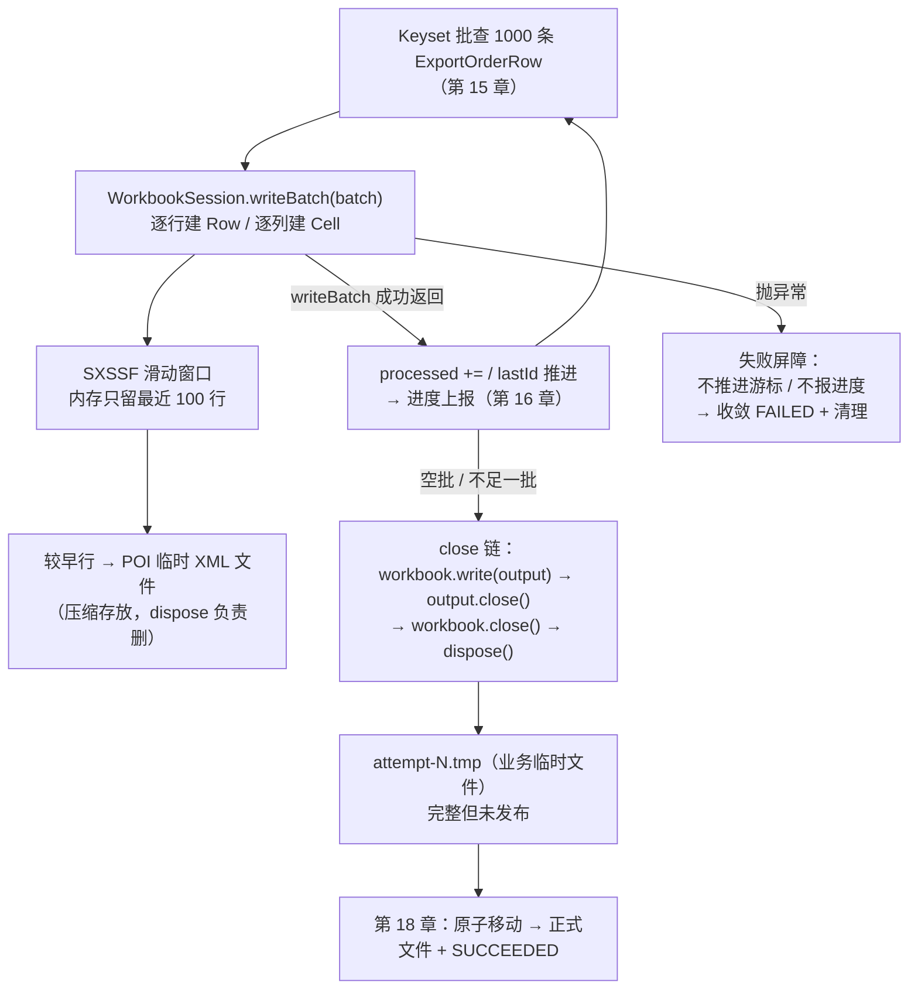

# 学习笔记：SXSSF 流式 Excel 生成——滑动窗口与资源防腐

> 对应教程章节「SXSSF 流式 Excel 生成与有限 JVM 堆内存控制」（第 17 章）。
> ✅ 实现状态：**本章主体已按第 7 节规划落地（2026-09）**——① `poi-ooxml:5.3.0` 依赖；② `ExcelExportWriter` + `WorkbookSession`（`export/excel/`：open 白名单复核/窗口 100/压缩临时文件/表头+冻结+筛选+列宽/金额样式单例；writeBatch 走 safeText+三类 Cell；close 链 write→close→dispose + suppressed exception）；③ `ExportFileService`（`export-files/job-{id}-attempt-{n}.tmp` 分配与失败清理，attempt 序号经 `selectRunningAttemptNo` 查询）；④ 执行体 runJob 接入 writeBatch 扩展点（「先写成功、后推进」+ 任何失败路径清理半成品）；⑤ Writer 单测 6 用例（真实 XSSF 重开断言表头/转义/NUMERIC/冻结/筛选/未知列拒绝不建文件）+ 执行体扩展 2 用例（行数与 processedRows 一致、写失败不虚假推进+文件清理），全量 167 测试通过。**未做（第 18 章）**：原子移动发布正式文件、`markSucceeded` 成功终态、下载接口——执行体写盘完成后仍以「成功终态尚未实现」收敛 FAILED 并删除临时文件。

---

## 0. 名词人话速查表（先看这个）

本章的词全部围绕「怎么把 100 万行订单写成一个 Excel 文件而不撑爆内存」。类比场景：**一条流水线**——数据库是上料口，SXSSF 是流水线，内存里只摆得下最近 100 个工位的料。

### 文件与库

| 名词 | 人话 |
|---|---|
| XLSX | 就是你双击打开的那个 **Excel 文件格式**。程序眼里它是一个「装了多份 XML 的压缩包」 |
| Apache POI | Java 界**操作 Excel 的工具库**（不是 Excel 软件，也不是文件格式） |
| XSSF | POI 里「**全量内存**」模式写 XLSX——所有行、单元格都变成 Java 对象堆在内存里。行数一多就撑爆 |
| SXSSF | POI 里「**流式**」模式——内存只留最近 N 行，更早的行刷到磁盘临时文件。适合大量顺序写入 |
| Workbook / Sheet / Row / Cell | 工作簿（整个文件）/ 工作表（一张表）/ 行 / 单元格——四层嵌套对象 |

### 机制词汇

| 名词 | 人话 |
|---|---|
| 滑动窗口（ROW_WINDOW=100） | 内存里只摆**最近 100 行**的对象；第 101 行进来时，最早那行被刷到磁盘。内存占用恒定，与总行数无关 |
| setCompressTempFiles(true) | 刷到磁盘的临时 XML **压缩存放**，省磁盘空间 |
| AutoCloseable / try-with-resources | 「**用完自动关**」的语法保险：离开 `try(...)` 代码块，`close()` 必被执行（哪怕中途抛异常） |
| dispose() | POI 的**专门清道夫**：删掉它自己在运行期间生成的临时 XML 文件。不调它，磁盘会被慢慢塞满 |
| suppressed exception | 关闭资源时如果又炸出第二个异常，Java 把它「挂在」第一个异常上一起报——两个都看得见，不丢线索 |
| 公式注入（Formula Injection） | 用户名字如果叫 `=删除全表`，Excel 会把它**当公式执行**。防法：给这类文本前面加一个单引号，强制按文本显示 |
| safeText() | 就是上面那个防法的函数：文本以 `=` `+` `-` `@` 开头时，前面补 `'` |
| CellStyle | 单元格的「格式模板」（如金额显示两位小数）。**必须全局复用一份**——每个单元格都新建一个样式对象，内存照样爆炸 |
| attempt-N.tmp | 业务层的**半成品文件**——Excel 写完但还没「上架」的临时路径。防用户下载到写了一半的文件 |
| 原子移动（Atomic Move，第 18 章） | 半成品写完后**一次性改名**成正式文件——不存在「改了一半」的中间态 |

---

## 1. 一句话总结

第 15 章解决了「数据库**怎么分批给**数据」；本章解决「Excel 写入端**怎么分批消费**」——用 SXSSF 的滑动窗口让内存里永远只有最近 100 行，配合「先写成功、再推进游标」的顺序，让 100 万行的导出内存占用与 100 行完全一样。

生活类比（一条流水线）：

| 机制 | 类比 |
|---|---|
| SXSSF 滑动窗口 | 流水线上只有 100 个工位——装满一件成品就装箱入库（刷磁盘），台面永远不堆料 |
| XSSF 全量内存 | 把 100 万件成品全部堆在台面上再一起装箱——台面（内存）瞬间塌了 |
| 两类临时文件 | 车间里的废料箱（POI 临时 XML，用完即清）vs 成品暂存柜（attempt-N.tmp，等质检上架） |
| safeText() | 商品标签上不能印「可执行指令」——以 `=` 开头的名字加个引号，防止货架把标签当遥控器 |

核心铁律一句话：**内存恒定来自每一层都只保留当前需要的数据，不是某一个库「自动优化」。**

---

## 2. 要解决的问题：三重危机

「导出 Excel」最容易写成的版本是「查出所有订单放 List → 一次性生成文件」。数据量一大，三重危机：

| 危机 | 成因 | 用户看到的 |
|---|---|---|
| 堆内存暴涨 / Full GC / OOM | XSSF 模式下每行数据 + 单元格 + 样式 + XML 节点全是 Java 对象，体积膨胀数十倍 | 长时间无进度，最后失败 |
| 无背压（上游快下游慢） | 数据库每批 1000 行很快，Excel 写盘慢，中间没有「有限缓冲」 | JVM 被滞留对象撑爆 |
| 文件契约破损 | 公式注入、数据类型错乱（金额变字符串）、列顺序失控 | 打开是损坏文件或存在安全隐患的伪文件 |

若不用流式的其他替代路线都不合适：每行重开文件（性能差 + 文件易损坏）、改 CSV（丢 Excel 格式能力，不符合交付要求）。**固定窗口顺序写入**是功能与成本之间的选择——代价是「不能回头改旧行」，而导出天然单向（第 15 章按 id 升序交付，Writer 按同序追加），正好匹配。

---

## 3. 全链路一览



三个「数量」各管一层，**不要混为一个「分页大小」**：

| 数值 | 所在层次 | 管什么 |
|---|---|---|
| 20 / 50 / 100 | 前端订单页 | 一页给用户看多少订单 |
| 1000（BATCH_SIZE） | ExportExecutionService | 一次向数据库要多少行、向 Writer 交付多少行 |
| 100（ROW_WINDOW） | SXSSFWorkbook | 内存里保留多少最近 Excel 行 |

---

## 4. 核心设计点

### 4.1 四个名字辨析：XLSX / POI / XSSF / SXSSF

| 名称 | 类别 | 负责什么 | 不是什么 |
|---|---|---|---|
| XLSX | 文件格式 | 定义工作簿/表/行/单元格如何打包 | 不是 Java API |
| Apache POI | Java 库 | 读写 Excel 等 Office 格式 | 不是 Excel 软件 |
| XSSF | POI 完整内存模型 | 灵活访问任意行（可回头改） | 不适合大规模顺序导出 |
| SXSSF | POI 流式实现 | 保留最近 N 行，较早刷临时文件 | 不能任意回头修改旧行 |

选 SXSSF 不是「它更先进」，是**用随机访问能力换内存上限**——与第 15 章选 Keyset（放弃任意跳页、换稳定前向扫描）是同一种取舍。两个选择组合，数据库读取和 Excel 写入才都是单向的。

### 4.2 WorkbookSession：把 Excel 生命周期收进一个对象

调用方（执行服务）只说三句话，POI 细节全部留在 Writer 内部：

```java
try (WorkbookSession workbook = writer.open(temporaryPath, config.columns())) {
    workbook.writeBatch(batch);   // 循环内逐批
}                                  // 离开代码块自动 close()
```

- `open()` 内部：建目录 → 建 SXSSFWorkbook（窗口 100 + 压缩临时文件）→ 建 Sheet → 写表头 → 定列宽/冻结首行/自动筛选 → 开输出流；
- `close()` 顺序即文件正确性：**`workbook.write(output)` → `output.close()` → `workbook.close()` → `workbook.dispose()`**——`write` 才把完整工作簿序列化进文件，`dispose` 才删 POI 临时 XML；
- 任一步失败：保留**最早的异常**、后续关闭异常挂为 suppressed——两条线索都不丢；无论如何 `dispose` 都执行。

**「循环写完所有批次」≠ 文件已完成**——只有走完 close 链，临时文件才有资格交给第 18 章发布。

### 4.3 两类临时文件：绝不能混

| 临时资源 | 谁创建 | 谁清理 | 是否给用户 |
|---|---|---|---|
| POI 的 SXSSF 临时 XML | SXSSFWorkbook 内部 | `workbook.dispose()` | 否（库内部实现） |
| attempt-N.tmp（业务临时文件） | ExportFileService | 失败删除 / 第 18 章原子移动 | 成功后是它的正式版 |

只关输出流不 dispose → 磁盘被 POI 临时文件慢慢塞满；只 dispose 不 write → 业务文件不完整。**两类清理分属两条生命周期，不能互相替代。**

### 4.4 列白名单：两道防线

- 第一道（第 12 章）：`CreateExportJobCommand.normalizeColumns` 在创建入口校验 `ExportColumn` 9 列白名单；
- 第二道（本章）：`ExcelExportWriter.open()` 再用 `COLUMNS.containsKey(column)` 复核——防止内部调用绕过 HTTP 校验。**校验失败在创建任何文件之前抛出**，不产生半成品。

9 列定义在 `LinkedHashMap`：key →（列标题 + 列宽 + 写入函数），默认顺序稳定、用户所选顺序也保留。列顺序是第 12 章请求指纹的一部分（改变表头顺序 = 改变请求）。

### 4.5 单元格按类型分三种写法 + safeText

| 数据 | 写法 | 原因 |
|---|---|---|
| 普通文本 | `setCellValue(safeText(v))` | 订单号/姓名/渠道按文本显示，且防公式注入 |
| 金额 | `BigDecimal.doubleValue()` + 复用的 `0.00` 样式 | 让 Excel 识别为**可计算数值**，不是带格式的字符串 |
| 时间 | `LocalDateTime.format(固定格式)` 后写文本 | 展示格式固定，不引入 Excel 日期格式对象 |

**safeText 公式注入防护**：用户可见文本以 `=`、`+`、`-`、`@` 开头时，前面补单引号（`'=2+3`），让 Excel 按文本显示而非当公式执行。这是**文件格式边界上的防护**，不是前端校验的替代。

**样式必须复用**：金额样式在 Session 创建时生成一份，所有金额 Cell 共享——每个 Cell 新建样式会让 POI 内部样式表随行数爆炸（样式对象同样是 Workbook 内存资源）。列宽/冻结/筛选同理：Session 开始时设置一次，不随批次重复。

### 4.6 表头也是文件契约

表头不是装饰：冻结首行（`createFreezePane(0,1)`）、自动筛选（`setAutoFilter`）、列宽，服务的是**用户下载后的阅读与对账**。用户按「订单号」「创建时间」定位列，表头与所选列顺序必须严格一致。

### 4.7 单 Workbook 只有一个写者

一个 WorkbookSession 只由一个执行线程顺序使用。**POI 不是并发协调工具**——「谁有权写这个文件」的并发边界在第 14 章条件抢占（一个 Job 一次只有一个有效执行者）解决，Writer 只负责把已确定顺序的数据转成文件。

### 4.8 失败屏障：writeBatch 失败不虚假推进

`writeBatch()` 抛异常时：`processed` 不增加、`lastId` 不移动、进度不上报——与第 15 章「先写成功、后推进」呼应。随后 try-with-resources 关闭资源，外层 catch 删除业务临时文件并收敛 FAILED。

**「数据库查到了」≠「文件里有了」**——只有 Writer 成功接受本批、Workbook 完整关闭、第 18 章发布后，才配得上对应的进度与终态。

### 4.9 文件正确性 ≠「能打开」

| 检查点 | 确认什么 |
|---|---|
| 表头 | 与用户所选列、顺序、中文名一致 |
| 行数 | 与执行过程的 processedRows 一致 |
| 文本 | 没有被当公式执行（safeText） |
| 数值 | 金额是数值类型（可计算），不是字符串 |
| 资源 | close 后无遗留 POI 临时文件 |

验收方式：**用真实 XSSF 重新打开输出文件**检查上述内容——「文件能重新打开且内容正确」比「代码执行到了最后一行」更有价值。

### 4.10 本章确认表

| 判断 | 正确结论 |
|---|---|
| SXSSF 让所有行不占内存？ | 否，保留最近窗口行，较早行刷临时文件 |
| 批次 1000 与窗口 100 必须相等？ | 否，服务不同资源边界 |
| writeBatch 返回就得到可下载文件？ | 否，还要 close（write→close→dispose）+ 第 18 章发布 |
| safeText 防什么？ | 公式前缀文本被表格软件当公式执行 |
| 第 18 章从哪里开始？ | WorkbookSession 已关闭、完整内容已写入 attempt-N.tmp |

### 4.11 从零实现的顺序

1. 用 SXSSF 写 5 行固定数据，确认 .xlsx 能打开；
2. 把 Workbook/Sheet/表头/输出流封装为 AutoCloseable Session（close 链 + suppressed exception）；
3. 接入列白名单与稳定列顺序，再处理文本/金额/时间三种 Cell 类型；
4. 加 safeText 与 Writer 测试（真实重开文件断言）；
5. 换 SXSSF 窗口，验证旧行不再随机访问；
6. 最后接第 15 章 Keyset 批次与第 16 章进度上报。

**绝不能反过来**：先把所有订单读进 List 再考虑 SXSSF——数据库批次和 Workbook 窗口必须从一开始一起设计。

---

## 5. 与本仓库的对照

### 5.1 已就绪（本章前置）

| 本章要求 | 本仓库现状 |
|---|---|
| 批次数据源 | ✅ 第 15 章 `ExportOrderMapper.findBatch`（Keyset + 高水位），每批 `List<ExportOrderRow>` |
| 行数据契约 | ✅ `ExportOrderRow` record（id + 9 列全字段：orderNo/orderStatus/salesChannel/customerName/customerPhone/totalAmount/currency/shippingProvince/createdAt） |
| 列白名单与顺序契约 | ✅ 第 12 章 `ExportColumn` 9 列枚举（key 为 snake_case）、`normalizeColumns` 白名单校验按白名单序输出、列顺序参与请求指纹 |
| writeBatch 调用位置 | ✅ `ExportExecutionService.runJob` 循环内注释预留（`:96`），「先写成功、后推进」顺序已排布 |
| 进度协作 | ✅ 第 16 章 `ExportProgressService.report`（writeBatch 成功后调用） |
| 失败收敛 | ✅ `execute` catch → `markFailed` + `refreshProjection`；业务临时文件删除待接入 |
| 业务临时文件目录 | ✅ `export-files/` 约定（.gitignore 已忽略）；V4 `file_path`/`file_size_bytes` 列就绪 |
| POI 依赖 / Writer / 临时文件服务 | ❌ 未实现（pom 无 `poi-ooxml`） |

### 5.2 尚未实现（本章主体缺口）

| 缺口 | 说明 |
|---|---|
| Maven 依赖 | `org.apache.poi:poi-ooxml:5.3.0` |
| `ExcelExportWriter` + `WorkbookSession` | open（白名单复核/建 Workbook/表头/冻结/筛选/列宽/金额样式）+ writeBatch（safeText/三类 Cell）+ close（write→close→dispose + suppressed exception） |
| 列定义表 | `LinkedHashMap<key, (标题, 列宽, 写入函数)>`，9 列 |
| `ExportFileService` 临时路径 | `export-files/` 下 `attempt-N.tmp` 分配；失败删除路径接入 execute catch |
| Writer 测试 | 真实 XSSF 重开断言：表头顺序 / `'=2+3` 转义 / 金额 CellType / 冻结首行 / 自动筛选 / 未知列拒绝且不创建文件 |
| 执行体测试扩展 | 行数与 processedRows 一致；writeBatch 抛异常 → 不虚假推进 + 临时文件清理 |

---

## 6. 明确不做的事（边界）

- 不做 Excel 模板、复杂公式、图表、宏；不做 CSV/PDF/对象存储上传。
- 不做多线程写同一个 Workbook——并发边界在抢占层，POI 不是协调工具。
- 不做背压、优先级、队列配额、磁盘预算——单次 Job 资源有限即可，多任务资源治理属更大规模议题。
- 不做自动列宽计算与大型样式主题；性能数字不写成长期架构承诺——验收以「重新打开文件检查内容 + 资源释放」为准。

---

## 7. 落地规划（建议顺序）

1. **引入依赖**：`poi-ooxml:5.3.0`（`backend/pom.xml`）。
2. **`ExcelExportWriter` + `WorkbookSession`**（`export/excel/` 或 `export/service/`）：
   - `open(target, columns)`：列白名单复核（未知列在创建文件前抛 `IllegalArgumentException`）→ 建目录 → `new SXSSFWorkbook(ROW_WINDOW=100)` + `setCompressTempFiles(true)` → Sheet「订单数据」→ 表头 + 冻结首行 + 自动筛选 + 列宽 → 金额 `0.00` 样式（单例复用）→ 开输出流；
   - `writeBatch(batch)`：逐行建 Row、逐列按 `LinkedHashMap` 写入函数落 Cell——文本走 `safeText`、金额 `doubleValue()` 带样式、时间固定格式文本；
   - `close()`（AutoCloseable）：`workbook.write(output)` → `output.close()` → `workbook.close()` → `workbook.dispose()`，首异常保留 + 后续挂 suppressed。
3. **`ExportFileService` 临时路径**：`export-files/` 下 `attempt-N.tmp` 分配（N=attempt_no）；`execute` catch 接入失败删除。
4. **执行体接入**：`runJob` 循环的 writeBatch 扩展点替换为真实调用——`writer.open(temporary, job.selectedColumns 解析列)` → 循环 `writeBatch(batch)` → 循环外 try-with-resources 关闭 → 读取完成后任务仍收敛 FAILED（成功终态随第 18 章文件发布接入）。
5. **Writer 测试**：真实 XSSF 重开断言（表头顺序随所选列变化、`'=2+3` 转义、金额 CellType 为 NUMERIC、冻结首行、自动筛选）；未知列拒绝且 target 不存在；close 后无 POI 临时文件遗留。
6. **执行体测试扩展**：行数与 processedRows 一致；writeBatch 中途抛异常 → 游标/进度不虚假推进 + 业务临时文件被清理。
7. **文档同步**：README/AGENTS（新依赖、Writer 生命周期、双临时文件约定）、笔记状态行更新。

依赖关系：①→②→③④→⑤⑥→⑦ 线性推进；②是核心批（一次成型）。第 18 章（原子移动 + SUCCEEDED + 下载）不在本章。

---

## 8. 本章沉淀

- **内存恒定是分层的乘积**：Keyset 每批 1000 行 × Writer 窗口 100 行 × 任何一层都不全量收集——SXSSF 只是其中一层，前面把十万行堆进 List 照样爆。
- **两类临时文件、两条生命周期**：POI 临时 XML（`dispose` 负责）与业务 attempt-N.tmp（失败删除/发布改名）绝不能互相替代。
- **close 顺序即文件正确性**：write → close → dispose，缺一步分别是「文件不完整」或「磁盘泄漏」；suppressed exception 保证失败线索不丢。
- **文件边界三道防线**：列白名单（两道：创建命令 + Writer 复核）、safeText 公式转义、金额类型化（可计算的数值而非字符串）。
- **验收以「重新打开文件」为准**：表头/行数/类型/转义/资源释放逐项断言——文件系统的最终用户是打开 Excel 的人，不是 Java 对象。
- 至此 Writer 交出「内容完整、格式安全、结构封闭但仍在临时路径」的 attempt-N.tmp。下一章（18）进入文件发布与安全下载：原子移动、签名 URL / 临时 Token 防越权、超期文件自动清理。
