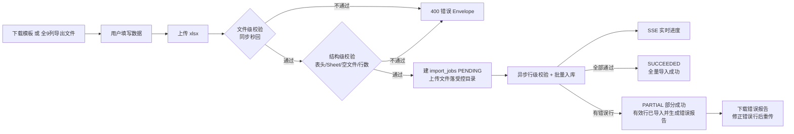

# 订单 Excel 导入功能规划

## 1. 文档定位

本文档规划「订单导入」功能的完整功能清单：模板下载、上传与三层校验、异步导入任务、错误报告与前端入口。**当前为规划定稿**：功能范围已列全，5 个关键决策点（见第 8 节）已拍板并回填全文；表结构 DDL、接口 Envelope 契约细节、任务拆解等详细设计待另行细化（可拆为 `order-import-design.md`）。

设计基调：**导入与导出严格互逆**——导入格式锚定为导出的全 9 列格式（中文表头一致），错误报告复用导出的 Excel 生成能力，异步任务复用既有 Outbox/消费/进度/SSE 管道模式。

| 文档属性 | 内容 |
| --- | --- |
| 状态 | 规划定稿，5 个决策点已拍板，未实现 |
| 代码基线 | `master @ 4244e1c` |
| 范围 | 订单 Excel 导入：模板下载、文件上传校验、异步导入任务与进度、错误报告、前端导入入口 |
| 明确排除 | 鉴权/权限、对象存储、多实例部署（沿用全局已知未实现能力）；非订单类数据导入；导入文件二次编辑留痕 |



## 2. 格式基线（导入格式 = 导出格式）

导入模板与校验规则锚定 `ExcelExportWriter.buildColumns()` 的 9 列定义（`export/excel/ExcelExportWriter.java`），**表头中文标题、列顺序、时间格式完全一致**，不另维护第二份列定义，保证导出文件改后可直接传回：

| # | 列 key | 表头标题 | 类型 | DB 列约束 | 导入必填 |
| --- | --- | --- | --- | --- | --- |
| 1 | order_no | 订单号 | 文本 | VARCHAR(64) NOT NULL，唯一 | 是 |
| 2 | order_status | 订单状态 | 文本 | VARCHAR(32)（回填自 status） | 是 |
| 3 | sales_channel | 销售渠道 | 文本 | VARCHAR(32) 可空 | 是 |
| 4 | customer_name | 客户姓名 | 文本 | VARCHAR(128) NOT NULL | 是 |
| 5 | customer_phone | 客户电话 | 文本 | VARCHAR(32) 可空 | 否 |
| 6 | total_amount | 订单金额 | 数值(0.00) | DECIMAL(18,2) NOT NULL | 是 |
| 7 | currency | 币种 | 文本 | VARCHAR(8) 可空 | 是 |
| 8 | shipping_province | 收货省份 | 文本 | VARCHAR(64) 可空 | 否 |
| 9 | created_at | 下单时间 | 文本 yyyy-MM-dd HH:mm:ss | TIMESTAMP NOT NULL | 是 |

两条合法来源（导入导出互逆）：

1. **空模板自己填**：下载模板，按「填写说明」Sheet 手工填写。
2. **全 9 列导出文件修改后传回**：导出时未裁剪列（全部 9 列）的文件可直接修改后导入。

边界：导出支持选列子集，**部分列导出的文件不属于合法导入文件**（表头列数/顺序对不上即结构校验失败），导入侧不做列缺失的智能猜测。

## 3. 总体流程

```
下载模板（或全 9 列导出文件） → 填写数据 → 上传 xlsx（≤10MB）
  → 文件级校验（同步秒回）→ 结构级校验 → 建导入任务 PENDING（异步受理 202）
  → 行级校验 + 批量入库（流式逐批）→ SSE 实时进度
  → SUCCEEDED（全量入库）/ PARTIAL（有效行入库 + 错误行跳过 → 下载错误报告 → 修正后重传）
```

校验按「文件级（同步）→ 结构级（同步）→ 行级（异步）」三层漏斗组织：越靠前的校验越便宜、越能秒回用户；行级校验随异步任务执行，避免 10MB 文件解析阻塞 HTTP 线程。

## 4. 功能清单

### F1 导入模板下载

- `GET /api/v1/import-jobs/template`，返回 xlsx 文件流（错误返回结构化 Envelope，与导出下载同模式）。
- 模板含两个 Sheet：
  - 「订单数据」：纯表头 9 列（标题/顺序与导出一致）+ 冻结首行 + 列宽 + 金额列预设数值格式（0.00）。
  - 「填写说明」：每列的必填性、格式示例、枚举取值清单、常见错误提示。
- 手填防错：订单状态/销售渠道/币种三列内置 **Excel 下拉约束**（POI DataValidation），从源头减少枚举填错。
- 表头列定义复用 `ExcelExportWriter` 的 COLUMNS 表（单一事实源），不在导入模块重复维护一份表头。

### F2 文件上传与文件级校验（同步秒回）

- `POST /api/v1/import-jobs`（multipart，`file` 字段），校验通过返回 202 受理 + 任务摘要（同导出创建的受理模式）。
- 文件级校验（任一失败立即 400，不落盘不建任务）：
  1. **大小 ≤ 10MB**（前端 `beforeUpload` 与后端双重拦截；后端同步配置 `spring.servlet.multipart.max-file-size`）。
  2. **只接受 `.xlsx` 一种格式**：拒绝 `.xls`/`.csv`/`.xlsm` 等一切其他格式（「只能上传导出的格式」）。
  3. **文件魔数校验**：xlsx 本质为 ZIP，校验文件头 `PK`，防止改后缀伪装。
- 校验通过后上传文件落受控 `importRoot`（复用 `ExportFileService` 的受控根目录提纯与路径双层防腐模式），留作任务执行输入与审计证据。
- 错误码建议：`IMPORT_FILE_TOO_LARGE` / `IMPORT_FORMAT_NOT_SUPPORTED` / `IMPORT_FILE_CORRUPTED`。

### F3 结构级校验

- **表头严格一致**：第一行 9 列名称与顺序必须与导出格式完全一致；不符报「模板不匹配」，并指出第一个不一致的列位置（便于用户定位）。
- **Sheet 校验**：只认「订单数据」Sheet（导出文件的 Sheet 名），不存在或为空则报错。
- **空文件校验**：无任何数据行（仅表头）报 `IMPORT_EMPTY_FILE`。
- **行数上限**：`import.max-rows`（默认 100,000，可配置）。10MB 是文件大小限制，行数上限是第二道保险——防超压缩比的超大行文件把解析拖垮。超限报 `IMPORT_TOO_MANY_ROWS`。
- 说明：结构级校验需要打开文件解析表头，在「同步受理」阶段完成（表头解析开销小）；数据行数上限在异步阶段统计到超限时收敛任务失败并出错误报告，或受理前快速计数拦截（详细设计时定，倾向受理前拦截以尽早反馈）。

### F4 行级校验（异步执行阶段，流式逐批）

读端采用 POI **XSSF SAX 流式读取**（`XSSFReader` + `SheetContentsHandler`，与写端 SXSSF 对称，内存恒定，零新增依赖），逐批交给校验与入库。

行级校验规则表：

| 列 | 规则 |
| --- | --- |
| 订单号 | 非空；trim 后 ≤ 64 字符；同一文件内唯一（文件内查重） |
| 订单状态 | 枚举 `PENDING/PAID/SHIPPED/COMPLETED/CANCELED`，大小写不敏感解析（复用 `ParamUtils.enumFromName` 口径），非法报错不静默 |
| 销售渠道 | 枚举 `WEB/APP/STORE/PARTNER`，同上 |
| 客户姓名 | 非空；≤ 128 字符 |
| 客户电话 | 可空；非空时 ≤ 32 字符（宽松格式校验，是否严格手机号校验见第 8 节注记） |
| 订单金额 | 必填；非负；≤ 2 位小数；满足 DECIMAL(18,2) 上下界 |
| 币种 | 白名单枚举（与 `seed-demo-data.sql` 的币种口径对齐，实现时取齐具体取值） |
| 收货省份 | 可空；非空时 ≤ 64 字符 |
| 下单时间 | 固定类型：严格 `yyyy-MM-dd HH:mm:ss` 文本格式解析，只认文本（决策 4 已定，不兼容 Excel 日期单元格） |

横切规则：

- **公式注入防御**：文本单元格以 `= + - @` 开头直接判为错误行（写库前拦截；导出侧 `safeText` 仍作为二次兜底）。
- **入库写入遗留 `status` 列**：`orders` 表保留旧列 `status`（V6 兼容设计），导入时与 `order_status` 同值双写，保持与既有数据口径一致。
- 错误按行聚合：一行多列错误合并为一条错误记录（原因用「；」连接），错误报告一行一个问题单元格。

### F5 错误报告生成与下载

- 任务存在跳过行收敛 PARTIAL 时，生成「导入错误报告.xlsx」（复用 `ExcelExportWriter` 的 SXSSF 生成模式）。
- 报告列：**Excel 行号、订单号、错误列、错误原因**；错误条数封顶（默认 5000 条，超出截断并在报告内注明「仅展示前 N 条」）。
- `GET /api/v1/import-jobs/{job_id}/error-report`：仅 PARTIAL 且存在错误报告时可下载，错误返回结构化 Envelope（复用导出下载协议模式，前端 `parseBlobError` 直接复用）。

### F6 结果摘要

- 任务完成后列表/详情可见：总行数、成功行数、跳过行数、错误分类 Top N（如「订单状态非法 ×120」，仅 PARTIAL 才非零）。
- 摘要字段随任务记录持久化（`import_jobs` 派生列或 JSON 列，详细设计定）。

### F7 异步导入任务与进度（复用既有管道模式）

- 新建 `import_jobs` 表（独立于 `export_jobs`，关键字段类比导出任务：`job_no`/`status`/`version`/`total_rows`/`processed_rows`/`error_code`/`error_message`/`error_report_path`/文件路径/时间列；完整 DDL 待详细设计）。**状态机含 PARTIAL**：PENDING → RUNNING → SUCCEEDED | PARTIAL | FAILED（FAILED 仅保留给执行/基础设施异常，行级错误不产生 FAILED）；`status` 之外按需落 `succeeded_rows`/`skipped_rows` 计数列供统计，成功/跳过也可由结果派生（详细设计定）。
- 管道模式整体复刻导出链路，模块内垂直自洽（`order-import/` 或 `import/` 包，controller/dto/service/mapper/entity/vo 分层）：
  - **Outbox 投递**：`outbox_events` 新增 `IMPORT_JOB_CREATED` 事件，复用现有分发器与 Confirm 闭环（`aggregate_type` 区分）。
  - **消费端**：手动 Ack + CAS 条件抢占 + Attempt 审计（复刻 `ExportJobConsumer` + `claimPendingJob` 模式），重复投递收敛为最多一次有效执行。
  - **进度推进**：条件 UPDATE（`processed_rows` 单调 + 终态单向 + heartbeat/lease 续期）+ Redis 投影（`import:progress:<jobId>`，TTL 与封顶规则同导出）。
  - **SSE 通知**：AFTER_COMMIT 广播 5 类事件 `import.progress`/`import.succeeded`/`import.partial`/`import.failed`/`heartbeat`，事件 id=`jobId:version` 版本栅栏；端点独立 `GET /api/v1/import-jobs/events`（是否与导出事件流合并，见第 8 节注记）。
  - **恢复与重试**：启动恢复收敛租约失效的 RUNNING；`POST /api/v1/import-jobs/{job_id}/retry` 人工重试（FAILED → PENDING 条件重置 + 新 Outbox 事件，复刻导出第 19 章模式）。
- 批量入库：每批 500~1000 行 INSERT（批大小 `import.execution.batch-size` 可配置）；进度按已处理行数单调推进。
- 数据层幂等兜底：无论冲突策略如何选择，`orders.order_no` 唯一约束始终是最终防线，不会产生重复订单。
- 创建接口不引入幂等键：重复上传同一文件 = 两个独立任务，由用户自行取舍；数据层由订单号唯一约束兜底（与导出「幂等键防重复受理」场景不同：导入的重复成本只是多跑一个空任务）。

### F8 前端导入入口（订单列表页）

- 订单列表页新增「导入订单」按钮 → 弹窗：模板下载链接 + `Upload.Dragger` 拖拽上传（前端预检：仅 `.xlsx`、≤ 10MB，超限/格式错误本地拦截不发请求）。
- 上传受理成功后提示「导入任务已创建」，并提供「查看进度」跳转。
- 导入任务列表页（独立页，见决策 5，布局复刻导出任务页）：状态 Tag（含 PARTIAL 部分成功）/ 进度条（SSE 实时刷新，复刻 `useExportEvents` 的连接状态机 + 版本栅栏 + 轮询降级）/ 总行数·成功·跳过统计 / 错误报告下载按钮（PARTIAL 可见）/ 失败重试按钮 / 分页。
- API 层新增 `api/importApi.ts`（上传 multipart、模板下载、任务列表、错误报告下载、重试、SSE 端点），multipart 上传走独立的请求通道（`requestJson` 目前面向 JSON Envelope，文件请求另行封装，错误仍收敛为 `ApiError`）。

## 5. 校验规则汇总

| 层级 | 时机 | 校验内容 | 失败表现 |
| --- | --- | --- | --- |
| 文件级 | 上传受理（同步） | 大小 ≤ 10MB；仅 `.xlsx`；ZIP 魔数 | 400 Envelope，秒回 |
| 结构级 | 上传受理（同步） | 表头 9 列名称与顺序严格一致；「订单数据」Sheet 存在；非空文件；行数 ≤ 上限 | 400 Envelope（倾向受理前拦截） |
| 行级 | 异步任务执行 | 必填/枚举/格式/长度/文件内查重/公式注入 | 错误行跳过 + 错误报告 xlsx，任务收敛 PARTIAL |
| 数据层 | 入库时刻 | `orders.order_no` 唯一约束 | 最终防线，冲突行记入错误报告并跳过（决策 1） |

## 6. 与现有基础设施的复用映射

| 现有能力 | 位置 | 导入侧复用方式 |
| --- | --- | --- |
| 导出 9 列列定义（表头事实源） | `ExcelExportWriter.buildColumns` | 模板表头与结构校验直接读取，不重复维护 |
| SXSSF 流式 Excel 生成 | `export/excel/` | 错误报告生成复刻同模式 |
| 受控文件根 + 路径双层防腐 | `ExportFileService` | 上传文件落 `importRoot`、错误报告落受控目录 |
| Outbox 分发 + Publisher Confirm | `export/mq/OutboxDispatcher` | 新事件类型接入，分发器零改动或极小改动 |
| 手动 Ack + CAS 抢占 + Attempt | `ExportJobConsumer` / `claimPendingJob` | 导入消费端复刻同模式 |
| 进度条件推进 + Redis 投影 + SSE 广播 | `ExportProgressService` / `ExportSseService` | 导入进度复刻同模式（`import:progress:` 前缀） |
| 启动恢复 + 人工重试 + 清理 | `ExportMaintenanceService` | 纳入同一维护服务或复刻独立服务（详细设计定） |
| 下载协议（成功二进制/失败 Envelope 分流） | 前端 `api/download.ts` | 模板下载与错误报告下载直接复用 |
| SSE 消费 Hook | `useExportEvents` | 导入页复刻（连接状态机 + 版本栅栏 + 轮询降级） |
| 归一化/解析工具 | `common/web/param/ParamUtils` | 行级校验的枚举解析与 trim 归一复用 |

## 7. 边界与非目标

- 鉴权/权限/任务归属校验：不实现（与导出侧一致，属全局已知未实现能力）。
- 对象存储：文件全部在本地受控目录，不接 OSS/S3。
- 多实例：SSE 广播为进程内连接表，导入任务抢占依赖单库 CAS，不做分布式锁。
- 仅支持订单数据导入；其他业务实体导入不在本功能范围。
- 不做导入历史文件的用户侧管理界面（上传原件与错误报告按保留期随任务清理，清理策略详细设计定，倾向复用过期清理模式）。

## 8. 待拍板的决策点

| # | 决策点 | 建议 | 拍板结果（✅） |
| --- | --- | --- | --- |
| 1 | **订单号冲突策略**（与库内已有订单重复） | 冲突行记入错误报告 | ✅ 冲突行记入错误报告并跳过，不整体失败（否定了覆盖旧订单：静默改数据风险高；也否定了遇冲突整体失败） |
| 2 | **校验失败裁决** | 有错误行则整批拒绝（一行不入库） | ✅ **有效行照常导入、错误行跳过**——引入 **PARTIAL 部分成功**语义 + `skipped` 统计（否定了整批拒绝：一行错误即全批作废偏苛刻，修正后只需重传错误行） |
| 3 | **行数上限** | 100,000 行（10MB xlsx 9 列约承载 7~15 万行，留余量） | ✅ 100,000 行（`import.max-rows` 可配置） |
| 4 | **下单时间单元格类型** | 严格只认 `yyyy-MM-dd HH:mm:ss` 文本（与导出严格互逆） | ✅ 固定类型：严格只认 `yyyy-MM-dd HH:mm:ss` 文本，与导出严格互逆（否定了兼容 Excel 日期单元格） |
| 5 | **导入任务页落点** | 独立「导入任务」页（字段会持续差异化） | ✅ 独立「导入任务」页（不入导出页 Tab） |

注记（非阻塞，详细设计时定）：

- 决策点 1 与 2 耦合生效：订单号冲突行与其余校验失败行一律**跳过不入库**并记入错误报告；只要存在跳过行任务即收敛 **PARTIAL**，全部导入成功才 SUCCEEDED。任务状态机：`PENDING → RUNNING → SUCCEEDED | PARTIAL | FAILED`，FAILED 仅保留给执行/基础设施异常（行级错误不产生 FAILED）。
- 客户电话是否做严格手机号校验（固定 11 位大陆手机号）或保持宽松（仅长度），实现时定。
- SSE 端点独立（`/api/v1/import-jobs/events`，前端第二个 EventSource）还是与导出合并为统一事件流（一个连接承载两类事件），详细设计时权衡。
- 行数上限的执行时机（受理前快速计数 vs 异步阶段超限收敛）在详细设计中定，倾向前者。

## 9. 实施顺序建议（待决策确认后细化）

1. 模板下载 + 前端入口（纯增量，不依赖任务管道）。
2. 上传受理链路：文件级 + 结构级校验、受控落盘、`import_jobs` 表与创建接口。
3. 异步执行管道：Outbox → 消费抢占 → SAX 流式行级校验 → 错误报告生成。
4. 进度与通知：条件推进（含 SUCCEEDED/PARTIAL/FAILED 三终态收敛 + 跳过行计数）+ Redis 投影 + SSE（5 类事件，含 `import.partial`）。
5. 恢复/重试/清理收尾 + 端到端联调（Playwright 链路）。
