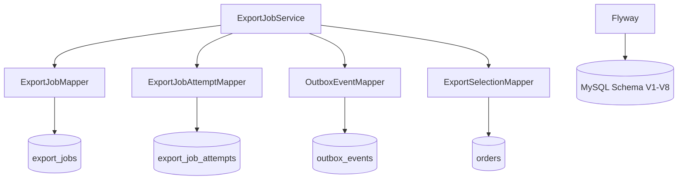
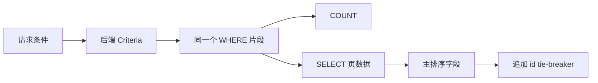
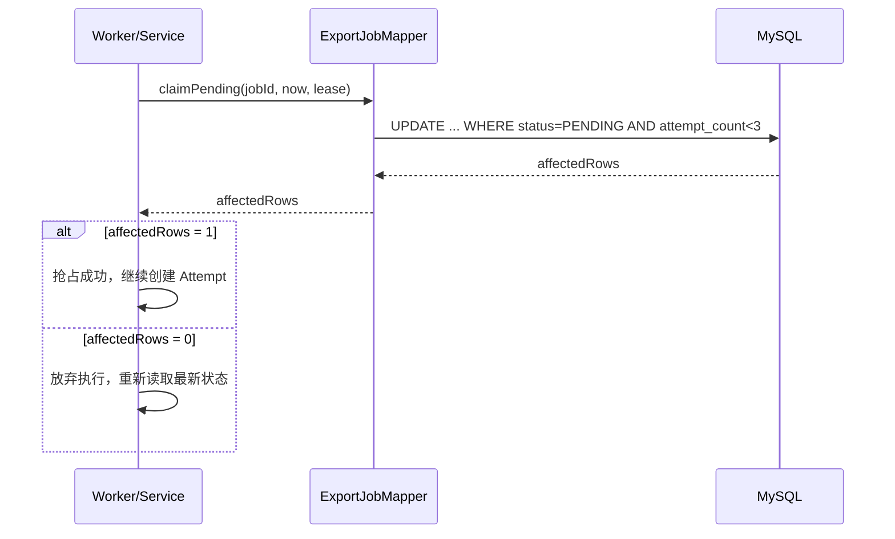
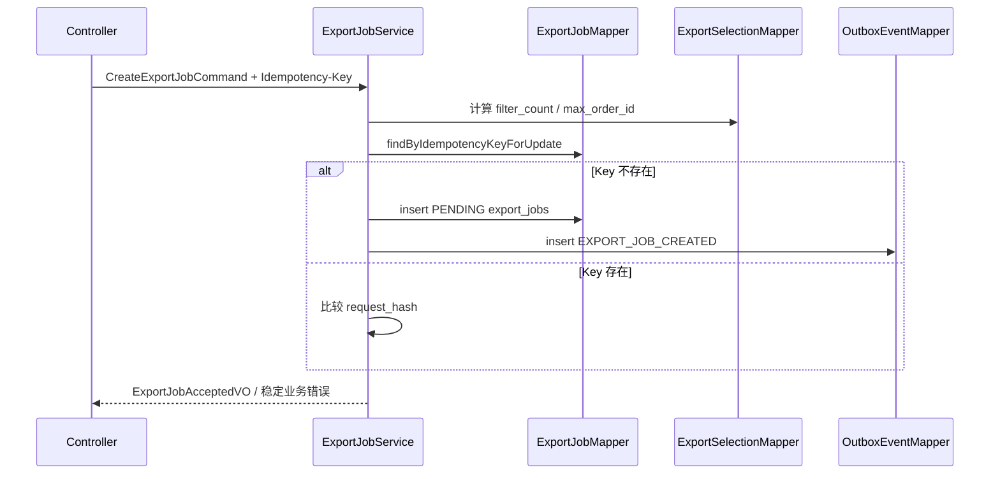

# ExportFlow 持久层补全计划（Persistence Domain）

## 1. 文档定位

本文只规划「持久层」这一章的缺失能力，不重新规划异步导出闭环。

核心问题只有三个：

1. SQL 怎么写得显式、安全、稳定分页。
2. 并发状态下怎么用数据库原子更新抢占任务，而不是靠应用层判断。
3. Schema 怎么继续用 Flyway 版本化演进，避免手工改库。

明确排除：RabbitMQ 发布/消费、Redis 进度、Excel 生成、SSE 推送、文件下载、重试入口和任务中心页面。这些能力只在依赖接口处留边界，不在本文展开实现。

## 2. 当前项目能力盘点

### 2.1 已完成

| 能力 | 现状 | 证据位置 |
| --- | --- | --- |
| MySQL 连接 | 已配置 MySQL 数据源 | `backend/src/main/resources/application.yml` |
| MyBatis 接入 | 已配置驼峰映射、record 构造映射和 XML 位置 | `backend/src/main/resources/application.yml` |
| Flyway 接入 | 已启用启动迁移 | `backend/src/main/resources/application.yml` |
| Schema V1-V8 | 已覆盖订单、Job、Attempt、Outbox、幂等、快照、执行态、租约、订单列和查询索引 | `backend/src/main/resources/db/migration/` |
| 订单动态查询 | 已实现 COUNT 与分页共用 WHERE、排序白名单、稳定 tie-breaker | `backend/src/main/resources/mapper/OrderMapper.xml` |
| 订单查询索引 | 已按状态、金额、创建时间、手机号建立索引 | `V8__add_order_query_indexes.sql` |
| trace_id | 已有 Web 过滤器、MDC 和异步装饰器 | `common/web/trace/` |

### 2.2 缺失

| 缺口 | 当前影响 | 本文交付方向 |
| --- | --- | --- |
| 导出持久层实体缺失 | `export_jobs`、`export_job_attempts`、`outbox_events` 有表但没有 Java 行模型 | 新增导出模块 Entity / Snapshot |
| Export Mapper 缺失 | Service 无法显式访问导出三张表 | 新增 Job、Attempt、Outbox、Selection Mapper |
| 创建事务缺失 | 导出创建仍是空壳 | 同事务写 Job + Outbox，未引入 MQ |
| 条件 UPDATE 缺失 | 没有“状态抢占成功与否”的持久层契约 | 用受影响行数表达状态迁移结果 |
| Attempt / Outbox 操作缺失 | 无法记录每次执行尝试，也无法标记事件已发布 | 补 Mapper 方法和受影响行数断言 |
| 持久层测试缺失 | 并发与状态迁移语义没有回归保护 | 增加 Mapper / Service 集成测试 |

## 3. 本章目标架构

分层规则：

- Mapper 只做数据访问和结果映射，不做业务判断。
- Service 负责事务、业务校验、状态迁移编排和受影响行数断言。
- Entity 表示数据库行；Snapshot 表示创建导出时的业务事实快照。
- Controller 不接触 Mapper，也不接触 SQL。

## 4. 不新增 Schema 版本

当前 V1-V8 已经覆盖本章所需表结构，本章不应为了接入 Java Mapper 而新增 V9。

若实现中发现字段确实不足，必须遵守 Flyway 规则：

1. 不修改已提交的 V1-V8。
2. 只前向新增 V9 及之后版本。
3. 迁移文件必须说明业务原因、字段语义和回填规则。
4. MySQL 与 H2 测试模式必须同时可迁移。

## 5. Mapper 设计

### 5.1 `ExportJobMapper`

必须提供显式 SQL，不使用通用 save/update。最小方法集：

| 方法 | 语义 | 关键条件 |
| --- | --- | --- |
| `findByIdempotencyKey` | 幂等查询 | `idempotency_key = ?` |
| `findByIdempotencyKeyForUpdate` | 事务内锁定幂等行 | `FOR UPDATE` |
| `findById` | 详情和状态机读取 | `id = ?` |
| `insert` | 创建 PENDING Job | `useGeneratedKeys` 回填 id |
| `countForPage` / `findForPage` | 任务列表真实化 | 状态过滤、稳定排序 |
| `claimPending` | PENDING -> RUNNING 抢占 | `status = PENDING AND attempt_count < 3` |
| `updateProgress` | 运行中进度和租约续期 | `status = RUNNING AND processed_rows <= ?` |
| `markSucceeded` | RUNNING -> SUCCEEDED | `status = RUNNING` |
| `markFailed` | RUNNING -> FAILED | `status = RUNNING` |
| `retryFailed` | FAILED -> PENDING | `status = FAILED AND attempt_count < 3` |
| `markExpired` | SUCCEEDED -> EXPIRED | `status = SUCCEEDED AND expired_at <= ?` |
| `recoverExpiredRunning` | 租约过期恢复 | `status = RUNNING AND lease 已过期` |

SELECT 语句必须列明字段，禁止 `SELECT *`；列别名与 Java record 参数名保持一致。所有状态变化都更新 `updated_at` 并递增 `version`。

### 5.2 `ExportJobAttemptMapper`

| 方法 | 语义 | 关键条件 |
| --- | --- | --- |
| `insertRunning` | 创建本次尝试 | 先完成 Job 条件抢占，再插入 Attempt |
| `findRunning` | 查询当前运行尝试 | `status = RUNNING ORDER BY attempt_no DESC LIMIT 1` |
| `findByAttemptNo` | 执行器读取本次尝试 | `(job_id, attempt_no)` |
| `list` | 审计历史尝试 | `ORDER BY attempt_no` |
| `markSucceeded` | 尝试成功 | `id = ? AND status = RUNNING` |
| `markFailed` | 尝试失败 | `id = ? AND status = RUNNING` |
| `markExpiredLeaseFailed` | 恢复时关闭失联尝试 | 只处理 Job 租约已过期的 RUNNING Attempt |

`(job_id, attempt_no)` 已有唯一索引；应用层必须先通过 Job 条件抢占串行化同一任务，唯一索引只作为最后防线。
`(job_id, attempt_no)` 已有唯一索引；应用层必须先通过 Job 条件抢占串行化同一任务，唯一索引只作为最后防线。

### 5.3 `OutboxEventMapper`

本章只做持久化，不实现 RabbitMQ 发布器：

| 方法 | 语义 | 关键条件 |
| --- | --- | --- |
| `insert` | 与 Job 同事务写入创建事件 | `payload`、`trace_id` 必须完整 |
| `findUnpublished` | 供后续投递器查询，本章不调用 | `published_at IS NULL`，按 `created_at, id` 排序 |
| `markPublished` | 标记事件已发布 | `id = ? AND published_at IS NULL` |

`markPublished` 返回 0 不代表系统失败，只代表事件已被另一个投递流程处理；调用方不得重复发布。

### 5.4 `ExportSelectionMapper`

该 Mapper 负责创建前的快照统计，不返回订单明细：

1. 输入使用后端 `OrderCriteria` 或导出筛选对象，不直接接收 Controller DTO。
2. 动态 WHERE 与订单查询保持业务语义一致，`COALESCE(order_status, status)` 兼容 V6 前的数据。
3. `SELECTED_IDS` 使用 ID 精确过滤；`FILTER` 使用条件过滤；排除 ID 只在筛选模式生效。
4. 只返回 `filter_count` 与 `max_order_id_at_create`，避免创建任务时加载大结果集。

## 6. SQL 安全与稳定分页

### 6.1 参数绑定规则

- 所有业务值一律使用 `#{}`，由 `PreparedStatement` 绑定。
- `${}` 只允许用于 SQL 结构，且取值必须来自 Java 枚举或常量白名单。
- 禁止把前端传入的 `sort_by`、`sort_order`、列名、状态值直接拼进 SQL。
- 动态条件统一封装在一个 `<sql>` 片段或 Provider 私有方法中，COUNT 与列表必须复用。

### 6.2 分页规则

1. 任务列表查询必须带稳定第二排序键，建议 `ORDER BY created_at DESC, id DESC` 或状态过滤后使用 `id DESC`。
2. `page` 和 `page_size` 在 Service 中转换为 `LIMIT/OFFSET`，并限制最大页大小。
3. 列表 SQL 与 COUNT SQL 的 WHERE 必须来自同一片段，避免 total 与 items 不一致。

## 7. 原子状态迁移

核心原则：不先 `SELECT status` 再 `UPDATE status`。状态判断必须写进 `UPDATE ... WHERE`，并用 Mapper 返回的受影响行数判断结果。

### 7.1 状态迁移表

| 迁移 | WHERE 必须约束 | 成功后字段变化 |
| --- | --- | --- |
| PENDING -> RUNNING | `status = PENDING`，`attempt_count < 3` | `attempt_count + 1`、清空旧产物和错误、写入心跳租约 |
| RUNNING 进度 | `status = RUNNING`，`processed_rows <= ?` | 只允许进度不回退，续期心跳租约 |
| RUNNING -> SUCCEEDED | `status = RUNNING` | 写入产物、大小、完成时间、过期时间 |
| RUNNING -> FAILED | `status = RUNNING` | 写入稳定错误码、错误信息、完成时间 |
| FAILED -> PENDING | `status = FAILED`，`attempt_count < 3` | 清空运行字段，等待重新抢占 |
| SUCCEEDED -> EXPIRED | `status = SUCCEEDED`，`expired_at <= ?` | 只改状态，不覆盖产物审计 |
| RUNNING 恢复 | `status = RUNNING`，租约已过期 | 标记恢复失败原因，释放租约 |

### 7.2 受影响行数语义

- 返回 `1`：本次调用获得状态迁移权。
- 返回 `0`：条件不满足或已被其他线程处理；调用方必须重新读取最新状态，不允许继续执行业务。
- 禁止把 `affectedRows = 0` 静默当作成功。
- 禁止在 Service 内存锁或 `synchronized` 中承担多节点互斥职责。

### 7.3 Attempt 与租约

执行器抢到 Job 后，先插入一条 `RUNNING` Attempt，再执行导出批次。每次尝试独立记录文件路径、错误码和完成时间，不覆盖历史 Attempt。

租约只在 `RUNNING` 状态下有意义：

1. 抢占时写入 `last_heartbeat_at` 和 `lease_expires_at`。
2. 批处理推进时同步续租。
3. 恢复流程只回收租约过期的 RUNNING Job 和 Attempt。
4. 心跳失败不等于任务业务失败；必须通过条件 UPDATE 确认是否仍持有执行权。
4. 心跳失败不等于任务业务失败；必须通过条件 UPDATE 确认是否仍持有执行权。

## 8. 导出创建事务

本章只实现“入口命令落库”，不实现执行器和消息投递。推荐流程：

事务规则：

1. `export_jobs` 和 `outbox_events` 必须在同一个 `@Transactional` 方法写入。
2. Job 初始状态固定为 `PENDING`；本章不写入 `RUNNING`。
3. 保存 `request_hash`、选择快照、列快照、`filter_count`、`max_order_id_at_create` 和 `trace_id`。
4. Outbox 事件只落库为未发布状态，不发送 RabbitMQ。
5. 事务失败必须整体回滚，不留下没有 Outbox 的 Job，也不留下没有 Job 的 Outbox。

幂等语义：

- 相同 `Idempotency-Key` + 相同 `request_hash`：返回原任务 VO，不重复写入。
- 相同 `Idempotency-Key` + 不同 `request_hash`：返回 `IDEMPOTENCY_CONFLICT`。
- 并发首个请求同时插入时，唯一约束兜底；捕获冲突后重新查询并比较请求指纹。

## 9. 实施任务

| 序号 | 任务 | 完成标准 |
| --- | --- | --- |
| 1 | 新增导出持久层模型 | Job、Attempt、Outbox、Selection Snapshot 使用明确类型，字段与 V1-V8 对齐 |
| 2 | 新增 `ExportJobMapper` | 覆盖幂等查询、插入、列表读取和全部条件 UPDATE |
| 3 | 新增 `ExportJobAttemptMapper` | 每次尝试可创建、查询、成功、失败和租约恢复 |
| 4 | 新增 `OutboxEventMapper` | 支持事件落库、未发布查询和条件标记发布 |
| 5 | 新增 `ExportSelectionMapper` | 复用订单筛选语义，只返回统计快照 |
| 6 | 接入创建事务 | Job + Outbox 同事务成功或同事务回滚 |
| 7 | 接入条件状态更新 | 所有状态迁移用 `affectedRows = 1` 作为唯一成功证据 |
| 8 | 补持久层测试 | H2 迁移、Mapper 行为、并发状态迁移和事务回滚有自动化测试 |

实施顺序建议：先模型和只读 Mapper，再创建事务，再状态机条件更新，最后补测试。不要先实现 Excel 或 MQ，再回头补持久层契约。

## 10. 测试要求

### 10.1 Flyway / Schema

1. 测试上下文必须从空库迁移到 V8。
2. 重复启动不重复执行已应用迁移。
3. H2 MySQL 模式与本地 MySQL 的关键表结构一致。

### 10.2 Mapper 行为

1. `insert` 后能通过幂等键和主键查询。
2. `claimPending` 第一次返回 1，第二次返回 0。
3. `updateProgress` 不允许进度回退。
4. `markSucceeded` / `markFailed` 只能从 RUNNING 迁移。
5. `retryFailed` 在 `attempt_count >= 3` 时返回 0。
6. `markPublished` 只能成功一次。
7. Attempt 唯一索引能阻止同一任务同一序号重复插入。

### 10.3 Service / 事务

1. 创建成功后 Job 和 Outbox 同时存在。
2. Outbox 插入失败时 Job 也回滚。
3. 相同幂等键和请求指纹返回原任务。
4. 相同幂等键但请求指纹不同返回冲突。
5. 状态迁移返回 0 时，Service 不调用后续业务逻辑。

## 11. 本章明确不做

- 不实现 RabbitMQ ConnectionFactory、Producer、Consumer 和消息确认。
- 不实现 Redis 进度、Redis 幂等缓存或分布式锁。
- 不实现 Excel 生成、SXSSF、临时文件和文件下载。
- 不实现 SSE 端点和前端实时进度。
- 不实现 Controller 层的重试、取消、清理接口。
- 不把任务列表接口从空壳变成完整产品功能，除非只作为验证 Mapper 查询的持久层前置工作。

## 12. 验收标准

1. 导出相关持久层 SQL 全部显式可见，能逐条审查 WHERE、SET 和排序。
2. `orders` 动态查询继续满足 COUNT/列表共用 WHERE、安全绑定和稳定排序。
3. 所有导出状态迁移都由数据库条件更新裁决，应用层只断言受影响行数。
4. Job、Attempt、Outbox 的持久化职责清晰，没有通用 save/update 掩盖状态变化。
5. V1-V8 不被修改；如确需变化，只新增前向 Flyway 版本。
6. `cd backend && ./mvnw test` 通过，且至少覆盖一条成功路径和一条受影响行数为 0 的失败/竞争路径。
