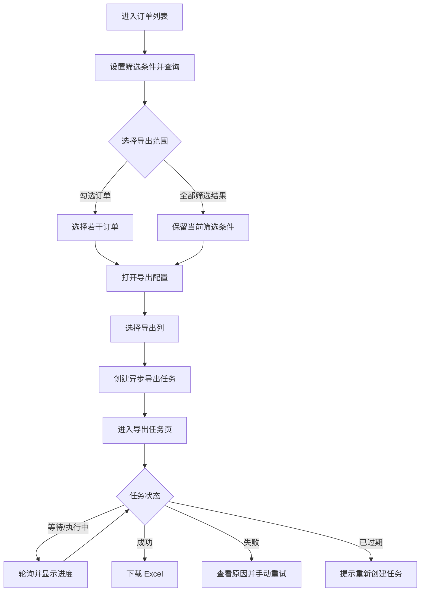
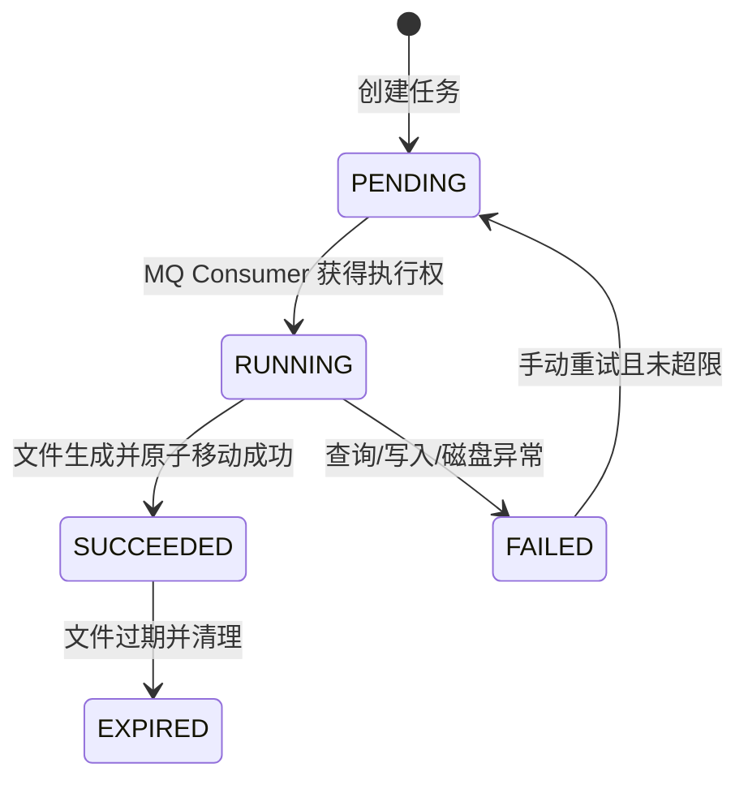

# FlowHub 企业级异步导出中心 - 产品需求文档（PRD）

| 文档属性 | 内容 |
| --- | --- |
| 文档版本 | v1.1 |
| 文档状态 | Draft |
| 项目代号 | FlowHub |
| 目标版本 | MVP |
| 目标工期 | 教学窗口 1–2 周；按 Core / Engineering / Challenge 分层结项 |
| 最后更新 | 2026-08-04 |
| 关联文档 | `be-td.md`、`fe-td.md` |

## 目录

1. 需求背景
2. 产品目标与成功标准
3. 用户、场景与术语
4. 项目范围
5. 整体产品设计
6. 功能清单
7. 详细需求
8. 业务规则与状态模型
9. 数据字段说明
10. 非功能性要求
11. 数据统计与监控
12. 验收方案
13. 发布、回滚与应急方案
14. 后续演进

---

## 1. 需求背景

### 1.1 业务背景

订单运营人员经常需要根据日期、订单状态和销售渠道筛选订单，并将结果导出为 Excel，用于对账、运营分析或离线处理。直接在列表接口中一次查询全部数据、在内存中构造文件并通过同一个 HTTP 请求返回，数据量增大后容易出现请求超时、服务内存上涨、重复点击生成重复文件和失败过程不可见等问题。

FlowHub 提供一个独立、可复用的异步导出闭环：用户筛选或勾选订单，选择导出字段后创建任务；服务在后台分批读取数据并流式生成 Excel；前端持续展示任务进度，完成后下载文件。

### 1.2 当前痛点

1. **长请求不稳定**：生成大文件可能超过网关或浏览器超时时间，用户无法判断是否仍在执行。
2. **内存风险**：一次加载全部订单或使用普通 Excel Workbook 容易造成内存占用过高甚至 OOM。
3. **重复执行**：用户重复点击时可能创建多个相同任务，造成无效数据库查询和文件生成。
4. **缺少过程反馈**：用户只能等待下载响应，无法查看排队、执行、失败和完成状态。
5. **失败不可追踪**：数据库异常、磁盘空间不足或文件写入失败时，没有统一任务记录和错误定位线索。
6. **导出内容不可配置**：固定列文件无法满足不同业务用途，且容易导出不必要字段。

### 1.3 核心矛盾

业务希望“一次操作即可获得大量订单数据”，系统则需要“限制单次资源消耗并让耗时任务可追踪”。本项目通过任务化、分批查询和流式文件写入解决这一矛盾。

## 2. 产品目标与成功标准

### 2.1 产品目标

1. 支持按订单筛选条件或已勾选订单创建异步 Excel 导出任务。
2. 支持用户选择导出列，并确保列名、顺序和数据格式稳定。
3. 通过 MySQL 任务表与事务 Outbox、RabbitMQ、Redis 进度缓存和本地文件存储完成可恢复异步架构。
4. 通过 SSE 实时查看进度和终态，并支持在 SSE 不可用时回退到轮询。
5. 支持查看失败原因、重试失败任务和下载成功文件。
6. 在 11 万条演示数据下验证分批查询与流式写入不会一次性占用大量内存。

### 2.2 成功标准

| 指标 | MVP 目标 |
| --- | --- |
| 订单列表查询 | 11 万条数据量下，常用筛选接口 P95 不超过 500 ms（本地参考环境） |
| 创建导出任务 | 接口 P95 不超过 500 ms，成功返回后不等待文件生成 |
| 导出能力 | 11 万行、9 列 Excel 在参考环境中 60 秒内生成；文件可正常打开 |
| 服务稳定性 | JVM 最大堆设置为 512 MB 时完成 11 万行导出，无 OOM |
| 任务可见性 | 活跃任务进度最终达到 100%，失败任务有明确错误摘要 |
| 幂等性 | 同一 Idempotency-Key 的重复请求仅对应一个任务 |
| 数据准确性 | 导出行数与任务创建时命中的订单数量一致，表头与选择列一致 |

> 性能目标用于本地验收，不作为跨硬件环境的绝对 SLA。验收时需记录 CPU、内存、数据量和耗时。

### 2.3 分层结项与性能口径

- **Core（必做）**：订单查询、任务状态机、Keyset 分批导出、SXSSF、任务列表与下载；以 11 万行、`-Xmx512m` 为统一验收。
- **Engineering（进阶）**：事务 Outbox、RabbitMQ、Redis、SSE/轮询、幂等、Attempt 审计、手动重试与文件清理。
- **Challenge（挑战）**：Worker 租约/崩溃恢复、MQ/Redis 故障演练、10 万行压测报告。

10 万行不是 Core SLA；它只用于 Challenge 性能报告。

## 3. 用户、场景与术语

### 3.1 目标用户

MVP 采用单用户、本地演示模式，不提供登录和权限管理。

| 用户 | 目标 | 典型操作 |
| --- | --- | --- |
| 订单运营人员 | 获取订单明细用于离线分析 | 筛选订单、勾选订单、选择字段、创建导出、下载文件 |
| 系统维护人员 | 判断导出失败原因 | 查看任务状态、错误摘要和后端日志 |

### 3.2 核心场景

1. 导出当前勾选的 10–1000 条订单。
2. 导出某个日期范围和状态下的全部订单。
3. 只导出订单号、状态、渠道、金额和下单时间等指定字段。
4. 查看导出任务进度并在完成后下载。
5. 对因临时错误失败的任务执行一次人工重试。
6. 查看已过期任务并了解文件不可下载的原因。

### 3.3 术语

| 术语 | 定义 |
| --- | --- |
| 筛选导出 | 按创建任务时保存的筛选条件导出所有命中订单 |
| 勾选导出 | 只导出用户显式勾选的订单 ID |
| 筛选快照 | 创建任务时保存的筛选条件 JSON；后续任务按该快照查询 |
| 导出任务 | 一次异步生成文件的完整记录，包含范围、字段、状态、进度和文件信息 |
| 活跃任务 | 状态为 `PENDING` 或 `RUNNING` 的任务 |
| 流式写入 | 使用有限内存窗口逐行写入 Excel，旧行写入临时文件后从内存释放 |
| 幂等键 | 客户端为一次创建操作生成的 UUID；重复请求使用相同键时返回原任务 |

## 4. 项目范围

### 4.1 本期范围（In Scope）

- 订单列表分页查询、筛选和排序。
- 当前页面勾选，翻页后保留已勾选 ID。
- 按勾选订单导出，显式勾选最多 1000 个 ID；表头全选进入反选模式（按筛选快照导出，可排除至多 1000 条）。
- 按当前筛选条件导出，最多 200000 行。
- 导出列选择和顺序配置。
- 统一异步导出，不实现同步 / 异步双通道。
- 数据库持久化导出任务。
- `export_jobs` 与 `outbox_events` 在同一 MySQL 事务持久化；`outbox_events.trace_id` 保存请求链路标识，Outbox Dispatcher 经 Publisher Confirm 投递 RabbitMQ 并透传 `X-Trace-Id`，Spring Rabbit Listener 消费并执行任务。
- `export_job_attempts` 保存每次实际执行的开始、结束、错误和文件证据；重试不得覆盖历史 Attempt。
- Redis 保存活跃任务进度和短期幂等映射；MySQL 仍是最终状态源。
- Apache POI SXSSF 流式生成 `.xlsx`。
- 本地文件系统存储导出文件。
- SSE 推送任务进度与终态；前端保留低频轮询作为降级。
- 任务列表、失败任务重试、成功文件下载。
- 24 小时文件保留与过期清理。
- Idempotency-Key 防重复创建。
- 基础结构化日志、健康检查和性能验证。
- MySQL 初始化脚本以及 11 万条随机订单 Mock 数据脚本。

### 4.2 明确不在本期范围（Out of Scope）

- 用户注册、登录、JWT、RBAC、多租户和数据权限。
- Kafka、MinIO、Elasticsearch。
- WebSocket、站内通知、邮件通知。
- Excel / CSV 导入、错误行报告和数据清洗。
- CSV、PDF 等其他导出格式。
- 分布式 Worker、跨节点任务抢占和高可用调度。
- 任务取消。Consumer 执行中的安全取消涉及中断、临时文件清理和数据库游标释放，本期不实现。
- 执行失败自动重试。MVP 只允许用户对失败任务手动重试；MQ 首次发布失败后的补发不属于业务执行重试。
- 云厂商专属部署和 Kubernetes。
- 真实客户数据；演示数据全部由脚本生成。

### 4.3 后续增强但不阻塞 MVP

- 列表虚拟化。
- 任务详情抽屉和更丰富的耗时分段。
- 导出完成浏览器通知。
- Prometheus 指标和 Grafana Dashboard。
- 对象存储、独立 Worker 和多实例消费。

## 5. 整体产品设计

### 5.1 页面信息架构

```text
FlowHub
├── 订单列表 /orders
│   ├── 筛选区
│   ├── 订单表格与分页
│   ├── 已选订单提示
│   └── 导出配置弹窗
└── 导出任务 /exports
    ├── 任务状态筛选
    ├── 任务列表
    ├── 进度与错误摘要
    └── 下载 / 重试操作
```

### 5.2 端到端流程



### 5.3 产品设计原则

1. 创建任务必须快速返回，不在请求线程中生成大文件。
2. 页面只展示服务端通过 SSE、Redis 或数据库确认的状态，不通过前端计时器伪造进度。
3. 筛选导出保存条件快照，任务执行时不依赖浏览器页面状态。
4. 可导出列由后端白名单控制，前端不能传任意数据库列名。
5. 文件生成失败必须进入终态并保留可理解的错误摘要。
6. MVP 优先保证单机可运行和实现清晰，不为了“企业级”标签堆叠基础设施。

## 6. 功能清单

| ID | 模块 | 功能 | 优先级 | 说明 |
| --- | --- | --- | :---: | --- |
| F-01 | 订单列表 | 分页查询订单 | P0 | 默认按下单时间倒序 |
| F-02 | 订单列表 | 多条件筛选 | P0 | 订单号、状态、渠道、时间、金额 |
| F-03 | 订单列表 | 勾选订单 | P0 | 翻页后保留已选择 ID，最多 1000 个；支持跨页全选（反选模式） |
| F-04 | 导出配置 | 选择导出范围 | P0 | 勾选订单或全部筛选结果 |
| F-05 | 导出配置 | 选择和排序导出列 | P0 | 至少选择 1 列，最多选择全部白名单列 |
| F-06 | 导出任务 | 创建异步任务 | P0 | 返回任务编号和初始状态 |
| F-07 | 导出任务 | 查看任务列表 | P0 | 分页、按状态筛选、按创建时间倒序 |
| F-08 | 导出任务 | 查看进度 | P0 | SSE 实时推送，轮询降级；展示已处理行数 / 总行数 |
| F-09 | 导出任务 | 下载文件 | P0 | 仅成功且未过期任务可下载 |
| F-10 | 导出任务 | 手动重试 | P1 | 仅失败且重试次数未超限的任务可重试 |
| F-11 | 系统维护 | 文件过期清理 | P1 | 默认保留 24 小时 |
| F-12 | 可观测性 | 日志与健康检查 | P1 | 使用 task_id、trace_id 定位问题 |

## 7. 详细需求

### 7.1 F-01/F-02 订单列表与筛选

#### 7.1.1 页面构成

- 顶部标题：订单列表。
- 筛选区：订单号、订单状态、销售渠道、下单时间范围、最小金额、最大金额。
- 操作区：查询、重置、导出已选、导出筛选结果。
- 表格区：选择框、订单号、客户姓名、客户手机号、状态、渠道、金额、币种、地区、下单时间。
- 分页区：当前页、每页数量、总条数；每页可选 20、50、100，默认 20。

#### 7.1.2 筛选规则

| 字段 | 控件 | 规则 |
| --- | --- | --- |
| 订单号 | 文本框 | 精确匹配；自动去除首尾空格；最长 32 字符 |
| 订单状态 | 单选下拉 | `PENDING`、`PAID`、`SHIPPED`、`COMPLETED`、`CANCELED` |
| 销售渠道 | 单选下拉 | `WEB`、`APP`、`STORE`、`PARTNER` |
| 下单时间 | 日期时间范围 | 开始时间不得晚于结束时间；范围最长 366 天 |
| 最小金额 | 数字框 | 大于等于 0，最多 2 位小数 |
| 最大金额 | 数字框 | 大于等于最小金额，最多 2 位小数 |

#### 7.1.3 排序规则

- MVP 只开放 `created_at` 和 `total_amount` 排序。
- 默认 `created_at desc`。
- 相同排序值时以 `id desc` 作为稳定次序。

#### 7.1.4 异常场景

- 参数非法：保留页面筛选值，显示接口返回的字段级错误。
- 请求失败：表格展示错误状态和“重新加载”按钮，不清空上一次筛选条件。
- 无结果：展示空状态；“导出筛选结果”按钮禁用。

### 7.2 F-03/F-04 导出范围

#### 7.2.1 勾选订单模式

- 用户可勾选当前页订单；翻页后已选 ID 继续保留。
- 页面显示“已选择 N 条”，并提供“清空选择”。
- 最多选择 1000 条。达到上限后继续选择时阻止操作并提示上限。
- 点击“导出已选”时，若未选择任何订单则提示“请至少选择一条订单”。
- 任务执行时以订单 ID 列表为准；若个别订单在任务执行前被删除，导出实际存在的订单，并以实际行数完成。MVP Mock 数据不提供删除入口。

#### 7.2.2 筛选结果模式

- 点击“导出筛选结果”时使用当前**已经提交查询**的筛选条件，不使用尚未点击“查询”的表单草稿。
- 创建任务前后端执行一次 `COUNT`，0 行时不创建任务并提示无数据。
- 命中数量超过 500000 行时不创建任务，提示缩小筛选范围。
- 创建成功后保存筛选快照。用户随后修改页面筛选条件不会影响已创建任务。

### 7.3 F-05 导出配置

#### 7.3.1 弹窗字段

| 字段 | 必填 | 默认值 | 规则 |
| --- | :---: | --- | --- |
| 导出范围 | 是 | 由入口按钮确定 | 弹窗内只读展示“已选 N 条”或“当前筛选结果 N 条” |
| 导出列 | 是 | 订单号、状态、渠道、金额、币种、下单时间 | 至少 1 列；按选择列表顺序生成表头 |
| 文件名 | 否 | `orders_yyyyMMdd_HHmmss.xlsx` | 不含路径；去除非法字符；扩展名由系统追加 |

#### 7.3.2 可导出列

| 列 Key | Excel 表头 | 数据格式 | 默认选择 |
| --- | --- | --- | :---: |
| `order_no` | 订单号 | 文本 | 是 |
| `order_status` | 订单状态 | 文本 | 是 |
| `sales_channel` | 销售渠道 | 文本 | 是 |
| `customer_name` | 客户姓名 | 文本 | 否 |
| `customer_phone` | 客户手机号 | 文本 | 否 |
| `total_amount` | 订单金额 | 数值，2 位小数 | 是 |
| `currency` | 币种 | 文本 | 是 |
| `shipping_province` | 收货省份 | 文本 | 否 |
| `created_at` | 下单时间 | `yyyy-MM-dd HH:mm:ss` | 是 |

#### 7.3.3 交互规则

- 默认列不可为空；用户可全选、恢复默认。
- 文件名实时校验，超过 100 字符时阻止提交。
- 提交期间禁用确认按钮，防止双击；客户端为本次操作生成 UUID 作为 `Idempotency-Key`。
- 创建成功后关闭弹窗、清空已勾选订单，并跳转到导出任务页或显示“查看任务”入口。

### 7.4 F-06 创建异步导出任务

#### 7.4.1 正常流程

1. 前端提交导出模式、订单 ID / 筛选快照、导出列和文件名。
2. 后端校验参数、列白名单、导出数量和幂等键。
3. 后端在同一事务写入 `export_jobs(PENDING)` 和 `outbox_events(PENDING)`，并保存筛选快照、预计行数与 `max_order_id_at_create`。
4. Outbox Dispatcher 使用 Publisher Confirm 向 RabbitMQ 发布只包含 `job_id` 和事件版本的持久化消息；确认后标记 Outbox 事件已发布。
5. 接口返回 HTTP 202、任务 ID、任务编号、状态和预计导出行数。
6. RabbitMQ Consumer 幂等消费消息，以条件更新抢占 `PENDING -> RUNNING` 后创建一条执行 Attempt，分批查询订单并写入 Excel。
7. 每完成一个批次，Consumer 更新 Redis 进度并发布进度事件；SSE 将事件推送给前端。
8. 成功后先原子移动文件，再在事务中记录文件、Attempt 和任务终态 `SUCCEEDED`，并推送终态事件。

#### 7.4.2 幂等规则

- 每次用户明确点击创建时生成新的 `Idempotency-Key`。
- 网络超时导致前端重试时复用原 Key。
- 相同 Key 和相同请求体返回原任务，不重复创建。
- 相同 Key 但请求体不同返回幂等冲突错误。
- Redis 使用 `export:idempotency:{key}` 保存任务 ID，TTL 为 24 小时，用于快速命中。
- 任务表仍保留幂等键唯一索引；Redis 丢失或不可用时以数据库唯一约束兜底。

#### 7.4.3 MQ 异常与重复消息

- RabbitMQ Queue、Exchange 和 Binding 必须持久化，消息使用 Persistent Delivery Mode。
- 默认 Consumer 并发数为 2，单 Consumer prefetch 为 1，避免单实例同时生成过多大文件。
- 同一个 `job_id` 可能因重投被重复消费；Consumer 只有在数据库原子更新 `PENDING -> RUNNING` 成功时才执行，其余消息直接确认。
- Outbox Dispatcher 崩溃或发布确认丢失时，未标记 `published_at` 的 Outbox 事件会再次投递；重复消息由 `PENDING -> RUNNING` 条件更新防护，不允许丢任务。
- 消息体格式非法时进入死信队列；可识别 job_id 的执行异常写入 `FAILED` 后确认消息，不做无限自动重试。

### 7.5 F-07/F-08 导出任务列表与进度

#### 7.5.1 列表字段

| 字段 | 说明 |
| --- | --- |
| 任务编号 | 对用户可见的唯一编号，如 `EXP20260722-6F4A2C8D` |
| 文件名 | 最终下载文件名 |
| 导出范围 | “已选订单 N 条”或“筛选结果 N 条” |
| 状态 | 等待中、生成中、已完成、失败、已过期 |
| 进度 | `processed_rows / total_rows` 和百分比 |
| 创建时间 | 任务创建时间 |
| 完成时间 | 成功或失败终止时间 |
| 文件大小 | 成功后展示 |
| 错误摘要 | 失败时展示用户可理解的信息 |
| 操作 | 下载、重试；不满足条件时禁用并显示原因 |

#### 7.5.2 SSE 与轮询降级

- 进入导出任务页后建立一个 SSE 连接，接收 `job.progress`、`job.succeeded`、`job.failed` 和 `heartbeat` 事件。
- 收到任务事件后更新对应行；收到终态事件后额外刷新一次任务详情，确保以 MySQL 最终状态为准。
- SSE 断开后前端主动关闭旧 EventSource，并以 1/2/5/10 秒退避新建连接；连续 3 次失败后进入轮询降级模式。
- 每个事件含单调递增的 `job_version`；前端仅接受版本更高的事件，终态、重连和页面重新可见时均以 HTTP 查询校准。
- 降级模式存在活跃任务时每 3 秒刷新当前页；无活跃任务时停止轮询。
- SSE 恢复后停止降级轮询，并立即刷新当前页，补齐断线期间遗漏的事件。
- 浏览器标签页不可见时可关闭 SSE 并改为每 15 秒轮询；重新可见后恢复连接并立即刷新。
- 页面卸载时关闭 EventSource、计时器和未完成请求。

#### 7.5.3 进度规则

- `PENDING` 显示 0%。
- `RUNNING` 显示 `floor(processed_rows / total_rows * 100)`，最高显示 99%。
- `SUCCEEDED` 固定显示 100%。
- `FAILED` 保留失败前最后进度，不显示为 100%。
- `EXPIRED` 保留原行数，进度显示 100%，但下载操作不可用。
- 活跃任务查询优先读取 Redis Hash；Redis 无数据或不可用时读取 MySQL 中最近一次持久化进度。

### 7.6 F-09 文件下载

#### 7.6.1 下载条件

- 任务状态为 `SUCCEEDED`。
- 当前时间早于 `expired_at`。
- 文件记录存在且本地文件可读。

#### 7.6.2 下载行为

- 浏览器点击“下载”后使用 Blob 下载。
- 文件名优先读取响应头 `Content-Disposition`，失败时使用任务列表文件名。
- 下载接口返回正确的 Excel MIME Type。
- 若文件已过期，页面刷新任务状态为 `EXPIRED` 并提示重新创建任务。
- 若数据库显示成功但文件丢失，提示“文件不存在，请重新创建导出任务”，后端记录错误日志。

### 7.7 F-10 失败任务重试

- 仅 `FAILED` 状态可重试。
- 每个任务最多手动重试 2 次，即总执行次数最多 3 次。
- 重试复用原筛选快照、订单 ID、导出列和文件名。
- 重试前清空任务聚合视图的错误摘要和已处理行数、清理旧临时文件，并创建新的 Outbox 事件；历史 Attempt 永久保留。
- 任务已达到重试上限时按钮禁用，并显示“已达到最大重试次数”。
- `EXPIRED` 不可重试；用户需重新创建，以便重新确认当前数据范围。

### 7.8 F-11 文件过期与清理

- 成功文件默认保留 24 小时，保留时长由配置决定。
- 后端每小时扫描一次到期成功任务。
- 删除文件成功后将任务状态改为 `EXPIRED`。
- 文件已不存在时也可将任务标记为 `EXPIRED`，并记录 Warning 日志。
- 文件删除失败时保持 `SUCCEEDED`，下次调度继续尝试，避免状态与实际文件不一致。
- 失败任务产生的 `.tmp` 文件在任务收尾时立即删除；清理调度同时兜底删除超过 1 小时的孤立临时文件。

## 8. 业务规则与状态模型

### 8.1 导出任务状态机



### 8.2 状态约束

| 当前状态 | 允许动作 | 禁止动作 |
| --- | --- | --- |
| `PENDING` | 查看 | 下载、重试 |
| `RUNNING` | 查看进度 | 下载、重试 |
| `SUCCEEDED` | 下载 | 重试 |
| `FAILED` | 查看错误、重试 | 下载 |
| `EXPIRED` | 查看 | 下载、重试 |

### 8.3 导出一致性口径

- 导出任务保存的是查询条件快照，但订单数据读取发生在后台执行时。
- 课程 MVP 的订单数据在导出期间视为不可变，且没有订单更新/删除入口。
- 筛选导出在创建时保存条件快照和 `max_order_id_at_create`；执行时使用相同快照且增加 `id <= max_order_id_at_create`，避免创建后新增数据进入文件。
- 因此标准验收中 `total_rows` 与实际写入行数必须一致；真实业务的历史快照、行版本与隔离级别作为 Challenge 讨论题。

### 8.4 Excel 安全规则

- 所有文本值若以 `=`, `+`, `-`, `@` 开头，在写入前添加单引号，避免公式注入。
- 客户手机号按文本写入，避免丢失前导零或被科学计数法转换。
- 导出列只能来自服务端白名单，不允许客户端传数据库字段名或 SQL 片段。
- 文件名移除 `/`, `\\`, `:`, `*`, `?`, `\"`, `<`, `>`, `|` 等非法字符，禁止 `..` 路径片段。
- Excel 单元格文本最大长度按 32767 字符截断并记录 Warning；本项目字段不会正常达到该上限。

## 9. 数据字段说明

### 9.1 订单状态

| 枚举 | 中文展示 | 含义 |
| --- | --- | --- |
| `PENDING` | 待支付 | 订单已创建但未支付 |
| `PAID` | 已支付 | 支付成功待发货 |
| `SHIPPED` | 已发货 | 商品已交付物流 |
| `COMPLETED` | 已完成 | 订单完成 |
| `CANCELED` | 已取消 | 订单已取消 |

### 9.2 销售渠道

| 枚举 | 中文展示 |
| --- | --- |
| `WEB` | Web 商城 |
| `APP` | 移动 App |
| `STORE` | 线下门店 |
| `PARTNER` | 合作渠道 |

### 9.3 金额与时间

- 数据库存储金额使用 `DECIMAL(12,2)`，禁止使用浮点类型。
- API 金额使用 JSON Number，前端展示保留 2 位小数。
- 数据库和后端统一使用 UTC 存储；API 返回 ISO 8601 UTC 时间，例如 `2026-07-22T08:30:00Z`。
- 前端按浏览器本地时区展示，导出文件按配置时区 `Asia/Shanghai` 输出。

## 10. 非功能性要求

### 10.1 性能与容量

| 项目 | 要求 |
| --- | --- |
| Mock 数据规模 | 默认 110000 条，可配置生成 10000–200000 条 |
| 单次导出上限 | 500000 行 |
| 勾选 ID 上限 | 1000 个 |
| Excel 列上限 | 9 个白名单业务列 |
| 查询批次 | 每批 1000 行，按 `id` 游标继续读取 |
| SXSSF 内存窗口 | 100 行 |
| RabbitMQ Consumer 并发 | 2 个 |
| Consumer Prefetch | 1 |
| Redis 进度 TTL | 48 小时 |
| SSE 心跳间隔 | 15 秒 |
| JVM 参考限制 | `-Xms256m -Xmx512m` |
| 文件保留 | 24 小时 |

### 10.2 可靠性

- 所有任务必须进入明确终态，不允许异常后长期停留在 `RUNNING`。
- 应用启动时将遗留 `RUNNING` 任务改为 `FAILED`，错误摘要为“服务重启导致任务中断，可手动重试”。
- MQ 重复投递通过数据库状态条件更新保证幂等；不得因重复消息生成第二份文件。
- 任务与 Outbox 事件必须同事务提交；Outbox 可重复发布但不得丢失，且 Attempt 记录必须保留每次执行证据。
- Redis 是可降级缓存，不作为任务是否成功的唯一依据；Redis 不可用时进度写入 MySQL，前端使用轮询。
- SSE 是可降级通知通道，断线不影响后台任务执行和最终状态。
- 文件先写 `.tmp`，成功关闭 Workbook 后再原子移动为 `.xlsx`。
- 状态更新使用乐观锁版本号，防止重复线程覆盖终态。
- 导出异常必须关闭数据库、输出流和 Workbook，并清理临时文件。

### 10.3 兼容性

- PC Web，最低宽度 1280 px。
- 支持最近两个主版本的 Chrome 和 Edge。
- 生成文件兼容 Microsoft Excel 2016+、WPS Office 主流版本和 LibreOffice。
- 不支持移动端和 IE。

### 10.4 可维护性

- API 统一使用 `/api/v1` 前缀。
- 普通 REST 统一返回 `{ code, message, data, trace_id }`；成功码固定为 `SUCCESS`；Excel 下载、SSE、Actuator 保持原生协议。
- 后端通过 `GlobalExceptionHandler` 将携带 `ErrorCode` 的 `BusinessException` 与框架校验异常转换为稳定错误 Envelope，前端不得依赖 Java 异常类名。
- 错误码稳定，不以 Java 异常类名作为前端判断条件。
- 日志至少包含 `trace_id`；异步链路同时包含 `job_id` 和 `job_no`。
- 核心配置通过环境变量覆盖，不硬编码本机绝对路径。

### 10.5 隐私与安全边界

- 本项目只使用脚本生成的虚构姓名和手机号。
- MVP 无鉴权，只允许在本机或受信任内网运行，不得直接暴露到公网。
- 用户可见错误只展示稳定错误码、安全消息与 `trace_id`；不得暴露堆栈、SQL、磁盘绝对路径或内部异常类名。
- 若部署公网，必须先增加身份认证、下载授权、HTTPS、限流和审计，本期文档不将其伪装为已完成能力。

## 11. 数据统计与监控

### 11.1 产品指标

| 指标 | 定义 |
| --- | --- |
| 导出任务创建数 | 成功写入任务表的任务数量 |
| 导出成功率 | `SUCCEEDED / 所有进入执行的任务` |
| 平均导出耗时 | `finished_at - started_at` 的平均值 |
| P95 导出耗时 | 成功任务耗时的 P95 |
| 平均导出行数 | 成功任务实际处理行数平均值 |
| 下载次数 | 下载接口成功响应次数 |
| 失败原因分布 | 按标准错误分类统计失败任务 |

### 11.2 MVP 监控方式

- Spring Boot Actuator 提供 `/actuator/health` 和基础 JVM 指标。
- 结构化日志记录任务开始、每批进度、成功、失败、重试和清理。
- MVP 不搭建 Prometheus / Grafana；可通过日志和数据库查询完成验收。

### 11.3 建议告警口径（生产演进）

- 连续 5 分钟导出失败率超过 20%。
- 等待任务数量超过队列容量的 80%。
- 磁盘剩余空间低于 20%。
- 任一任务运行超过 10 分钟。

## 12. 验收方案

### 12.1 P0 功能验收

| Case ID | 场景 | 前置条件 | 操作 | 预期结果 |
| --- | --- | --- | --- | --- |
| AC-01 | 默认查询 | 已有 11 万订单 | 打开订单列表 | 返回第一页 20 条，按下单时间倒序 |
| AC-02 | 组合筛选 | 已有多状态、多渠道数据 | 设置状态、渠道、时间和金额后查询 | 列表与总数均满足全部条件 |
| AC-03 | 勾选导出 | 至少 10 条订单 | 跨两页勾选订单，选择 5 列并创建 | 生成任务；Excel 仅含所选订单和 5 列，列顺序一致 |
| AC-04 | 筛选导出 | 筛选命中 1000+ 条 | 点击导出筛选结果 | 创建异步任务；修改页面筛选不影响任务快照 |
| AC-05 | 进度展示 | 存在运行任务 | 打开导出任务页 | SSE 持续收到进度，进度单调增加并最终进入成功 |
| AC-06 | 下载文件 | 任务成功且未过期 | 点击下载 | 文件名正确、Excel 可打开、行数和金额格式正确 |
| AC-07 | 幂等创建 | 准备相同请求和相同 Key | 连续提交两次 | 两次返回相同任务，仅一条任务记录 |
| AC-08 | 列白名单 | 构造非法列 Key | 调用创建接口 | 返回参数错误，不创建任务 |
| AC-09 | 行数上限 | 筛选命中超过配置上限 | 创建筛选导出 | 返回超限错误，不创建任务 |
| AC-10 | 文件丢失 | 删除成功任务对应文件 | 点击下载 | 返回文件不存在错误，后端日志可定位 task_id |
| AC-11 | 公式注入 | Mock 一条以 `=` 开头的文本 | 导出并打开 Excel | 单元格按文本显示，不执行公式 |
| AC-12 | 服务重启恢复 | 人工构造 RUNNING 任务后重启 | 启动服务 | 遗留任务改为失败，可手动重试 |
| AC-13 | MQ 重复消息 | 对同一 job_id 投递两条消息 | 等待消费完成 | 仅执行一次并只生成一个正式文件 |
| AC-14 | SSE 断线降级 | 阻断 SSE 连接 | 保持任务页打开 | 页面切换为轮询并最终获取正确终态 |
| AC-15 | Redis 降级 | 任务执行时停止 Redis | 观察任务与页面 | 任务继续执行，MySQL 有进度，页面通过轮询获得终态 |
| AC-15a | Outbox 恢复 | 在发布确认前中断 Dispatcher 后恢复 | 等待 Dispatcher 扫描 | Outbox 事件最终投递；任务执行一次且保留一条成功 Attempt |

### 12.2 P1 功能验收

| Case ID | 场景 | 预期结果 |
| --- | --- | --- |
| AC-16 | 失败重试 | 失败任务重试后重新进入等待并可成功完成；执行次数增加 |
| AC-17 | 重试上限 | 达到 3 次总执行后禁止继续重试 |
| AC-18 | 文件过期 | 到期文件被删除，任务变为已过期且不可下载 |
| AC-19 | MQ 首次发布失败 | 恢复 RabbitMQ 后，PENDING 扫描任务完成补发并最终执行 |

### 12.3 性能验收

1. 使用初始化脚本生成 110000 条订单。
2. JVM 设置为 `-Xmx512m`。
3. 选择 9 个导出列，创建筛选全量导出。
4. 记录创建接口耗时、生成耗时、最大堆使用和文件大小。
5. 文件可打开，实际数据行数为 110000，另含 1 行表头。
6. 验收报告记录机器配置；未满足参考目标时应说明瓶颈和优化结果。

## 13. 发布、回滚与应急方案

### 13.1 本地发布

1. 使用 Docker Compose 启动 MySQL、Redis 和 RabbitMQ。
2. 执行建表和 11 万条 Mock 数据脚本。
3. 启动 Spring Boot 后端，确认 `/actuator/health` 为 UP。
4. 启动 Vite 前端，完成订单查询、任务创建和下载冒烟测试。
5. 导出目录必须可写，并预留足够磁盘空间。

### 13.2 配置检查

- MySQL、Redis、RabbitMQ 地址、用户名和密码。
- 导出根目录。
- 最大导出行数、批次大小、Consumer 并发数、Redis TTL、SSE 心跳和文件保留时间。
- 前端 API Base URL。
- CORS 允许来源仅包含本地前端地址。

### 13.3 回滚

- 前后端均可回滚到上一构建版本。
- 数据库只新增业务表，不修改已有表；回滚应用时保留订单和任务数据。
- 回滚前停止创建新任务，并等待运行任务结束或接受其在重启后被标记失败。
- 若新版本生成文件异常，关闭前端导出入口、暂停 RabbitMQ Listener，并回滚后端。

### 13.4 应急处理

| 故障 | 临时处理 | 恢复动作 |
| --- | --- | --- |
| 数据库不可用 | 停止创建任务，页面展示服务不可用 | 恢复数据库后重试失败任务 |
| RabbitMQ 不可用 | 新任务保留为等待中，补发调度持续重试 | 恢复 MQ 后由扫描任务重新发布 |
| Redis 不可用 | 进度回写 MySQL，SSE 失效时前端轮询 | 恢复 Redis 后新进度继续写缓存 |
| SSE 连接异常 | 页面自动切换为轮询 | 连接恢复后重新订阅并刷新任务 |
| 磁盘空间不足 | 停止创建新任务，执行过期文件清理 | 扩容或更换目录后重试 |
| 大量任务排队 | 提示系统繁忙 | 等待队列下降，检查是否存在慢 SQL |
| 文件生成持续失败 | 保留失败记录并关闭导出入口 | 根据 job_id 排查日志，修复后手动重试 |

## 14. 后续演进

若项目需要从单机演示发展到团队共享服务，可按以下顺序演进：

1. 增加登录、任务归属和下载授权。
2. 将本地文件替换为 MinIO / S3，并使用签名下载 URL。
3. 将同一 Spring Boot 应用中的 Consumer 拆为可独立扩缩容的 Worker。
4. 使用 Redis Pub/Sub 或消息广播支持多 API 实例的 SSE 推送。
5. 增加多实例任务租约、心跳、超时恢复和更完善的审计。
6. 增加 CSV、定时导出、导出模板和邮件通知。

以上均不属于 MVP 的实现前置条件。
